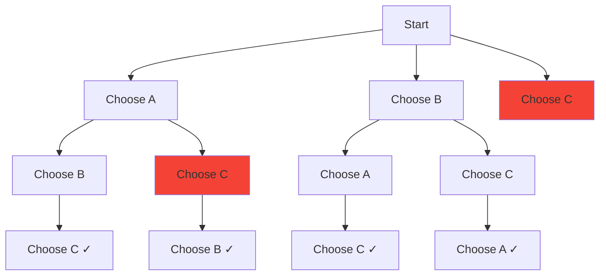

# Backtracking

## What Is Backtracking?

**Backtracking** is a systematic way to explore all possible solutions by building candidates incrementally and abandoning ("pruning") candidates as soon as they can't lead to a valid solution.



Think of it as DFS on a decision tree with pruning.

## The Backtracking Template

Almost every backtracking problem follows this pattern:

```python
def backtrack(state, choices, result):
    if is_goal(state):
        result.append(state.copy())
        return
    for choice in choices:
        if is_valid(choice, state):
            state.add(choice)          # make the choice
            backtrack(state, choices, result)  # recurse
            state.remove(choice)       # undo the choice (backtrack)
```

**Key steps:**

1. **Base case:** have we reached a complete solution?
2. **Choose:** pick an option from available choices
3. **Explore:** recurse with the choice added
4. **Unchoose:** undo the choice before trying the next option

## When to Use Backtracking

- Generate **all permutations or combinations**
- Find **all valid configurations** (N-Queens, Sudoku)
- Search problems where you need to **explore and prune**
- Constraint satisfaction problems
- When the solution space is a **tree of decisions**

## Classic Problems

### Subsets (Power Set)

Generate all subsets of a set.

```python
def subsets(nums: list[int]) -> list[list[int]]:
    result = []

    def backtrack(start: int, current: list[int]):
        result.append(current[:])
        for i in range(start, len(nums)):
            current.append(nums[i])
            backtrack(i + 1, current)
            current.pop()

    backtrack(0, [])
    return result
```

**Input:** `[1, 2, 3]` -> **Output:** `[[], [1], [1,2], [1,2,3], [1,3], [2], [2,3], [3]]`

**Time:** O(n * 2^n) — 2^n subsets, each takes O(n) to copy.

### Permutations

Generate all orderings of a set.

```python
def permutations(nums: list[int]) -> list[list[int]]:
    result = []

    def backtrack(current: list[int], remaining: set):
        if not remaining:
            result.append(current[:])
            return
        for num in list(remaining):
            current.append(num)
            remaining.remove(num)
            backtrack(current, remaining)
            current.pop()
            remaining.add(num)

    backtrack([], set(nums))
    return result
```

**Time:** O(n * n!) — n! permutations, each takes O(n) to copy.

### Combination Sum

Find all combinations that sum to a target (elements can be reused).

```python
def combination_sum(candidates: list[int], target: int) -> list[list[int]]:
    result = []

    def backtrack(start: int, current: list[int], remaining: int):
        if remaining == 0:
            result.append(current[:])
            return
        for i in range(start, len(candidates)):
            if candidates[i] > remaining:
                break
            current.append(candidates[i])
            backtrack(i, current, remaining - candidates[i])
            current.pop()

    candidates.sort()
    backtrack(0, [], target)
    return result
```

### N-Queens

Place N queens on an NxN board so no two attack each other.

```python
def solve_n_queens(n: int) -> list[list[str]]:
    result = []
    cols = set()
    diag1 = set()  # row - col
    diag2 = set()  # row + col

    def backtrack(row: int, board: list[list[str]]):
        if row == n:
            result.append([''.join(r) for r in board])
            return
        for col in range(n):
            if col in cols or (row - col) in diag1 or (row + col) in diag2:
                continue
            cols.add(col)
            diag1.add(row - col)
            diag2.add(row + col)
            board[row][col] = 'Q'
            backtrack(row + 1, board)
            board[row][col] = '.'
            cols.remove(col)
            diag1.remove(row - col)
            diag2.remove(row + col)

    board = [['.' for _ in range(n)] for _ in range(n)]
    backtrack(0, board)
    return result
```

### Word Search

Find if a word exists in a grid by traversing adjacent cells.

```python
def exist(board: list[list[str]], word: str) -> bool:
    rows, cols = len(board), len(board[0])

    def backtrack(r: int, c: int, idx: int) -> bool:
        if idx == len(word):
            return True
        if (r < 0 or r >= rows or c < 0 or c >= cols
                or board[r][c] != word[idx]):
            return False
        temp = board[r][c]
        board[r][c] = '#'  # mark visited
        found = (backtrack(r + 1, c, idx + 1) or
                 backtrack(r - 1, c, idx + 1) or
                 backtrack(r, c + 1, idx + 1) or
                 backtrack(r, c - 1, idx + 1))
        board[r][c] = temp  # unmark
        return found

    for r in range(rows):
        for c in range(cols):
            if backtrack(r, c, 0):
                return True
    return False
```

## Pruning Techniques

Pruning is what makes backtracking practical. Without it, you explore every branch.

| Technique | How | Example |
|-----------|-----|---------|
| **Constraint check** | Skip choices that violate constraints immediately | N-Queens: skip columns already used |
| **Sort + skip** | Sort candidates, stop when remaining sum exceeded | Combination sum: break if candidate > remaining |
| **Duplicate avoidance** | Skip duplicate values at the same decision level | Subsets II: `if i > start and nums[i] == nums[i-1]: continue` |
| **Bound check** | Skip if even the best remaining outcome can't beat current best | Branch and bound optimization |

### Avoiding Duplicates

For problems with duplicate elements (e.g., Subsets II, Permutations II):

```python
def subsets_with_dup(nums: list[int]) -> list[list[int]]:
    result = []
    nums.sort()

    def backtrack(start: int, current: list[int]):
        result.append(current[:])
        for i in range(start, len(nums)):
            if i > start and nums[i] == nums[i - 1]:
                continue  # skip duplicates at same level
            current.append(nums[i])
            backtrack(i + 1, current)
            current.pop()

    backtrack(0, [])
    return result
```

## Backtracking vs Other Approaches

| | Backtracking | DP | Greedy | BFS |
|---|-------------|-----|--------|-----|
| **Explores** | All valid paths with pruning | All subproblems | One path | All paths level-by-level |
| **Complexity** | Exponential (with pruning) | Polynomial | Polynomial | Polynomial for graphs |
| **Best for** | Enumeration, constraint satisfaction | Optimization with overlapping subproblems | Provably greedy-safe problems | Shortest path, level-order |

## Flashcard Review

??? flashcard "What is the backtracking template?"

    1. Check if current state is a solution (base case).
    2. For each available choice: make the choice, recurse, undo the choice.
    The "undo" step is what makes it backtracking — you restore state before trying the next option.

??? flashcard "How do you avoid duplicate subsets in backtracking?"

    **Sort the input** first. At each decision level, skip a candidate if it equals the previous candidate at the same level: `if i > start and nums[i] == nums[i-1]: continue`.

??? flashcard "What is the time complexity of generating all subsets?"

    **O(n * 2^n)** — there are 2^n subsets, and each takes O(n) to copy. The decision tree has 2^n leaves.

??? flashcard "Backtracking vs brute force: what is the difference?"

    Backtracking **prunes** branches that can't lead to valid solutions, while brute force explores every possibility. Pruning can reduce the effective search space dramatically (e.g., N-Queens from n^n to much less).

## Quiz

<div class="quiz" markdown>

**How many permutations does a set of 6 elements have?**
{: .quiz-question}

<div class="quiz-options" data-correct="c">
  <button class="quiz-option" data-value="a">36</button>
  <button class="quiz-option" data-value="b">64</button>
  <button class="quiz-option" data-value="c">720</button>
  <button class="quiz-option" data-value="d">63</button>
</div>

<div class="quiz-feedback" data-correct="Correct! 6! = 6 * 5 * 4 * 3 * 2 * 1 = 720 permutations." data-incorrect="Permutations of n elements = n!. For n=6: 6! = 720. Subsets would be 2^6 = 64."></div>

</div>

<div class="quiz" markdown>

**In the N-Queens problem, what constitutes a "constraint check" for pruning?**
{: .quiz-question}

<div class="quiz-options" data-correct="d">
  <button class="quiz-option" data-value="a">Check if the queen is on the board</button>
  <button class="quiz-option" data-value="b">Check if the row is empty</button>
  <button class="quiz-option" data-value="c">Check if the column is in bounds</button>
  <button class="quiz-option" data-value="d">Check column, main diagonal, and anti-diagonal conflicts</button>
</div>

<div class="quiz-feedback" data-correct="Correct! Since we place one queen per row, we only need to check the column, main diagonal (row-col), and anti-diagonal (row+col) against previously placed queens." data-incorrect="We place one queen per row (so rows can't conflict). The constraints to check are: column (already used?), main diagonal (row-col seen?), and anti-diagonal (row+col seen?)."></div>

</div>

<div class="quiz" markdown>

**Which step makes backtracking different from plain DFS?**
{: .quiz-question}

<div class="quiz-options" data-correct="b">
  <button class="quiz-option" data-value="a">The recursion step</button>
  <button class="quiz-option" data-value="b">The undo/unchoose step</button>
  <button class="quiz-option" data-value="c">The base case</button>
  <button class="quiz-option" data-value="d">The loop over choices</button>
</div>

<div class="quiz-feedback" data-correct="Correct! The 'undo' step (removing the choice after recursion) is what distinguishes backtracking. It restores state so the next sibling branch starts from the same configuration." data-incorrect="The undo/unchoose step is the defining feature. After recursing with a choice, backtracking undoes it before trying the next option. This is what 'backtracking' means — going back to try alternatives."></div>

</div>

## LeetCode Problems

| # | Problem | Difficulty | Key Concept |
|---|---------|:----------:|-------------|
| 78 | Subsets | Medium | Basic backtracking |
| 46 | Permutations | Medium | Generate all orderings |
| 39 | Combination Sum | Medium | Reusable candidates |
| 90 | Subsets II | Medium | Duplicate avoidance |
| 79 | Word Search | Medium | Grid backtracking |
| 51 | N-Queens | Hard | Constraint propagation |
| 37 | Sudoku Solver | Hard | Complex constraint backtracking |
