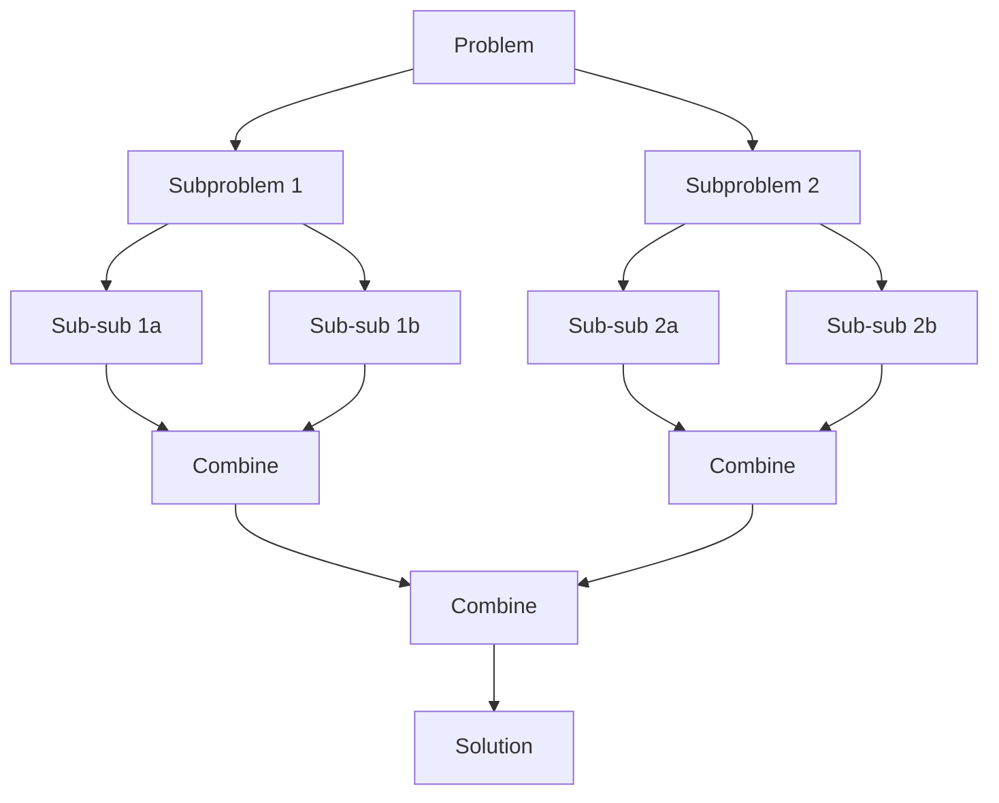

# Divide and Conquer

## What Is Divide and Conquer?

**Divide and conquer** solves a problem by:

1. **Divide** — split the problem into smaller, independent subproblems
2. **Conquer** — solve each subproblem recursively
3. **Combine** — merge the subproblem solutions into the final answer



The key distinction from DP: subproblems are **independent** (no overlap). If subproblems overlap, you need DP with memoization.

## The Master Theorem

For recurrences of the form `T(n) = aT(n/b) + O(n^d)`:

| Condition | Complexity | Meaning |
|-----------|:----------:|---------|
| d > log_b(a) | O(n^d) | Combine step dominates |
| d = log_b(a) | O(n^d log n) | Evenly split between levels |
| d < log_b(a) | O(n^(log_b(a))) | Recursive calls dominate |

**Examples:**

- Merge sort: T(n) = 2T(n/2) + O(n) -> a=2, b=2, d=1 -> O(n log n)
- Binary search: T(n) = T(n/2) + O(1) -> a=1, b=2, d=0 -> O(log n)
- Karatsuba multiply: T(n) = 3T(n/2) + O(n) -> O(n^1.585)

## Classic Algorithms

### Merge Sort

Divide the array in half, recursively sort each half, merge the sorted halves.

```python
def merge_sort(arr: list[int]) -> list[int]:
    if len(arr) <= 1:
        return arr
    mid = len(arr) // 2
    left = merge_sort(arr[:mid])
    right = merge_sort(arr[mid:])
    return merge(left, right)

def merge(left: list[int], right: list[int]) -> list[int]:
    result = []
    i = j = 0
    while i < len(left) and j < len(right):
        if left[i] <= right[j]:
            result.append(left[i])
            i += 1
        else:
            result.append(right[j])
            j += 1
    result.extend(left[i:])
    result.extend(right[j:])
    return result
```

**Time:** O(n log n) always. **Space:** O(n). **Stable:** yes.

### Quick Sort

Pick a pivot, partition elements into less-than and greater-than groups, recurse.

```python
import random

def quick_sort(arr: list[int]) -> list[int]:
    if len(arr) <= 1:
        return arr
    pivot = random.choice(arr)
    left = [x for x in arr if x < pivot]
    mid = [x for x in arr if x == pivot]
    right = [x for x in arr if x > pivot]
    return quick_sort(left) + mid + quick_sort(right)
```

**Time:** O(n log n) average, O(n^2) worst case (bad pivot). **Space:** O(log n) with in-place. **Not stable.**

**In-place partition (Lomuto scheme):**

```python
def partition(arr: list[int], lo: int, hi: int) -> int:
    pivot = arr[hi]
    i = lo
    for j in range(lo, hi):
        if arr[j] < pivot:
            arr[i], arr[j] = arr[j], arr[i]
            i += 1
    arr[i], arr[hi] = arr[hi], arr[i]
    return i
```

### Quick Select (Kth Smallest)

Find the kth smallest element without fully sorting. Average O(n).

```python
import random

def quick_select(arr: list[int], k: int) -> int:
    if len(arr) == 1:
        return arr[0]
    pivot = random.choice(arr)
    left = [x for x in arr if x < pivot]
    mid = [x for x in arr if x == pivot]
    right = [x for x in arr if x > pivot]
    if k <= len(left):
        return quick_select(left, k)
    elif k <= len(left) + len(mid):
        return pivot
    else:
        return quick_select(right, k - len(left) - len(mid))
```

**Time:** O(n) average, O(n^2) worst case. Used by `numpy.median` and `std::nth_element`.

### Binary Search

```python
def binary_search(arr: list[int], target: int) -> int:
    lo, hi = 0, len(arr) - 1
    while lo <= hi:
        mid = lo + (hi - lo) // 2
        if arr[mid] == target:
            return mid
        elif arr[mid] < target:
            lo = mid + 1
        else:
            hi = mid - 1
    return -1
```

**Time:** O(log n). See [Sorting & Searching](sorting-and-searching.md) for advanced binary search patterns.

### Count Inversions (Modified Merge Sort)

Count pairs (i, j) where i < j but arr[i] > arr[j]. Uses merge sort with a counter.

```python
def count_inversions(arr: list[int]) -> int:
    if len(arr) <= 1:
        return 0
    mid = len(arr) // 2
    left_inv = count_inversions(arr[:mid])
    right_inv = count_inversions(arr[mid:])
    split_inv = merge_count(arr, mid)
    return left_inv + right_inv + split_inv

def merge_count(arr: list[int], mid: int) -> int:
    left = arr[:mid]
    right = arr[mid:]
    inversions = i = j = k = 0
    while i < len(left) and j < len(right):
        if left[i] <= right[j]:
            arr[k] = left[i]
            i += 1
        else:
            arr[k] = right[j]
            inversions += len(left) - i
            j += 1
        k += 1
    arr[k:k + len(left) - i] = left[i:]
    arr[k + len(left) - i:] = right[j:]
    return inversions
```

### Maximum Subarray (Kadane's vs D&C)

Kadane's algorithm (O(n)) is preferred, but the divide-and-conquer approach illustrates the pattern:

```python
def max_subarray_dc(nums: list[int], lo: int, hi: int) -> int:
    if lo == hi:
        return nums[lo]
    mid = (lo + hi) // 2
    left_max = max_subarray_dc(nums, lo, mid)
    right_max = max_subarray_dc(nums, mid + 1, hi)
    cross_max = max_crossing_sum(nums, lo, mid, hi)
    return max(left_max, right_max, cross_max)

def max_crossing_sum(nums, lo, mid, hi):
    left_sum = float('-inf')
    total = 0
    for i in range(mid, lo - 1, -1):
        total += nums[i]
        left_sum = max(left_sum, total)
    right_sum = float('-inf')
    total = 0
    for i in range(mid + 1, hi + 1):
        total += nums[i]
        right_sum = max(right_sum, total)
    return left_sum + right_sum
```

## Divide and Conquer vs DP vs Greedy

| | Divide & Conquer | DP | Greedy |
|---|-----------------|-----|--------|
| **Subproblems** | Independent | Overlapping | N/A (no subproblems) |
| **Approach** | Split, solve, combine | Solve all subproblems, reuse | Local optimal at each step |
| **Memoization** | Not needed | Required | Not needed |
| **Example** | Merge sort | Coin change | Activity selection |

## Flashcard Review

??? flashcard "What are the three steps of divide and conquer?"

    1. **Divide** — split into smaller independent subproblems.
    2. **Conquer** — solve each subproblem recursively.
    3. **Combine** — merge subproblem solutions into the final answer.

??? flashcard "Merge sort vs quick sort: key differences?"

    **Merge sort:** O(n log n) always, O(n) extra space, stable. Divide is trivial (split in half), combine is the work (merge).
    **Quick sort:** O(n log n) average / O(n^2) worst, O(log n) space in-place, not stable. Divide is the work (partition), combine is trivial.

??? flashcard "What is the Master Theorem?"

    For T(n) = aT(n/b) + O(n^d): compare d to log_b(a). If d > log_b(a): O(n^d). If d = log_b(a): O(n^d log n). If d < log_b(a): O(n^log_b(a)). Covers most D&C recurrences.

??? flashcard "What is quickselect and when to use it?"

    An O(n) average algorithm to find the kth smallest element without fully sorting. Uses the partition step from quicksort. Recurses into only one half. Use it when you need kth element but not a full sort.

??? flashcard "When does divide and conquer fail?"

    When subproblems **overlap** (same work repeated). In that case, use DP to memoize. Also fails when the combine step is too expensive, or when the problem can't be divided into independent parts.

## Quiz

<div class="quiz" markdown>

**What is the time complexity of merge sort?**
{: .quiz-question}

<div class="quiz-options" data-correct="c">
  <button class="quiz-option" data-value="a">O(n) best, O(n^2) worst</button>
  <button class="quiz-option" data-value="b">O(n log n) average, O(n^2) worst</button>
  <button class="quiz-option" data-value="c">O(n log n) always</button>
  <button class="quiz-option" data-value="d">O(n^2) always</button>
</div>

<div class="quiz-feedback" data-correct="Correct! Merge sort always divides in half and always merges in O(n), giving O(n log n) in best, average, and worst case." data-incorrect="Merge sort is O(n log n) in all cases. It always splits evenly and always does O(n) work to merge. Quick sort is the one with O(n^2) worst case."></div>

</div>

<div class="quiz" markdown>

**Quick sort's worst case O(n^2) occurs when:**
{: .quiz-question}

<div class="quiz-options" data-correct="b">
  <button class="quiz-option" data-value="a">The array has duplicates</button>
  <button class="quiz-option" data-value="b">The pivot is always the smallest or largest element</button>
  <button class="quiz-option" data-value="c">The array is random</button>
  <button class="quiz-option" data-value="d">The array has an odd number of elements</button>
</div>

<div class="quiz-feedback" data-correct="Correct! If the pivot is always the min or max, one partition has n-1 elements and the other has 0, giving n levels of O(n) work = O(n^2). Fix: randomized pivot selection." data-incorrect="Worst case happens when the partition is maximally unbalanced — one side has n-1 elements. This occurs when the pivot is always the smallest or largest element (e.g., sorted input with first-element pivot)."></div>

</div>

<div class="quiz" markdown>

**You need the 5th smallest element from an unsorted array of 1M elements. Best approach?**
{: .quiz-question}

<div class="quiz-options" data-correct="c">
  <button class="quiz-option" data-value="a">Sort the array, return index 4</button>
  <button class="quiz-option" data-value="b">Use a max-heap of size 5</button>
  <button class="quiz-option" data-value="c">Quickselect</button>
  <button class="quiz-option" data-value="d">Binary search</button>
</div>

<div class="quiz-feedback" data-correct="Correct! Quickselect finds the kth element in O(n) average time without sorting the entire array. Sorting is O(n log n). A heap works too at O(n log k), but quickselect is faster for small k." data-incorrect="Quickselect finds the kth smallest in O(n) average time by partitioning and only recursing into the relevant half. Sorting the whole array (O(n log n)) is wasteful when you only need one element."></div>

</div>

## LeetCode Problems

| # | Problem | Difficulty | Key Concept |
|---|---------|:----------:|-------------|
| 912 | Sort an Array | Medium | Merge sort / quick sort |
| 215 | Kth Largest Element in an Array | Medium | Quickselect |
| 23 | Merge K Sorted Lists | Hard | Divide and conquer merge |
| 53 | Maximum Subarray | Medium | D&C or Kadane's |
| 493 | Reverse Pairs | Hard | Modified merge sort |
| 4 | Median of Two Sorted Arrays | Hard | Binary search D&C |
