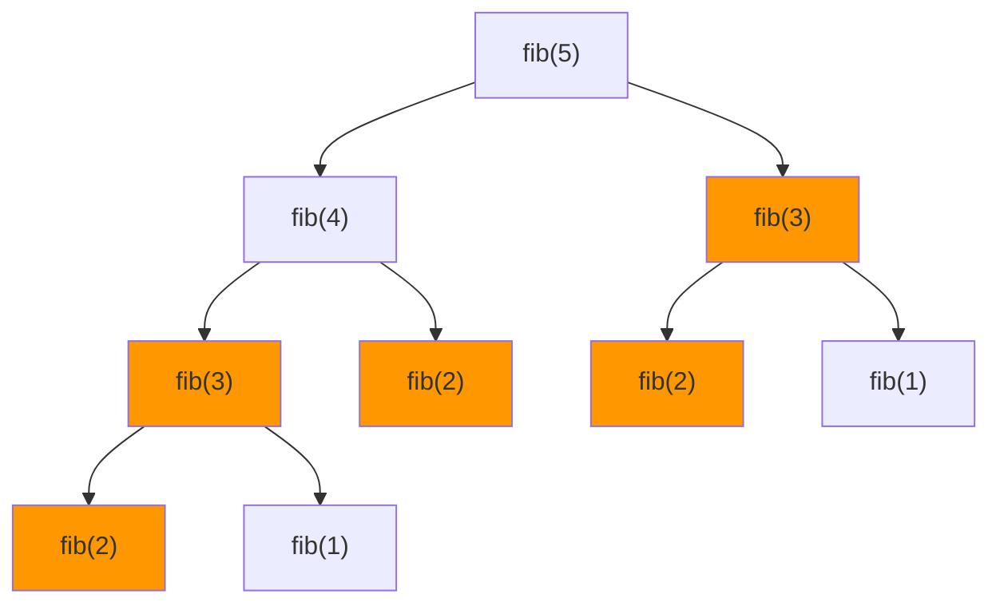

# Dynamic Programming

## What Is Dynamic Programming?

**Dynamic programming (DP)** solves problems by breaking them into overlapping subproblems, solving each subproblem once, and storing results to avoid redundant computation.

A problem is suitable for DP when it has:

1. **Optimal substructure** — the optimal solution can be built from optimal solutions to subproblems
2. **Overlapping subproblems** — the same subproblems are solved repeatedly



Without DP, `fib(3)` is computed 3 times. DP computes it once and reuses.

## Two Approaches

### Top-Down (Memoization)

Start from the original problem, recurse into subproblems, cache results.

```python
from functools import cache

@cache
def fib(n: int) -> int:
    if n <= 1:
        return n
    return fib(n - 1) + fib(n - 2)
```

**Pros:** natural, only solves subproblems that are actually needed.

**Cons:** recursion overhead, stack depth limits.

### Bottom-Up (Tabulation)

Build up from the smallest subproblems in a table.

```python
def fib(n: int) -> int:
    if n <= 1:
        return n
    dp = [0] * (n + 1)
    dp[1] = 1
    for i in range(2, n + 1):
        dp[i] = dp[i - 1] + dp[i - 2]
    return dp[n]
```

**Pros:** no recursion overhead, easier to optimize space.

**Cons:** must figure out the order of computation, may solve unnecessary subproblems.

### Space Optimization

When the DP table only depends on the previous row/column, reduce space from O(n) to O(1).

```python
def fib(n: int) -> int:
    if n <= 1:
        return n
    prev2, prev1 = 0, 1
    for _ in range(2, n + 1):
        prev2, prev1 = prev1, prev2 + prev1
    return prev1
```

## The DP Recipe

1. **Define the state:** what does `dp[i]` (or `dp[i][j]`) represent?
2. **Define the recurrence:** how does `dp[i]` relate to smaller subproblems?
3. **Identify base cases:** what are the trivial subproblems?
4. **Determine the order:** bottom-up, which direction to fill the table?
5. **Optimize space:** does the current state only depend on a few previous states?

## Classic 1D DP Patterns

### Climbing Stairs

**Problem:** you can take 1 or 2 steps at a time. How many ways to reach step n?

```python
def climb_stairs(n: int) -> int:
    if n <= 2:
        return n
    prev2, prev1 = 1, 2
    for _ in range(3, n + 1):
        prev2, prev1 = prev1, prev2 + prev1
    return prev1
```

**State:** `dp[i]` = number of ways to reach step i. **Recurrence:** `dp[i] = dp[i-1] + dp[i-2]`.

### House Robber

**Problem:** rob houses along a street, can't rob two adjacent houses. Maximize total.

```python
def rob(nums: list[int]) -> int:
    if not nums:
        return 0
    if len(nums) == 1:
        return nums[0]
    prev2, prev1 = 0, 0
    for num in nums:
        prev2, prev1 = prev1, max(prev1, prev2 + num)
    return prev1
```

**State:** `dp[i]` = max money robbing from houses 0..i. **Recurrence:** `dp[i] = max(dp[i-1], dp[i-2] + nums[i])`.

### Coin Change

**Problem:** given coin denominations, find the minimum coins to make a target amount.

```python
def coin_change(coins: list[int], amount: int) -> int:
    dp = [float('inf')] * (amount + 1)
    dp[0] = 0
    for a in range(1, amount + 1):
        for coin in coins:
            if coin <= a:
                dp[a] = min(dp[a], dp[a - coin] + 1)
    return dp[amount] if dp[amount] != float('inf') else -1
```

**State:** `dp[a]` = min coins to make amount a. **Recurrence:** `dp[a] = min(dp[a - coin] + 1)` for each valid coin.

### Longest Increasing Subsequence (LIS)

```python
def length_of_lis(nums: list[int]) -> int:
    dp = [1] * len(nums)
    for i in range(1, len(nums)):
        for j in range(i):
            if nums[j] < nums[i]:
                dp[i] = max(dp[i], dp[j] + 1)
    return max(dp)
```

**Time:** O(n^2). Can be optimized to O(n log n) using patience sorting with binary search.

### Word Break

```python
def word_break(s: str, word_dict: list[str]) -> bool:
    words = set(word_dict)
    dp = [False] * (len(s) + 1)
    dp[0] = True
    for i in range(1, len(s) + 1):
        for j in range(i):
            if dp[j] and s[j:i] in words:
                dp[i] = True
                break
    return dp[len(s)]
```

## Classic 2D DP Patterns

### Longest Common Subsequence

```python
def lcs(text1: str, text2: str) -> int:
    m, n = len(text1), len(text2)
    dp = [[0] * (n + 1) for _ in range(m + 1)]
    for i in range(1, m + 1):
        for j in range(1, n + 1):
            if text1[i - 1] == text2[j - 1]:
                dp[i][j] = dp[i - 1][j - 1] + 1
            else:
                dp[i][j] = max(dp[i - 1][j], dp[i][j - 1])
    return dp[m][n]
```

**Time:** O(m * n). **Space:** O(m * n), optimizable to O(min(m, n)).

### Edit Distance

**Problem:** minimum insertions, deletions, and substitutions to transform one string into another.

```python
def edit_distance(word1: str, word2: str) -> int:
    m, n = len(word1), len(word2)
    dp = [[0] * (n + 1) for _ in range(m + 1)]
    for i in range(m + 1):
        dp[i][0] = i
    for j in range(n + 1):
        dp[0][j] = j
    for i in range(1, m + 1):
        for j in range(1, n + 1):
            if word1[i - 1] == word2[j - 1]:
                dp[i][j] = dp[i - 1][j - 1]
            else:
                dp[i][j] = 1 + min(
                    dp[i - 1][j],      # delete
                    dp[i][j - 1],      # insert
                    dp[i - 1][j - 1],  # replace
                )
    return dp[m][n]
```

### 0/1 Knapsack

```python
def knapsack(weights: list[int], values: list[int], capacity: int) -> int:
    n = len(weights)
    dp = [[0] * (capacity + 1) for _ in range(n + 1)]
    for i in range(1, n + 1):
        for w in range(capacity + 1):
            dp[i][w] = dp[i - 1][w]
            if weights[i - 1] <= w:
                dp[i][w] = max(dp[i][w],
                               dp[i - 1][w - weights[i - 1]] + values[i - 1])
    return dp[n][capacity]
```

**Space optimization** (1D array, iterate capacity backward):

```python
def knapsack_optimized(weights: list[int], values: list[int], capacity: int) -> int:
    dp = [0] * (capacity + 1)
    for i in range(len(weights)):
        for w in range(capacity, weights[i] - 1, -1):
            dp[w] = max(dp[w], dp[w - weights[i]] + values[i])
    return dp[capacity]
```

## How to Recognize DP Problems

- "Find the **minimum/maximum** of something" + choices that affect future options
- "Count the **number of ways** to do something"
- "Can you **partition/split** this into parts with some property?"
- "Given a **string/sequence**, find the longest/shortest **subsequence/substring** with property X"
- Brute force would try all combinations (exponential) — DP reduces to polynomial

## Flashcard Review

??? flashcard "Top-down vs bottom-up DP: when to use each?"

    **Top-down (memoization):** when the recurrence is natural and you only need a subset of subproblems. Easier to write.
    **Bottom-up (tabulation):** when you need all subproblems, want to optimize space, or want to avoid recursion limits.

??? flashcard "What is the DP recipe?"

    1. **Define the state** (what does dp[i] represent?)
    2. **Write the recurrence** (how does dp[i] relate to smaller subproblems?)
    3. **Identify base cases**
    4. **Determine fill order** (bottom-up direction)
    5. **Optimize space** (can you use O(1) or O(n) instead of O(n^2)?)

??? flashcard "How do you optimize DP space?"

    If `dp[i]` only depends on `dp[i-1]` (and possibly `dp[i-2]`), replace the table with 1-2 variables. For 2D DP where row i depends only on row i-1, use two 1D arrays or a single array filled in the right direction.

??? flashcard "Coin change: why doesn't greedy work but DP does?"

    Greedy picks the largest coin first, which can lead to suboptimal solutions for arbitrary denominations (e.g., coins [1,3,4], amount 6: greedy gives 4+1+1=3 coins, DP finds 3+3=2 coins). DP tries all options at each step.

??? flashcard "How do you identify a DP problem in an interview?"

    Look for: (1) optimization (min/max/count), (2) choices that affect future options, (3) overlapping subproblems (same computation repeated). If brute force is exponential and subproblems overlap, it's likely DP.

## Quiz

<div class="quiz" markdown>

**What is the time complexity of the standard coin change DP solution?**
{: .quiz-question}

<div class="quiz-options" data-correct="b">
  <button class="quiz-option" data-value="a">O(n)</button>
  <button class="quiz-option" data-value="b">O(amount * number of coins)</button>
  <button class="quiz-option" data-value="c">O(amount^2)</button>
  <button class="quiz-option" data-value="d">O(2^amount)</button>
</div>

<div class="quiz-feedback" data-correct="Correct! For each amount from 1 to target, we check each coin denomination. Total: O(amount * |coins|)." data-incorrect="The outer loop runs 'amount' times, and for each amount we check all coin denominations. Total: O(amount * |coins|)."></div>

</div>

<div class="quiz" markdown>

**For the 0/1 knapsack problem with n items and capacity W, what is the DP table size?**
{: .quiz-question}

<div class="quiz-options" data-correct="c">
  <button class="quiz-option" data-value="a">O(n)</button>
  <button class="quiz-option" data-value="b">O(W)</button>
  <button class="quiz-option" data-value="c">O(n * W)</button>
  <button class="quiz-option" data-value="d">O(2^n)</button>
</div>

<div class="quiz-feedback" data-correct="Correct! dp[i][w] represents the max value using items 0..i with capacity w. The table has (n+1) rows and (W+1) columns. Can be optimized to O(W) space with a 1D array." data-incorrect="The table is dp[n+1][W+1] — one row per item, one column per capacity value. Size is O(n * W). Space can be optimized to O(W) by using a single row."></div>

</div>

<div class="quiz" markdown>

**Which problem does NOT typically use dynamic programming?**
{: .quiz-question}

<div class="quiz-options" data-correct="d">
  <button class="quiz-option" data-value="a">Edit distance</button>
  <button class="quiz-option" data-value="b">Longest common subsequence</button>
  <button class="quiz-option" data-value="c">Coin change</button>
  <button class="quiz-option" data-value="d">Interval scheduling (max non-overlapping)</button>
</div>

<div class="quiz-feedback" data-correct="Correct! Interval scheduling is solved greedily (sort by end time, pick earliest). It has the greedy choice property, so DP is unnecessary." data-incorrect="Interval scheduling (maximum non-overlapping intervals) is a classic greedy problem — sort by end time and pick greedily. No DP needed."></div>

</div>

<div class="quiz" markdown>

**You have a recursive solution with overlapping subproblems that causes TLE. What is the simplest fix?**
{: .quiz-question}

<div class="quiz-options" data-correct="a">
  <button class="quiz-option" data-value="a">Add memoization (@cache or a dict)</button>
  <button class="quiz-option" data-value="b">Rewrite as bottom-up tabulation</button>
  <button class="quiz-option" data-value="c">Convert to greedy</button>
  <button class="quiz-option" data-value="d">Use multithreading</button>
</div>

<div class="quiz-feedback" data-correct="Correct! Adding @cache (or @lru_cache) to your recursive function is the simplest way to avoid recomputing subproblems. It turns exponential into polynomial with minimal code change." data-incorrect="Memoization (adding @cache) is the simplest fix — one decorator on your existing recursive function. Bottom-up works too but requires restructuring. Greedy only works if the problem has the greedy choice property."></div>

</div>

## LeetCode Problems

| # | Problem | Difficulty | Pattern |
|---|---------|:----------:|---------|
| 70 | Climbing Stairs | Easy | 1D DP (Fibonacci-like) |
| 198 | House Robber | Medium | 1D DP (skip pattern) |
| 322 | Coin Change | Medium | Unbounded knapsack |
| 300 | Longest Increasing Subsequence | Medium | 1D DP, O(n log n) optimization |
| 139 | Word Break | Medium | 1D DP with string matching |
| 1143 | Longest Common Subsequence | Medium | 2D DP |
| 72 | Edit Distance | Medium | 2D DP |
| 416 | Partition Equal Subset Sum | Medium | 0/1 knapsack variant |
| 312 | Burst Balloons | Hard | Interval DP |
