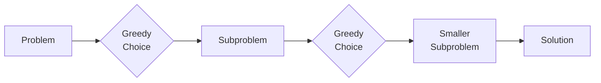

# Greedy Algorithms

## What Is a Greedy Algorithm?

A **greedy algorithm** builds a solution piece by piece, always choosing the option that looks best *right now* (the locally optimal choice), without reconsidering previous decisions.

A greedy approach works when the problem has:

1. **Greedy choice property** — a locally optimal choice leads to a globally optimal solution
2. **Optimal substructure** — an optimal solution contains optimal solutions to subproblems



!!! warning "The trap"
    Not every optimization problem has the greedy choice property. If a problem requires considering future consequences (e.g., 0/1 knapsack), you need dynamic programming or backtracking instead.

## How to Recognize Greedy Problems

- The problem asks for a **minimum/maximum** of something
- Making the locally best choice at each step doesn't invalidate future choices
- **Sorting** the input often reveals the greedy structure
- The problem involves **intervals, scheduling, or resource allocation**
- You can prove that the greedy choice is always part of an optimal solution (exchange argument)

## Classic Greedy Patterns

### Interval Scheduling (Activity Selection)

**Problem:** given intervals, find the maximum number of non-overlapping intervals.

**Strategy:** sort by end time, greedily pick the earliest-finishing interval.

```python
def max_non_overlapping(intervals: list[tuple[int, int]]) -> int:
    intervals.sort(key=lambda x: x[1])
    count = 0
    last_end = float('-inf')
    for start, end in intervals:
        if start >= last_end:
            count += 1
            last_end = end
    return count
```

**Why greedy works:** choosing the interval that ends earliest leaves the most room for future intervals. You can prove by exchange argument that replacing any other choice with the earliest-ending one never makes the solution worse.

### Minimum Number of Intervals to Remove

The flip side: given intervals, find the minimum removals to make them non-overlapping.

```python
def erase_overlap_intervals(intervals: list[list[int]]) -> int:
    intervals.sort(key=lambda x: x[1])
    count = 0
    last_end = float('-inf')
    for start, end in intervals:
        if start >= last_end:
            last_end = end
        else:
            count += 1
    return count
```

**Answer = total intervals - max non-overlapping.**

### Jump Game

**Problem:** given an array where each element is the max jump length at that position, determine if you can reach the end.

```python
def can_jump(nums: list[int]) -> bool:
    max_reach = 0
    for i, jump in enumerate(nums):
        if i > max_reach:
            return False
        max_reach = max(max_reach, i + jump)
    return True
```

### Task Scheduler

**Problem:** given tasks with cooldown periods, find the minimum time to execute all tasks.

```python
from collections import Counter

def least_interval(tasks: list[str], n: int) -> int:
    freq = Counter(tasks)
    max_freq = max(freq.values())
    max_count = sum(1 for v in freq.values() if v == max_freq)
    return max(len(tasks), (max_freq - 1) * (n + 1) + max_count)
```

**Greedy insight:** the most frequent task dictates the minimum time. Schedule it first, fill gaps with other tasks.

### Fractional Knapsack

**Problem:** given items with weight and value, maximize value within a weight capacity. Items can be split.

```python
def fractional_knapsack(items: list[tuple[int, int]], capacity: int) -> float:
    # items: [(weight, value)]
    items.sort(key=lambda x: x[1] / x[0], reverse=True)
    total = 0.0
    for weight, value in items:
        if capacity >= weight:
            total += value
            capacity -= weight
        else:
            total += value * (capacity / weight)
            break
    return total
```

**Why greedy works:** taking items by value-to-weight ratio is optimal when splitting is allowed. (For 0/1 knapsack where splitting is NOT allowed, greedy fails — use DP.)

### Huffman Coding

Build an optimal prefix-free encoding tree. Always merge the two lowest-frequency nodes.

```python
import heapq

def huffman_codes(freq: dict[str, int]) -> dict[str, str]:
    heap = [(f, char) for char, f in freq.items()]
    heapq.heapify(heap)

    if len(heap) == 1:
        return {heap[0][1]: '0'}

    while len(heap) > 1:
        f1, left = heapq.heappop(heap)
        f2, right = heapq.heappop(heap)
        heapq.heappush(heap, (f1 + f2, (left, right)))

    codes = {}
    def build(node, prefix=''):
        if isinstance(node, str):
            codes[node] = prefix
            return
        build(node[0], prefix + '0')
        build(node[1], prefix + '1')

    build(heap[0][1])
    return codes
```

## Greedy vs Dynamic Programming

| | Greedy | Dynamic Programming |
|---|--------|-------------------|
| **Approach** | Pick best now, never revisit | Try all subproblems, combine optimally |
| **Speed** | Usually O(n log n) | Usually O(n^2) or more |
| **Correctness** | Only if greedy choice property holds | Always correct for optimization |
| **Space** | Usually O(1) extra | O(n) or O(n^2) table |
| **Proof** | Need exchange argument or matroid theory | Prove optimal substructure + overlapping subproblems |

### How to Decide

1. Can you prove a greedy choice is always safe? -> Greedy
2. Does the problem have overlapping subproblems? -> DP
3. Unsure? Try greedy first (simpler), verify with counterexamples. If a counterexample exists, switch to DP.

## Flashcard Review

??? flashcard "What two properties must a problem have for greedy to work?"

    1. **Greedy choice property:** the locally optimal choice is part of a globally optimal solution.
    2. **Optimal substructure:** an optimal solution contains optimal solutions to subproblems.

??? flashcard "How do you solve interval scheduling greedily?"

    Sort intervals by **end time**. Greedily pick the interval that ends earliest and doesn't overlap with the last picked. This maximizes the number of non-overlapping intervals.

??? flashcard "Why doesn't greedy work for 0/1 knapsack?"

    A high value-to-weight item might prevent taking a combination of items with higher total value. Example: capacity=10, items [(6,$6), (5,$5), (5,$5)]. Greedy takes the $6 item; optimal takes both $5 items for $10.

??? flashcard "What is the exchange argument for proving greedy correctness?"

    Assume an optimal solution that doesn't use the greedy choice. Show you can swap in the greedy choice without making the solution worse. This proves the greedy choice is always safe.

??? flashcard "Greedy vs DP: when to use each?"

    **Greedy:** when you can prove local choices lead to global optimum (intervals, scheduling, Huffman). Simpler and faster.
    **DP:** when you need to consider multiple subproblem combinations (knapsack, edit distance, longest common subsequence).

## Quiz

<div class="quiz" markdown>

**You need to find the minimum number of coins to make change for a given amount. Coin denominations are [1, 5, 10, 25]. Does greedy work?**
{: .quiz-question}

<div class="quiz-options" data-correct="a">
  <button class="quiz-option" data-value="a">Yes — always pick the largest coin that fits</button>
  <button class="quiz-option" data-value="b">No — greedy never works for coin change</button>
  <button class="quiz-option" data-value="c">Only if the amount is a multiple of 5</button>
  <button class="quiz-option" data-value="d">Only for amounts under 100</button>
</div>

<div class="quiz-feedback" data-correct="Correct! For US coin denominations [1, 5, 10, 25], greedy works because each denomination is a multiple of smaller ones. But for arbitrary denominations (e.g., [1, 3, 4]), greedy fails — use DP." data-incorrect="For standard US denominations, greedy works. But note: for arbitrary denominations like [1, 3, 4], greedy fails on amount 6 (greedy: 4+1+1=3 coins; optimal: 3+3=2 coins). The general coin change problem requires DP."></div>

</div>

<div class="quiz" markdown>

**Intervals: [(1,4), (2,3), (3,5), (6,8)]. What is the maximum number of non-overlapping intervals using the greedy approach?**
{: .quiz-question}

<div class="quiz-options" data-correct="c">
  <button class="quiz-option" data-value="a">1</button>
  <button class="quiz-option" data-value="b">2</button>
  <button class="quiz-option" data-value="c">3</button>
  <button class="quiz-option" data-value="d">4</button>
</div>

<div class="quiz-feedback" data-correct="Correct! Sort by end time: (2,3), (1,4), (3,5), (6,8). Pick (2,3). Skip (1,4) — overlaps. Pick (3,5) — starts at end of (2,3). Pick (6,8). Total: 3." data-incorrect="Sort by end time: (2,3), (1,4), (3,5), (6,8). Pick (2,3). (1,4) overlaps — skip. (3,5) starts at 3 >= 3 — pick. (6,8) starts at 6 >= 5 — pick. Answer: 3."></div>

</div>

<div class="quiz" markdown>

**Which of these problems can be solved greedily?**
{: .quiz-question}

<div class="quiz-options" data-correct="b">
  <button class="quiz-option" data-value="a">0/1 Knapsack</button>
  <button class="quiz-option" data-value="b">Fractional Knapsack</button>
  <button class="quiz-option" data-value="c">Longest Common Subsequence</button>
  <button class="quiz-option" data-value="d">Edit Distance</button>
</div>

<div class="quiz-feedback" data-correct="Correct! Fractional knapsack allows splitting items, so taking by value-to-weight ratio is optimal. 0/1 knapsack, LCS, and edit distance all require DP." data-incorrect="Fractional knapsack is the greedy one — items can be split, so taking the highest value-to-weight ratio first is provably optimal. The others require considering all subproblem combinations (DP)."></div>

</div>

## LeetCode Problems

| # | Problem | Difficulty | Key Concept |
|---|---------|:----------:|-------------|
| 455 | Assign Cookies | Easy | Basic greedy matching |
| 55 | Jump Game | Medium | Greedy reachability |
| 45 | Jump Game II | Medium | Greedy minimum jumps |
| 435 | Non-overlapping Intervals | Medium | Interval scheduling |
| 621 | Task Scheduler | Medium | Frequency-based scheduling |
| 134 | Gas Station | Medium | Circular greedy |
| 135 | Candy | Hard | Two-pass greedy |
