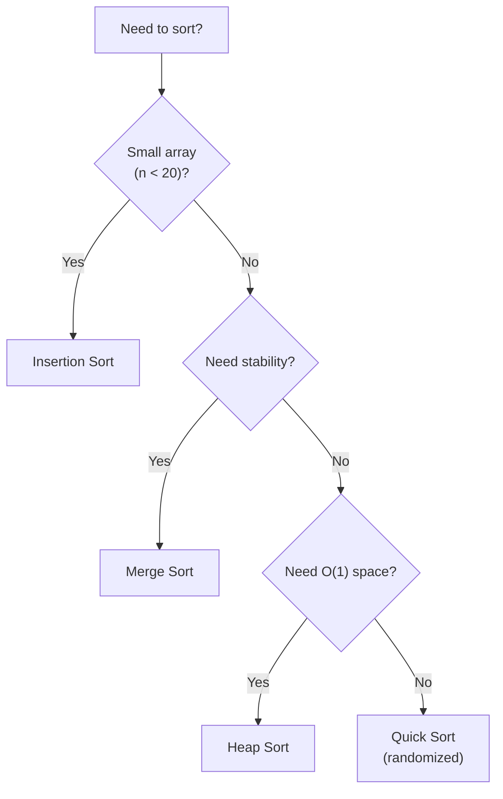

# Sorting & Searching

## Sorting Algorithms Overview

| Algorithm | Best | Average | Worst | Space | Stable | Notes |
|-----------|:----:|:-------:|:-----:|:-----:|:------:|-------|
| **Bubble Sort** | O(n) | O(n^2) | O(n^2) | O(1) | Yes | Educational only |
| **Insertion Sort** | O(n) | O(n^2) | O(n^2) | O(1) | Yes | Good for small/nearly sorted |
| **Merge Sort** | O(n log n) | O(n log n) | O(n log n) | O(n) | Yes | Guaranteed performance |
| **Quick Sort** | O(n log n) | O(n log n) | O(n^2) | O(log n) | No | Fastest in practice |
| **Heap Sort** | O(n log n) | O(n log n) | O(n log n) | O(1) | No | In-place, no extra memory |
| **Counting Sort** | O(n+k) | O(n+k) | O(n+k) | O(k) | Yes | Non-comparison, k = range |
| **Radix Sort** | O(d(n+k)) | O(d(n+k)) | O(d(n+k)) | O(n+k) | Yes | d = digits, k = base |
| **Bucket Sort** | O(n+k) | O(n+k) | O(n^2) | O(n) | Yes | Uniform distribution |
| **Tim Sort** | O(n) | O(n log n) | O(n log n) | O(n) | Yes | Python/Java default |

## Comparison-Based Sorts

### Insertion Sort

Best for small arrays (n < 20) and nearly-sorted data. Many optimized sorts use it as a base case.

```python
def insertion_sort(arr: list[int]) -> None:
    for i in range(1, len(arr)):
        key = arr[i]
        j = i - 1
        while j >= 0 and arr[j] > key:
            arr[j + 1] = arr[j]
            j -= 1
        arr[j + 1] = key
```

### Merge Sort

See [Divide and Conquer](divide-and-conquer.md) for full implementation.

**When to use:** when you need guaranteed O(n log n), stability, or are sorting linked lists (merge sort on linked lists is O(1) extra space).

### Quick Sort

See [Divide and Conquer](divide-and-conquer.md) for full implementation.

**When to use:** general-purpose sorting in practice. Faster than merge sort due to better cache locality and lower constant factors. Randomized pivot avoids worst case.

### Heap Sort

See [Heaps](../data-structures/heaps.md) for implementation.

**When to use:** when you need O(n log n) with O(1) extra space. Rarely used in practice because quick sort is faster on average and merge sort is stable.

### Choosing a Sort



In practice, use Python's built-in `sorted()` or `.sort()` — it uses **TimSort**, a hybrid merge/insertion sort that is stable, adaptive, and optimized for real-world data.

## Non-Comparison Sorts

These break the O(n log n) lower bound by not comparing elements.

### Counting Sort

When values are integers in a known range [0, k].

```python
def counting_sort(arr: list[int]) -> list[int]:
    if not arr:
        return []
    max_val = max(arr)
    count = [0] * (max_val + 1)
    for num in arr:
        count[num] += 1
    result = []
    for val, cnt in enumerate(count):
        result.extend([val] * cnt)
    return result
```

**Time:** O(n + k). **Use when:** k is not much larger than n (e.g., sorting ages, grades, small integers).

### Radix Sort

Sort by each digit, from least significant to most significant, using a stable sort (counting sort) as a subroutine.

```python
def radix_sort(arr: list[int]) -> list[int]:
    if not arr:
        return []
    max_val = max(arr)
    exp = 1
    while max_val // exp > 0:
        arr = counting_sort_by_digit(arr, exp)
        exp *= 10
    return arr

def counting_sort_by_digit(arr: list[int], exp: int) -> list[int]:
    count = [0] * 10
    for num in arr:
        digit = (num // exp) % 10
        count[digit] += 1
    for i in range(1, 10):
        count[i] += count[i - 1]
    output = [0] * len(arr)
    for num in reversed(arr):
        digit = (num // exp) % 10
        count[digit] -= 1
        output[count[digit]] = num
    return output
```

**Time:** O(d * (n + k)) where d = number of digits, k = base (10).

## Binary Search Patterns

Binary search is more than just "find target in sorted array." These patterns appear constantly.

### Standard Binary Search

```python
def binary_search(arr: list[int], target: int) -> int:
    lo, hi = 0, len(arr) - 1
    while lo <= hi:
        mid = lo + (hi - lo) // 2
        if arr[mid] == target:
            return mid
        elif arr[mid] < target:
            lo = mid + 1
        else:
            hi = mid - 1
    return -1
```

### Find Left Boundary (First Occurrence)

```python
def find_left(arr: list[int], target: int) -> int:
    lo, hi = 0, len(arr)
    while lo < hi:
        mid = lo + (hi - lo) // 2
        if arr[mid] < target:
            lo = mid + 1
        else:
            hi = mid
    return lo if lo < len(arr) and arr[lo] == target else -1
```

### Find Right Boundary (Last Occurrence)

```python
def find_right(arr: list[int], target: int) -> int:
    lo, hi = 0, len(arr)
    while lo < hi:
        mid = lo + (hi - lo) // 2
        if arr[mid] <= target:
            lo = mid + 1
        else:
            hi = mid
    return lo - 1 if lo > 0 and arr[lo - 1] == target else -1
```

### Binary Search on Answer

**The most important pattern for interviews.** Instead of searching an array, binary search on the answer space with a feasibility check.

**Template:** "Find the minimum/maximum X such that some condition is satisfied."

```python
def binary_search_on_answer(lo: int, hi: int) -> int:
    while lo < hi:
        mid = lo + (hi - lo) // 2
        if feasible(mid):
            hi = mid
        else:
            lo = mid + 1
    return lo
```

**Example: Koko Eating Bananas** — find the minimum eating speed to finish all piles in h hours.

```python
def min_eating_speed(piles: list[int], h: int) -> int:
    def feasible(speed: int) -> bool:
        return sum((p + speed - 1) // speed for p in piles) <= h

    lo, hi = 1, max(piles)
    while lo < hi:
        mid = lo + (hi - lo) // 2
        if feasible(mid):
            hi = mid
        else:
            lo = mid + 1
    return lo
```

### Search in Rotated Sorted Array

```python
def search_rotated(nums: list[int], target: int) -> int:
    lo, hi = 0, len(nums) - 1
    while lo <= hi:
        mid = lo + (hi - lo) // 2
        if nums[mid] == target:
            return mid
        if nums[lo] <= nums[mid]:  # left half sorted
            if nums[lo] <= target < nums[mid]:
                hi = mid - 1
            else:
                lo = mid + 1
        else:  # right half sorted
            if nums[mid] < target <= nums[hi]:
                lo = mid + 1
            else:
                hi = mid - 1
    return -1
```

## Python's bisect Module

```python
from bisect import bisect_left, bisect_right, insort

arr = [1, 3, 3, 5, 7]

bisect_left(arr, 3)    # 1 — leftmost position for 3
bisect_right(arr, 3)   # 3 — rightmost position for 3
bisect_left(arr, 4)    # 3 — where 4 would be inserted

insort(arr, 4)         # [1, 3, 3, 4, 5, 7] — insert maintaining order
```

## Flashcard Review

??? flashcard "What is the lower bound for comparison-based sorting?"

    **O(n log n)**. Any comparison-based sort must make at least n log n comparisons in the worst case (information-theoretic argument: log2(n!) = O(n log n)). Non-comparison sorts (counting, radix) can beat this.

??? flashcard "When should you use counting sort vs comparison sort?"

    Use counting sort when values are **integers in a small known range** (k not much larger than n). O(n+k) beats O(n log n). If the range is huge (k >> n), stick with comparison sorts.

??? flashcard "What is binary search on answer?"

    Instead of searching a sorted array, binary search on the **answer space**. Define a feasibility function that checks if a candidate answer works. The answer space must be monotonic: if X works, all values > X (or < X) also work.

??? flashcard "Why is quicksort faster than merge sort in practice?"

    Better **cache locality** (sorts in-place, sequential memory access) and lower constant factors (no need to allocate and copy merge buffers). But merge sort is better for linked lists and has guaranteed O(n log n).

??? flashcard "What is TimSort?"

    Python's default sorting algorithm. A hybrid of merge sort and insertion sort. It detects pre-existing order ("runs") in the data and merges them, making it O(n) on nearly-sorted data. Stable and adaptive.

## Quiz

<div class="quiz" markdown>

**Which sorting algorithm is used by Python's built-in `sorted()` function?**
{: .quiz-question}

<div class="quiz-options" data-correct="c">
  <button class="quiz-option" data-value="a">Quick Sort</button>
  <button class="quiz-option" data-value="b">Merge Sort</button>
  <button class="quiz-option" data-value="c">Tim Sort</button>
  <button class="quiz-option" data-value="d">Heap Sort</button>
</div>

<div class="quiz-feedback" data-correct="Correct! Python uses TimSort — a hybrid merge/insertion sort that is stable, O(n log n) worst case, and O(n) on nearly-sorted data." data-incorrect="Python uses TimSort, a hybrid of merge sort and insertion sort. It's stable, adaptive (O(n) on nearly-sorted data), and O(n log n) worst case."></div>

</div>

<div class="quiz" markdown>

**You need to find the minimum ship capacity to ship all packages within D days. Packages can't be split. Best approach?**
{: .quiz-question}

<div class="quiz-options" data-correct="b">
  <button class="quiz-option" data-value="a">Sort packages by weight</button>
  <button class="quiz-option" data-value="b">Binary search on answer (capacity)</button>
  <button class="quiz-option" data-value="c">Greedy allocation</button>
  <button class="quiz-option" data-value="d">Dynamic programming</button>
</div>

<div class="quiz-feedback" data-correct="Correct! Binary search on the capacity range [max(packages), sum(packages)]. For each candidate capacity, greedily check if all packages fit in D days. Monotonic: if capacity X works, X+1 also works." data-incorrect="This is a classic binary search on answer problem. Search the range [max(packages), sum(packages)]. For each candidate capacity, a greedy check determines if D days suffice."></div>

</div>

<div class="quiz" markdown>

**What is the key difference between `bisect_left` and `bisect_right`?**
{: .quiz-question}

<div class="quiz-options" data-correct="c">
  <button class="quiz-option" data-value="a">bisect_left is faster</button>
  <button class="quiz-option" data-value="b">bisect_right works on unsorted arrays</button>
  <button class="quiz-option" data-value="c">bisect_left returns the leftmost insertion point, bisect_right returns the rightmost</button>
  <button class="quiz-option" data-value="d">They are identical</button>
</div>

<div class="quiz-feedback" data-correct="Correct! For duplicates: bisect_left returns the index of the first occurrence, bisect_right returns the index after the last occurrence. Both O(log n)." data-incorrect="bisect_left finds where to insert to keep the element before any existing equal values. bisect_right inserts after existing equal values. For [1,3,3,5]: bisect_left(arr,3)=1, bisect_right(arr,3)=3."></div>

</div>

<div class="quiz" markdown>

**You're sorting 10 million 32-bit integers. Which approach is most efficient?**
{: .quiz-question}

<div class="quiz-options" data-correct="b">
  <button class="quiz-option" data-value="a">Merge sort</button>
  <button class="quiz-option" data-value="b">Radix sort</button>
  <button class="quiz-option" data-value="c">Bubble sort</button>
  <button class="quiz-option" data-value="d">Insertion sort</button>
</div>

<div class="quiz-feedback" data-correct="Correct! Radix sort on 32-bit integers takes O(4 * (n + 256)) = O(n) using base-256. For 10M integers, this is faster than O(n log n) comparison sorts." data-incorrect="Radix sort is O(d * (n + k)). For 32-bit integers with base-256: d=4, k=256. Total: O(4n) which is effectively O(n), beating the O(n log n) lower bound of comparison sorts."></div>

</div>

## LeetCode Problems

| # | Problem | Difficulty | Key Concept |
|---|---------|:----------:|-------------|
| 704 | Binary Search | Easy | Standard binary search |
| 278 | First Bad Version | Easy | Binary search on answer |
| 33 | Search in Rotated Sorted Array | Medium | Modified binary search |
| 875 | Koko Eating Bananas | Medium | Binary search on answer |
| 153 | Find Minimum in Rotated Sorted Array | Medium | Binary search on rotated |
| 34 | Find First and Last Position | Medium | Left/right boundary search |
| 4 | Median of Two Sorted Arrays | Hard | Binary search partition |
| 315 | Count of Smaller Numbers After Self | Hard | Modified merge sort |
