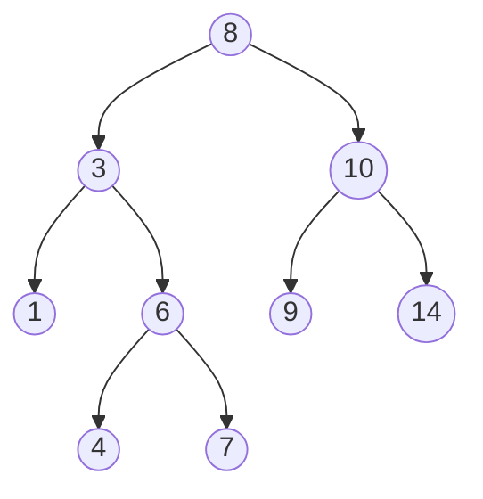

# Binary Trees

## Definition

A **binary tree** is a hierarchical data structure where each node has at most **two children** (left and right). The topmost node is the **root**. Nodes with no children are **leaves**.



### Variants

- **Binary Search Tree (BST)** — left child < parent < right child for all nodes
- **Balanced BST (AVL, Red-Black)** — BST with height guaranteed to be O(log n)
- **Complete Binary Tree** — every level filled except possibly the last, which is filled left-to-right (this is what heaps use)
- **Full Binary Tree** — every node has 0 or 2 children
- **Perfect Binary Tree** — all internal nodes have 2 children, all leaves at same depth

## Key Operations & Complexity

### Binary Search Tree (BST)

| Operation   | Average  | Worst (unbalanced) | Description                |
|-------------|:--------:|:------------------:|----------------------------|
| `search(x)` | O(log n) | O(n)              | Find a node by value       |
| `insert(x)` | O(log n) | O(n)              | Add a new node             |
| `delete(x)` | O(log n) | O(n)              | Remove a node              |
| `min/max`    | O(log n) | O(n)              | Leftmost/rightmost node    |
| `traversal`  | O(n)     | O(n)              | Visit all nodes            |

**Space:** O(n) for the tree, O(h) for recursive operations where h is the height.

!!! warning "Unbalanced BSTs degrade to linked lists"
    Inserting sorted data into a plain BST creates a chain with O(n) operations. This is why balanced trees (AVL, Red-Black) exist — they guarantee O(log n) height.

## Tree Node

```python
class TreeNode:
    def __init__(self, val=0, left=None, right=None):
        self.val = val
        self.left = left
        self.right = right
```

## Traversals

The four standard traversals — know all of them cold.

=== "Inorder (Left, Root, Right)"

    Visits BST nodes in **sorted order**.

    ```python
    def inorder(root: TreeNode | None) -> list:
        if not root:
            return []
        return inorder(root.left) + [root.val] + inorder(root.right)

    # Iterative (uses explicit stack)
    def inorder_iterative(root: TreeNode | None) -> list:
        result, stack = [], []
        current = root
        while current or stack:
            while current:
                stack.append(current)
                current = current.left
            current = stack.pop()
            result.append(current.val)
            current = current.right
        return result
    ```

=== "Preorder (Root, Left, Right)"

    Useful for **serialization** — can reconstruct the tree from preorder + inorder.

    ```python
    def preorder(root: TreeNode | None) -> list:
        if not root:
            return []
        return [root.val] + preorder(root.left) + preorder(root.right)

    def preorder_iterative(root: TreeNode | None) -> list:
        if not root:
            return []
        result, stack = [], [root]
        while stack:
            node = stack.pop()
            result.append(node.val)
            if node.right:
                stack.append(node.right)
            if node.left:
                stack.append(node.left)
        return result
    ```

=== "Postorder (Left, Right, Root)"

    Useful for **deletion** (delete children before parent) and **expression evaluation**.

    ```python
    def postorder(root: TreeNode | None) -> list:
        if not root:
            return []
        return postorder(root.left) + postorder(root.right) + [root.val]
    ```

=== "Level-order (BFS)"

    Visits nodes **level by level**. See [Queues](queues.md) for the implementation.

    ```python
    from collections import deque

    def level_order(root: TreeNode | None) -> list[list]:
        if not root:
            return []
        result, queue = [], deque([root])
        while queue:
            level = []
            for _ in range(len(queue)):
                node = queue.popleft()
                level.append(node.val)
                if node.left:
                    queue.append(node.left)
                if node.right:
                    queue.append(node.right)
            result.append(level)
        return result
    ```

## Major Algorithms

### BST Search, Insert, Delete

```python
def search_bst(root: TreeNode | None, target: int) -> TreeNode | None:
    if not root or root.val == target:
        return root
    if target < root.val:
        return search_bst(root.left, target)
    return search_bst(root.right, target)

def insert_bst(root: TreeNode | None, val: int) -> TreeNode:
    if not root:
        return TreeNode(val)
    if val < root.val:
        root.left = insert_bst(root.left, val)
    elif val > root.val:
        root.right = insert_bst(root.right, val)
    return root
```

### Validate BST

A common interview question. The trick: pass valid ranges down the recursion.

```python
def is_valid_bst(root: TreeNode | None,
                 lo=float('-inf'), hi=float('inf')) -> bool:
    if not root:
        return True
    if root.val <= lo or root.val >= hi:
        return False
    return (is_valid_bst(root.left, lo, root.val) and
            is_valid_bst(root.right, root.val, hi))
```

### Lowest Common Ancestor (LCA)

```python
def lca(root: TreeNode | None, p: TreeNode, q: TreeNode) -> TreeNode | None:
    if not root or root == p or root == q:
        return root
    left = lca(root.left, p, q)
    right = lca(root.right, p, q)
    if left and right:
        return root
    return left or right
```

**For BST specifically** (can exploit ordering):

```python
def lca_bst(root: TreeNode, p: TreeNode, q: TreeNode) -> TreeNode:
    while root:
        if p.val < root.val and q.val < root.val:
            root = root.left
        elif p.val > root.val and q.val > root.val:
            root = root.right
        else:
            return root
```

### Tree Height / Max Depth

```python
def max_depth(root: TreeNode | None) -> int:
    if not root:
        return 0
    return 1 + max(max_depth(root.left), max_depth(root.right))
```

### Check if Balanced

A tree is balanced if the height difference between left and right subtrees is at most 1, for every node.

```python
def is_balanced(root: TreeNode | None) -> bool:
    def height(node):
        if not node:
            return 0
        left_h = height(node.left)
        right_h = height(node.right)
        if left_h == -1 or right_h == -1 or abs(left_h - right_h) > 1:
            return -1
        return 1 + max(left_h, right_h)
    return height(root) != -1
```

### Invert Binary Tree

```python
def invert_tree(root: TreeNode | None) -> TreeNode | None:
    if not root:
        return None
    root.left, root.right = invert_tree(root.right), invert_tree(root.left)
    return root
```

## Common Use Cases

- **BSTs** — ordered data storage, in-memory indexes, symbol tables
- **Expression trees** — compilers represent arithmetic expressions as trees
- **Decision trees** — ML classification and regression models
- **Huffman trees** — data compression (optimal prefix codes)
- **Trie** — prefix-based string storage (autocomplete, spell check)
- **Heaps** — priority queues (see [Heaps](heaps.md))
- **B-trees / B+ trees** — database indexes (disk-optimized balanced trees)

## Flashcard Review

??? flashcard "What is the difference between a binary tree and a BST?"

    A **binary tree** only requires each node to have at most 2 children. A **BST** adds the ordering invariant: left child < parent < right child for all nodes. This enables O(log n) search.

??? flashcard "What are the four tree traversal orders?"

    **Inorder** (Left, Root, Right) — sorted order for BST.
    **Preorder** (Root, Left, Right) — useful for serialization.
    **Postorder** (Left, Right, Root) — useful for deletion.
    **Level-order** (BFS) — level by level using a queue.

??? flashcard "Why do balanced BSTs matter?"

    An unbalanced BST can degenerate into a linked list with O(n) operations. Balanced trees (AVL, Red-Black) guarantee O(log n) height, keeping all operations efficient.

??? flashcard "How do you find the Lowest Common Ancestor?"

    For a general binary tree: recurse left and right. If both return non-null, the current node is the LCA. For a BST: use the ordering property to decide which subtree to explore.

??? flashcard "What is the space complexity of recursive tree algorithms?"

    **O(h)** where h is the height. Each recursive call adds a frame to the call stack. For a balanced tree h = O(log n). For a skewed tree h = O(n).

## Quiz

<div class="quiz" markdown>

**What does an inorder traversal of a BST produce?**
{: .quiz-question}

<div class="quiz-options" data-correct="b">
  <button class="quiz-option" data-value="a">Nodes in insertion order</button>
  <button class="quiz-option" data-value="b">Nodes in sorted (ascending) order</button>
  <button class="quiz-option" data-value="c">Nodes in level order</button>
  <button class="quiz-option" data-value="d">Nodes in reverse order</button>
</div>

<div class="quiz-feedback" data-correct="Correct! Inorder traversal visits left, root, right — which for a BST is smallest to largest." data-incorrect="Inorder traversal (Left, Root, Right) on a BST visits nodes in sorted ascending order, since all left descendants are smaller and all right descendants are larger."></div>

</div>

<div class="quiz" markdown>

**A BST has n nodes. What is the worst-case time for search?**
{: .quiz-question}

<div class="quiz-options" data-correct="c">
  <button class="quiz-option" data-value="a">O(1)</button>
  <button class="quiz-option" data-value="b">O(log n)</button>
  <button class="quiz-option" data-value="c">O(n)</button>
  <button class="quiz-option" data-value="d">O(n log n)</button>
</div>

<div class="quiz-feedback" data-correct="Correct! A skewed BST (essentially a linked list) has height n, making search O(n). This is why balanced BSTs exist." data-incorrect="The worst case is O(n). If elements were inserted in sorted order, the BST becomes a linked list with height n. Balanced BSTs (AVL, Red-Black) guarantee O(log n)."></div>

</div>

<div class="quiz" markdown>

**Which traversal would you use to delete an entire binary tree safely?**
{: .quiz-question}

<div class="quiz-options" data-correct="c">
  <button class="quiz-option" data-value="a">Preorder</button>
  <button class="quiz-option" data-value="b">Inorder</button>
  <button class="quiz-option" data-value="c">Postorder</button>
  <button class="quiz-option" data-value="d">Level-order</button>
</div>

<div class="quiz-feedback" data-correct="Correct! Postorder visits children before the parent, so you can safely delete children first without losing references." data-incorrect="Postorder (Left, Right, Root) is the safe choice: it processes children before their parent, so you never delete a node while its children still need it."></div>

</div>

<div class="quiz" markdown>

**What is the maximum number of nodes in a binary tree of height h?**
{: .quiz-question}

<div class="quiz-options" data-correct="a">
  <button class="quiz-option" data-value="a">2^(h+1) - 1</button>
  <button class="quiz-option" data-value="b">2^h</button>
  <button class="quiz-option" data-value="c">h^2</button>
  <button class="quiz-option" data-value="d">2h + 1</button>
</div>

<div class="quiz-feedback" data-correct="Correct! A perfect binary tree of height h has 2^(h+1) - 1 nodes. Height 0 = 1 node, height 1 = 3 nodes, height 2 = 7 nodes." data-incorrect="A perfect binary tree (all levels full) of height h has 2^(h+1) - 1 nodes. Each level k has 2^k nodes, and the sum from k=0 to h is 2^(h+1) - 1."></div>

</div>

## LeetCode Problems

| # | Problem | Difficulty | Key Concept |
|---|---------|:----------:|-------------|
| 226 | Invert Binary Tree | Easy | Recursive swap |
| 104 | Maximum Depth of Binary Tree | Easy | Tree height |
| 98 | Validate Binary Search Tree | Medium | Range-based validation |
| 102 | Binary Tree Level Order Traversal | Medium | BFS |
| 236 | Lowest Common Ancestor | Medium | Recursive LCA |
| 105 | Construct Tree from Preorder and Inorder | Medium | Tree reconstruction |
| 124 | Binary Tree Maximum Path Sum | Hard | Path through any node |
| 297 | Serialize and Deserialize Binary Tree | Hard | Tree encoding |
