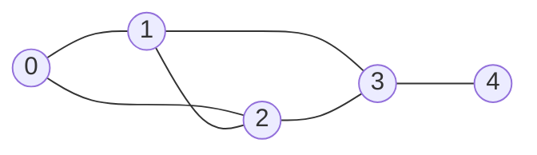

# Graphs

## Definition

A **graph** is a collection of **nodes (vertices)** connected by **edges**. Unlike trees, graphs can have cycles, multiple paths between nodes, and nodes with any number of connections.



### Types

- **Directed vs Undirected** — edges have a direction (A -> B) or not (A -- B)
- **Weighted vs Unweighted** — edges carry a cost/distance or not
- **Cyclic vs Acyclic** — contains cycles or not. A directed acyclic graph is a **DAG**
- **Connected vs Disconnected** — all nodes reachable from any node, or not
- **Dense vs Sparse** — close to E = V^2 edges (dense) or E ~ V edges (sparse)

## Representations

=== "Adjacency List"

    Best for **sparse graphs** (most real-world graphs). O(V + E) space.

    ```python
    # Unweighted
    graph = {
        0: [1, 2],
        1: [0, 2, 3],
        2: [0, 1, 3],
        3: [1, 2, 4],
        4: [3],
    }

    # Weighted
    graph = {
        0: [(1, 5), (2, 3)],   # (neighbor, weight)
        1: [(0, 5), (2, 1)],
        2: [(0, 3), (1, 1)],
    }

    # Using defaultdict for building on the fly
    from collections import defaultdict
    graph = defaultdict(list)
    for u, v in edges:
        graph[u].append(v)
        graph[v].append(u)  # omit for directed
    ```

=== "Adjacency Matrix"

    Best for **dense graphs** or when you need O(1) edge lookup. O(V^2) space.

    ```python
    # V x V matrix where matrix[i][j] = 1 if edge exists
    V = 5
    matrix = [[0] * V for _ in range(V)]
    matrix[0][1] = 1
    matrix[1][0] = 1  # undirected

    # Weighted: store weight instead of 1
    matrix[0][1] = 5  # edge 0->1 with weight 5
    ```

=== "Edge List"

    Simplest representation. Useful for Kruskal's algorithm.

    ```python
    edges = [(0, 1), (0, 2), (1, 2), (1, 3), (2, 3), (3, 4)]

    # Weighted
    edges = [(0, 1, 5), (0, 2, 3), (1, 2, 1)]  # (u, v, weight)
    ```

## Key Algorithms

### DFS (Depth-First Search)

Explores as deep as possible before backtracking. Uses a stack (or recursion).

```python
def dfs_recursive(graph: dict, node, visited: set = None) -> list:
    if visited is None:
        visited = set()
    visited.add(node)
    result = [node]
    for neighbor in graph[node]:
        if neighbor not in visited:
            result.extend(dfs_recursive(graph, neighbor, visited))
    return result

def dfs_iterative(graph: dict, start) -> list:
    visited = set()
    stack = [start]
    result = []
    while stack:
        node = stack.pop()
        if node in visited:
            continue
        visited.add(node)
        result.append(node)
        for neighbor in graph[node]:
            if neighbor not in visited:
                stack.append(neighbor)
    return result
```

**Time:** O(V + E). **Space:** O(V).

### BFS (Breadth-First Search)

Explores level by level. Uses a queue. Finds shortest path in unweighted graphs.

```python
from collections import deque

def bfs(graph: dict, start) -> list:
    visited = {start}
    queue = deque([start])
    result = []
    while queue:
        node = queue.popleft()
        result.append(node)
        for neighbor in graph[node]:
            if neighbor not in visited:
                visited.add(neighbor)
                queue.append(neighbor)
    return result
```

**Time:** O(V + E). **Space:** O(V).

### Dijkstra's Shortest Path (Weighted)

Finds shortest paths from a source to all other nodes in a graph with **non-negative** weights. Uses a min-heap (see [Heaps](heaps.md)).

```python
import heapq

def dijkstra(graph: dict, start) -> dict:
    dist = {start: 0}
    heap = [(0, start)]
    while heap:
        d, node = heapq.heappop(heap)
        if d > dist.get(node, float('inf')):
            continue
        for neighbor, weight in graph[node]:
            new_dist = d + weight
            if new_dist < dist.get(neighbor, float('inf')):
                dist[neighbor] = new_dist
                heapq.heappush(heap, (new_dist, neighbor))
    return dist
```

**Time:** O((V + E) log V) with a binary heap.

### Topological Sort (DAG only)

Linear ordering of vertices such that for every directed edge u -> v, u comes before v. Only possible on DAGs.

=== "BFS (Kahn's Algorithm)"

    ```python
    from collections import deque

    def topo_sort_bfs(graph: dict, num_nodes: int) -> list:
        in_degree = [0] * num_nodes
        for node in graph:
            for neighbor in graph[node]:
                in_degree[neighbor] += 1

        queue = deque(i for i in range(num_nodes) if in_degree[i] == 0)
        order = []

        while queue:
            node = queue.popleft()
            order.append(node)
            for neighbor in graph[node]:
                in_degree[neighbor] -= 1
                if in_degree[neighbor] == 0:
                    queue.append(neighbor)

        if len(order) != num_nodes:
            return []  # cycle detected
        return order
    ```

=== "DFS-based"

    ```python
    def topo_sort_dfs(graph: dict, num_nodes: int) -> list:
        visited = set()
        stack = []

        def dfs(node):
            visited.add(node)
            for neighbor in graph.get(node, []):
                if neighbor not in visited:
                    dfs(neighbor)
            stack.append(node)

        for i in range(num_nodes):
            if i not in visited:
                dfs(i)

        return stack[::-1]
    ```

**Time:** O(V + E). **Use cases:** build systems, course prerequisites, task scheduling.

### Cycle Detection

=== "Undirected (Union-Find)"

    ```python
    class UnionFind:
        def __init__(self, n):
            self.parent = list(range(n))
            self.rank = [0] * n

        def find(self, x):
            if self.parent[x] != x:
                self.parent[x] = self.find(self.parent[x])
            return self.parent[x]

        def union(self, x, y) -> bool:
            px, py = self.find(x), self.find(y)
            if px == py:
                return False  # cycle detected
            if self.rank[px] < self.rank[py]:
                px, py = py, px
            self.parent[py] = px
            if self.rank[px] == self.rank[py]:
                self.rank[px] += 1
            return True

    def has_cycle_undirected(n: int, edges: list) -> bool:
        uf = UnionFind(n)
        for u, v in edges:
            if not uf.union(u, v):
                return True
        return False
    ```

=== "Directed (DFS with colors)"

    ```python
    def has_cycle_directed(graph: dict, num_nodes: int) -> bool:
        WHITE, GRAY, BLACK = 0, 1, 2
        color = [WHITE] * num_nodes

        def dfs(node):
            color[node] = GRAY
            for neighbor in graph.get(node, []):
                if color[neighbor] == GRAY:
                    return True  # back edge = cycle
                if color[neighbor] == WHITE and dfs(neighbor):
                    return True
            color[node] = BLACK
            return False

        return any(color[i] == WHITE and dfs(i) for i in range(num_nodes))
    ```

### Number of Connected Components / Islands

A classic BFS/DFS application on grids.

```python
def num_islands(grid: list[list[str]]) -> int:
    if not grid:
        return 0
    rows, cols = len(grid), len(grid[0])
    count = 0

    def dfs(r, c):
        if r < 0 or r >= rows or c < 0 or c >= cols or grid[r][c] != '1':
            return
        grid[r][c] = '0'  # mark visited
        dfs(r + 1, c)
        dfs(r - 1, c)
        dfs(r, c + 1)
        dfs(r, c - 1)

    for r in range(rows):
        for c in range(cols):
            if grid[r][c] == '1':
                count += 1
                dfs(r, c)
    return count
```

## Complexity Summary

| Algorithm | Time | Space | Notes |
|-----------|:----:|:-----:|-------|
| BFS | O(V + E) | O(V) | Shortest path (unweighted) |
| DFS | O(V + E) | O(V) | Cycle detection, topological sort |
| Dijkstra | O((V+E) log V) | O(V) | Shortest path (non-negative weights) |
| Bellman-Ford | O(V * E) | O(V) | Handles negative weights |
| Topological Sort | O(V + E) | O(V) | DAG only |
| Union-Find | O(alpha(n)) per op | O(V) | Near O(1) with path compression |

## Common Use Cases

- **Social networks** — friend connections, recommendations (graph traversal)
- **Maps/navigation** — shortest path (Dijkstra, A*)
- **Dependency resolution** — build systems, package managers (topological sort)
- **Network routing** — finding paths, detecting bottlenecks
- **Web crawling** — BFS traversal of linked pages
- **Scheduling** — task ordering with dependencies (DAG)

## Flashcard Review

??? flashcard "When do you use BFS vs DFS on a graph?"

    **BFS:** shortest path in unweighted graphs, level-order processing, finding nodes closest to source.
    **DFS:** cycle detection, topological sort, connected components, path existence, backtracking problems.

??? flashcard "What is topological sort and when is it used?"

    A linear ordering of vertices in a DAG where for every edge u -> v, u appears before v. Used for: build systems, course prerequisites, task scheduling. Only works on directed acyclic graphs.

??? flashcard "Adjacency list vs adjacency matrix — when to use each?"

    **Adjacency list:** sparse graphs (E << V^2), most real-world graphs. O(V+E) space, O(degree) edge lookup.
    **Adjacency matrix:** dense graphs (E close to V^2), frequent edge existence checks. O(V^2) space, O(1) edge lookup.

??? flashcard "What is Union-Find and what is it used for?"

    A data structure that tracks elements partitioned into disjoint sets. Supports near-O(1) `find` (which set?) and `union` (merge sets) with path compression and union by rank. Used for: cycle detection in undirected graphs, Kruskal's MST, connected components.

??? flashcard "Can Dijkstra handle negative edge weights?"

    **No.** Dijkstra assumes that once a node is finalized, no shorter path can be found. Negative edges break this assumption. Use **Bellman-Ford** (O(V*E)) for graphs with negative weights.

## Quiz

<div class="quiz" markdown>

**Which algorithm finds shortest paths in a weighted graph with non-negative edges?**
{: .quiz-question}

<div class="quiz-options" data-correct="c">
  <button class="quiz-option" data-value="a">DFS</button>
  <button class="quiz-option" data-value="b">BFS</button>
  <button class="quiz-option" data-value="c">Dijkstra's algorithm</button>
  <button class="quiz-option" data-value="d">Topological sort</button>
</div>

<div class="quiz-feedback" data-correct="Correct! Dijkstra's algorithm uses a min-heap to greedily process the closest unvisited node, finding shortest paths in O((V+E) log V)." data-incorrect="Dijkstra's algorithm is designed for weighted graphs with non-negative edges. BFS works for unweighted graphs. DFS doesn't guarantee shortest paths."></div>

</div>

<div class="quiz" markdown>

**You need to determine if a set of courses can be completed given prerequisites. Which approach works?**
{: .quiz-question}

<div class="quiz-options" data-correct="b">
  <button class="quiz-option" data-value="a">BFS shortest path</button>
  <button class="quiz-option" data-value="b">Topological sort (check for cycles)</button>
  <button class="quiz-option" data-value="c">Dijkstra's algorithm</button>
  <button class="quiz-option" data-value="d">Union-Find</button>
</div>

<div class="quiz-feedback" data-correct="Correct! Model courses as a directed graph with prerequisite edges. If a topological sort succeeds (no cycle), the courses can be completed. A cycle means circular prerequisites." data-incorrect="This is a topological sort problem. Model courses as nodes and prerequisites as directed edges. If the graph has a cycle, the courses can't all be completed."></div>

</div>

<div class="quiz" markdown>

**What is the time complexity of BFS on a graph with V vertices and E edges?**
{: .quiz-question}

<div class="quiz-options" data-correct="b">
  <button class="quiz-option" data-value="a">O(V)</button>
  <button class="quiz-option" data-value="b">O(V + E)</button>
  <button class="quiz-option" data-value="c">O(V * E)</button>
  <button class="quiz-option" data-value="d">O(V^2)</button>
</div>

<div class="quiz-feedback" data-correct="Correct! BFS visits each vertex once (O(V)) and examines each edge once (O(E)), totaling O(V + E)." data-incorrect="BFS visits every vertex once and examines every edge once. The total work is O(V + E), not their product."></div>

</div>

<div class="quiz" markdown>

**A graph has 6 vertices and 15 edges (every pair connected). Which representation is more space-efficient?**
{: .quiz-question}

<div class="quiz-options" data-correct="b">
  <button class="quiz-option" data-value="a">Adjacency list</button>
  <button class="quiz-option" data-value="b">Adjacency matrix</button>
  <button class="quiz-option" data-value="c">They use the same space</button>
  <button class="quiz-option" data-value="d">Edge list</button>
</div>

<div class="quiz-feedback" data-correct="Correct! This is a complete graph (dense). The adjacency matrix uses O(V^2) = 36 entries. The adjacency list stores 2*15 = 30 neighbor references plus overhead per list, roughly the same or worse. For dense graphs, the matrix is cleaner." data-incorrect="For a complete graph (E = V*(V-1)/2), the adjacency matrix at O(V^2) is comparable or better than an adjacency list which stores 2E pointers plus per-list overhead."></div>

</div>

## LeetCode Problems

| # | Problem | Difficulty | Key Concept |
|---|---------|:----------:|-------------|
| 200 | Number of Islands | Medium | DFS/BFS on grid |
| 133 | Clone Graph | Medium | BFS/DFS graph copy |
| 207 | Course Schedule | Medium | Topological sort / cycle detection |
| 210 | Course Schedule II | Medium | Topological ordering |
| 743 | Network Delay Time | Medium | Dijkstra |
| 417 | Pacific Atlantic Water Flow | Medium | Multi-source DFS |
| 787 | Cheapest Flights Within K Stops | Medium | Modified Dijkstra/BFS |
| 332 | Reconstruct Itinerary | Hard | Eulerian path (DFS) |
