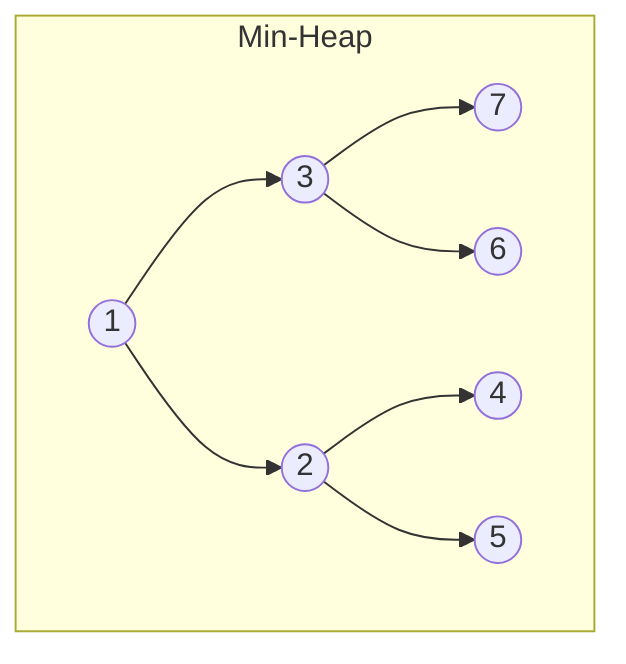

# Heaps

## Definition

A **heap** is a complete binary tree that satisfies the **heap property**:

- **Min-heap:** every parent is less than or equal to its children. The root is the minimum.
- **Max-heap:** every parent is greater than or equal to its children. The root is the maximum.

Heaps are the underlying structure for **priority queues** — when you need fast access to the smallest (or largest) element.



### Array Representation

Heaps are stored as arrays. For element at index `i`:

- **Parent:** `(i - 1) // 2`
- **Left child:** `2 * i + 1`
- **Right child:** `2 * i + 2`

```
Index:  0  1  2  3  4  5  6
Value: [1, 3, 2, 7, 6, 4, 5]
```

No pointers needed — the tree structure is implicit in the array positions.

## Key Operations & Complexity

| Operation        | Time      | Description                            |
|------------------|:---------:|----------------------------------------|
| `insert(x)`      | O(log n) | Add element, bubble up to restore heap |
| `extract_min/max` | O(log n) | Remove root, bubble down to restore    |
| `peek()`          | O(1)     | Return root without removing           |
| `heapify(array)`  | O(n)     | Build a heap from an unsorted array    |
| `decrease_key`    | O(log n) | Lower a key's value, bubble up         |

**Space:** O(n)

!!! note "Heapify is O(n), not O(n log n)"
    Building a heap by sifting down from the last internal node is O(n), not O(n log n). Most nodes are near the leaves and barely move. This matters for heap sort's space analysis.

## Implementation

=== "Using Python's heapq (min-heap)"

    ```python
    import heapq

    nums = [5, 3, 8, 1, 2]
    heapq.heapify(nums)          # O(n) — in-place

    heapq.heappush(nums, 4)      # Insert
    smallest = heapq.heappop(nums)  # Extract min

    # Peek without removing
    smallest = nums[0]

    # Top-K largest
    top_3 = heapq.nlargest(3, nums)

    # Top-K smallest
    bottom_3 = heapq.nsmallest(3, nums)
    ```

=== "Max-heap trick"

    ```python
    import heapq

    # Python only has min-heap. For max-heap, negate values.
    max_heap = []
    heapq.heappush(max_heap, -5)
    heapq.heappush(max_heap, -3)
    heapq.heappush(max_heap, -8)

    largest = -heapq.heappop(max_heap)  # 8
    ```

=== "Min-heap from scratch"

    ```python
    class MinHeap:
        def __init__(self):
            self._data = []

        def push(self, val):
            self._data.append(val)
            self._bubble_up(len(self._data) - 1)

        def pop(self):
            if not self._data:
                raise IndexError("pop from empty heap")
            self._swap(0, len(self._data) - 1)
            val = self._data.pop()
            if self._data:
                self._bubble_down(0)
            return val

        def peek(self):
            if not self._data:
                raise IndexError("peek at empty heap")
            return self._data[0]

        def _bubble_up(self, i):
            while i > 0:
                parent = (i - 1) // 2
                if self._data[i] < self._data[parent]:
                    self._swap(i, parent)
                    i = parent
                else:
                    break

        def _bubble_down(self, i):
            n = len(self._data)
            while True:
                smallest = i
                left = 2 * i + 1
                right = 2 * i + 2
                if left < n and self._data[left] < self._data[smallest]:
                    smallest = left
                if right < n and self._data[right] < self._data[smallest]:
                    smallest = right
                if smallest == i:
                    break
                self._swap(i, smallest)
                i = smallest

        def _swap(self, i, j):
            self._data[i], self._data[j] = self._data[j], self._data[i]

        def __len__(self):
            return len(self._data)
    ```

## Major Algorithms Using Heaps

### Top-K Elements

Find the K largest elements in an array. Use a min-heap of size K — if a new element is larger than the heap's minimum, replace it.

```python
import heapq

def top_k_largest(nums: list[int], k: int) -> list[int]:
    return heapq.nlargest(k, nums)

# Manual approach (useful when streaming):
def top_k_streaming(nums: list[int], k: int) -> list[int]:
    heap = []
    for num in nums:
        if len(heap) < k:
            heapq.heappush(heap, num)
        elif num > heap[0]:
            heapq.heapreplace(heap, num)
    return sorted(heap, reverse=True)
```

**Time:** O(n log k) — much better than O(n log n) sorting when k is small.

### Merge K Sorted Lists

```python
import heapq

def merge_k_sorted(lists: list[list[int]]) -> list[int]:
    heap = []
    for i, lst in enumerate(lists):
        if lst:
            heapq.heappush(heap, (lst[0], i, 0))

    result = []
    while heap:
        val, list_idx, elem_idx = heapq.heappop(heap)
        result.append(val)
        if elem_idx + 1 < len(lists[list_idx]):
            next_val = lists[list_idx][elem_idx + 1]
            heapq.heappush(heap, (next_val, list_idx, elem_idx + 1))
    return result
```

**Time:** O(N log k) where N is total elements, k is number of lists.

### Running Median (Two Heaps)

Maintain a max-heap for the lower half and a min-heap for the upper half. The median is always at the top of one (or both) heaps.

```python
import heapq

class MedianFinder:
    def __init__(self):
        self.lo = []  # max-heap (negated)
        self.hi = []  # min-heap

    def add_num(self, num: int):
        heapq.heappush(self.lo, -num)
        heapq.heappush(self.hi, -heapq.heappop(self.lo))
        if len(self.hi) > len(self.lo):
            heapq.heappush(self.lo, -heapq.heappop(self.hi))

    def find_median(self) -> float:
        if len(self.lo) > len(self.hi):
            return -self.lo[0]
        return (-self.lo[0] + self.hi[0]) / 2
```

### Heap Sort

```python
def heap_sort(arr: list[int]) -> list[int]:
    heapq.heapify(arr)
    return [heapq.heappop(arr) for _ in range(len(arr))]
```

**Time:** O(n log n). **Space:** O(1) if done in-place with a max-heap. Not stable.

### Dijkstra's Shortest Path

Uses a min-heap to always process the closest unvisited node.

```python
import heapq

def dijkstra(graph: dict, start) -> dict:
    dist = {start: 0}
    heap = [(0, start)]
    while heap:
        d, node = heapq.heappop(heap)
        if d > dist.get(node, float('inf')):
            continue
        for neighbor, weight in graph[node]:
            new_dist = d + weight
            if new_dist < dist.get(neighbor, float('inf')):
                dist[neighbor] = new_dist
                heapq.heappush(heap, (new_dist, neighbor))
    return dist
```

## Common Use Cases

- **Priority queues** — task scheduling by priority, OS process scheduling
- **Top-K problems** — most frequent elements, K closest points
- **Median maintenance** — streaming median with two heaps
- **Graph algorithms** — Dijkstra's, Prim's MST
- **Merge operations** — merging K sorted streams (log files, database results)
- **Event-driven simulation** — process events in timestamp order

## Flashcard Review

??? flashcard "What is the heap property?"

    **Min-heap:** every parent <= its children (root is minimum).
    **Max-heap:** every parent >= its children (root is maximum).
    The tree must also be **complete** — filled left-to-right at every level.

??? flashcard "Why is building a heap O(n) instead of O(n log n)?"

    Sift-down heapify starts from the last internal node and works up. Nodes near the leaves (the majority) barely move. The sum of work is O(n), not O(n log n). Sift-up insertion of n elements would be O(n log n).

??? flashcard "How do you implement a max-heap in Python?"

    Python's `heapq` is min-heap only. **Negate values** on push and negate again on pop: `heappush(h, -x)` and `-heappop(h)`.

??? flashcard "What is the two-heap pattern for running median?"

    Keep a **max-heap** for the lower half and a **min-heap** for the upper half. Balance sizes so they differ by at most 1. The median is at the top of the larger heap (or the average of both tops).

??? flashcard "When would you use a heap vs sorting?"

    Use a heap when you need the **K smallest/largest** from a large dataset (O(n log k) vs O(n log n)), when data arrives as a **stream**, or when you need **repeated min/max extraction**. Sort when you need the entire dataset ordered.

## Quiz

<div class="quiz" markdown>

**What is the time complexity of extracting the minimum from a min-heap?**
{: .quiz-question}

<div class="quiz-options" data-correct="b">
  <button class="quiz-option" data-value="a">O(1)</button>
  <button class="quiz-option" data-value="b">O(log n)</button>
  <button class="quiz-option" data-value="c">O(n)</button>
  <button class="quiz-option" data-value="d">O(n log n)</button>
</div>

<div class="quiz-feedback" data-correct="Correct! Peeking is O(1), but extracting requires removing the root and bubbling down the replacement, which takes O(log n)." data-incorrect="Extracting (not just peeking) requires removing the root, placing the last element at the root, and bubbling it down. That takes O(log n) — the height of the tree."></div>

</div>

<div class="quiz" markdown>

**You have 1 billion numbers and need the top 100. What approach is most efficient?**
{: .quiz-question}

<div class="quiz-options" data-correct="c">
  <button class="quiz-option" data-value="a">Sort all 1B numbers, take last 100</button>
  <button class="quiz-option" data-value="b">Use a max-heap of size 1B</button>
  <button class="quiz-option" data-value="c">Use a min-heap of size 100</button>
  <button class="quiz-option" data-value="d">Use quickselect</button>
</div>

<div class="quiz-feedback" data-correct="Correct! A min-heap of size K=100 processes each element in O(log 100), for O(n) total. It also works on streaming data and uses O(K) memory." data-incorrect="A min-heap of size 100 is the best approach: O(n log 100) time, O(100) space, and works on streaming data. Sorting would be O(n log n) and require all data in memory."></div>

</div>

<div class="quiz" markdown>

**In a min-heap stored as an array, where is the parent of element at index 7?**
{: .quiz-question}

<div class="quiz-options" data-correct="b">
  <button class="quiz-option" data-value="a">Index 2</button>
  <button class="quiz-option" data-value="b">Index 3</button>
  <button class="quiz-option" data-value="c">Index 4</button>
  <button class="quiz-option" data-value="d">Index 6</button>
</div>

<div class="quiz-feedback" data-correct="Correct! Parent index = (i - 1) // 2 = (7 - 1) // 2 = 3." data-incorrect="The parent formula is (i - 1) // 2. For index 7: (7 - 1) // 2 = 6 // 2 = 3."></div>

</div>

<div class="quiz" markdown>

**Which algorithm does NOT typically use a heap?**
{: .quiz-question}

<div class="quiz-options" data-correct="d">
  <button class="quiz-option" data-value="a">Dijkstra's shortest path</button>
  <button class="quiz-option" data-value="b">Merge K sorted lists</button>
  <button class="quiz-option" data-value="c">Finding the running median</button>
  <button class="quiz-option" data-value="d">Topological sort</button>
</div>

<div class="quiz-feedback" data-correct="Correct! Topological sort uses a queue (Kahn's algorithm) or DFS with a stack. It does not need a heap." data-incorrect="Topological sort uses a queue (BFS/Kahn's) or a stack (DFS). It does not involve priority-based extraction, so a heap is not needed."></div>

</div>

## LeetCode Problems

| # | Problem | Difficulty | Key Concept |
|---|---------|:----------:|-------------|
| 703 | Kth Largest Element in a Stream | Easy | Min-heap of size K |
| 215 | Kth Largest Element in an Array | Medium | Heap or quickselect |
| 347 | Top K Frequent Elements | Medium | Heap + frequency map |
| 295 | Find Median from Data Stream | Hard | Two-heap pattern |
| 23 | Merge K Sorted Lists | Hard | K-way merge with heap |
| 373 | Find K Pairs with Smallest Sums | Medium | Heap-based enumeration |
| 743 | Network Delay Time | Medium | Dijkstra with heap |
