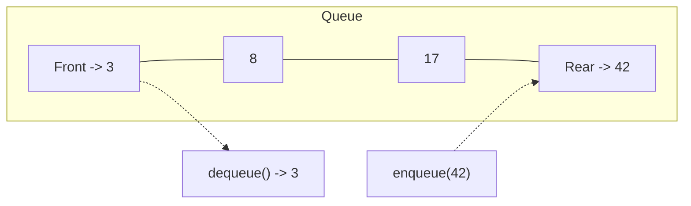
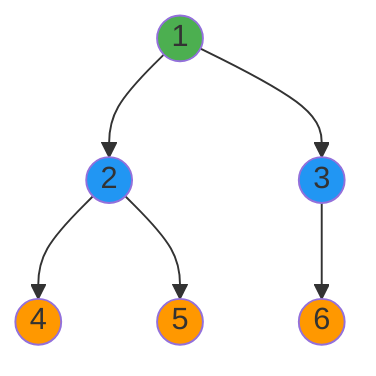

# Queues

## Definition

A **queue** is a linear data structure that follows the **First-In, First-Out (FIFO)** principle. The first element added is the first one removed. Think of a line at a checkout — people are served in the order they arrive.



### Variants

- **Simple Queue (FIFO)** — standard queue described above
- **Double-Ended Queue (Deque)** — insert and remove from both ends
- **Priority Queue** — elements dequeued by priority, not insertion order (see [Heaps](heaps.md))
- **Circular Queue** — fixed-size array where the end wraps around to the beginning

## Key Operations & Complexity

| Operation     | Time | Space | Description                          |
|---------------|:----:|:-----:|--------------------------------------|
| `enqueue(x)`  | O(1) | O(1)  | Add element to rear                  |
| `dequeue()`   | O(1) | O(1)  | Remove and return front element      |
| `peek()`      | O(1) | O(1)  | Return front element without removing|
| `isEmpty()`   | O(1) | O(1)  | Check if queue is empty              |
| `size()`      | O(1) | O(1)  | Return number of elements            |

**Overall space:** O(n) where n is the number of elements stored.

!!! warning "Array-based queue pitfall"
    A naive array-based queue with `pop(0)` is **O(n)** because every element shifts. Use `collections.deque` or a circular buffer for true O(1) operations.

## Implementation

=== "Using collections.deque"

    ```python
    from collections import deque

    class Queue:
        def __init__(self):
            self._items = deque()

        def enqueue(self, item):
            self._items.append(item)

        def dequeue(self):
            if self.is_empty():
                raise IndexError("dequeue from empty queue")
            return self._items.popleft()

        def peek(self):
            if self.is_empty():
                raise IndexError("peek at empty queue")
            return self._items[0]

        def is_empty(self):
            return len(self._items) == 0

        def __len__(self):
            return len(self._items)
    ```

=== "Circular buffer (fixed size)"

    ```python
    class CircularQueue:
        def __init__(self, capacity: int):
            self._items = [None] * capacity
            self._head = 0
            self._tail = 0
            self._size = 0
            self._capacity = capacity

        def enqueue(self, item):
            if self._size == self._capacity:
                raise OverflowError("queue is full")
            self._items[self._tail] = item
            self._tail = (self._tail + 1) % self._capacity
            self._size += 1

        def dequeue(self):
            if self.is_empty():
                raise IndexError("dequeue from empty queue")
            item = self._items[self._head]
            self._head = (self._head + 1) % self._capacity
            self._size -= 1
            return item

        def peek(self):
            if self.is_empty():
                raise IndexError("peek at empty queue")
            return self._items[self._head]

        def is_empty(self):
            return self._size == 0

        def is_full(self):
            return self._size == self._capacity
    ```

=== "Linked-list-based"

    ```python
    class Node:
        def __init__(self, val, next_node=None):
            self.val = val
            self.next = next_node

    class Queue:
        def __init__(self):
            self._head = None
            self._tail = None
            self._size = 0

        def enqueue(self, item):
            node = Node(item)
            if self._tail:
                self._tail.next = node
            self._tail = node
            if self._head is None:
                self._head = node
            self._size += 1

        def dequeue(self):
            if self.is_empty():
                raise IndexError("dequeue from empty queue")
            val = self._head.val
            self._head = self._head.next
            if self._head is None:
                self._tail = None
            self._size -= 1
            return val

        def is_empty(self):
            return self._head is None

        def __len__(self):
            return self._size
    ```

## Major Algorithms Using Queues

### BFS (Breadth-First Search)

BFS explores all neighbors at the current depth before moving deeper. A queue ensures nodes are visited in order of discovery.

```python
from collections import deque

def bfs(graph: dict, start) -> list:
    visited = set([start])
    queue = deque([start])
    order = []
    while queue:
        node = queue.popleft()
        order.append(node)
        for neighbor in graph[node]:
            if neighbor not in visited:
                visited.add(neighbor)
                queue.append(neighbor)
    return order
```



**BFS order from node 1:** 1 -> 2 -> 3 -> 4 -> 5 -> 6 (level by level)

### Shortest Path in Unweighted Graph

BFS naturally finds the shortest path (fewest edges) because it explores in order of distance from the source.

```python
from collections import deque

def shortest_path(graph: dict, start, end) -> list | None:
    if start == end:
        return [start]
    visited = {start}
    queue = deque([(start, [start])])
    while queue:
        node, path = queue.popleft()
        for neighbor in graph[node]:
            if neighbor == end:
                return path + [neighbor]
            if neighbor not in visited:
                visited.add(neighbor)
                queue.append((neighbor, path + [neighbor]))
    return None
```

### Level-Order Tree Traversal

```python
from collections import deque

def level_order(root) -> list[list]:
    if not root:
        return []
    result = []
    queue = deque([root])
    while queue:
        level = []
        for _ in range(len(queue)):
            node = queue.popleft()
            level.append(node.val)
            if node.left:
                queue.append(node.left)
            if node.right:
                queue.append(node.right)
        result.append(level)
    return result
```

### Sliding Window Maximum (Monotonic Deque)

Use a deque to maintain candidates for the maximum in the current window. Elements are kept in decreasing order.

```python
from collections import deque

def max_sliding_window(nums: list[int], k: int) -> list[int]:
    dq = deque()  # stores indices
    result = []
    for i, num in enumerate(nums):
        while dq and dq[0] <= i - k:
            dq.popleft()
        while dq and nums[dq[-1]] < num:
            dq.pop()
        dq.append(i)
        if i >= k - 1:
            result.append(nums[dq[0]])
    return result
```

## Common Use Cases

- **BFS traversal** — graph exploration, shortest path in unweighted graphs
- **Task scheduling** — OS process scheduler, print job queues
- **Buffering** — I/O buffers, network packet queues, message queues (Kafka, RabbitMQ)
- **Rate limiting** — sliding window implemented with a deque of timestamps
- **Cache eviction** — FIFO eviction policy
- **Level-order processing** — tree traversal, serialization

## Flashcard Review

??? flashcard "What ordering principle does a queue follow?"

    **FIFO** — First In, First Out. The earliest added element is the first one removed.

??? flashcard "Why is `list.pop(0)` bad for a queue in Python?"

    `list.pop(0)` is **O(n)** because it shifts every remaining element left by one position. Use `collections.deque` which has O(1) `popleft()` via a doubly-linked list of fixed-size blocks.

??? flashcard "What is the difference between BFS and DFS in terms of data structures?"

    **BFS uses a queue** (FIFO) — explores level by level, finds shortest path.
    **DFS uses a stack** (LIFO) — explores as deep as possible first, uses less memory on wide graphs.

??? flashcard "What is a circular queue and why use it?"

    A fixed-size queue where the tail wraps around to the beginning of the array when it reaches the end. Avoids wasted space from dequeued elements and avoids shifting. Common in embedded systems and kernel buffers.

??? flashcard "What is a monotonic deque?"

    A deque where elements are maintained in sorted order (increasing or decreasing). Used for sliding window min/max problems in O(n) time. Elements are removed from the back when they violate the monotonic property.

## Quiz

<div class="quiz" markdown>

**Which traversal algorithm uses a queue?**
{: .quiz-question}

<div class="quiz-options" data-correct="b">
  <button class="quiz-option" data-value="a">DFS (Depth-First Search)</button>
  <button class="quiz-option" data-value="b">BFS (Breadth-First Search)</button>
  <button class="quiz-option" data-value="c">Binary Search</button>
  <button class="quiz-option" data-value="d">Quicksort</button>
</div>

<div class="quiz-feedback" data-correct="Correct! BFS uses a queue to explore nodes level by level. DFS uses a stack." data-incorrect="BFS (Breadth-First Search) uses a queue to explore all neighbors at the current depth before moving deeper. DFS uses a stack."></div>

</div>

<div class="quiz" markdown>

**What is the time complexity of `deque.popleft()` in Python?**
{: .quiz-question}

<div class="quiz-options" data-correct="a">
  <button class="quiz-option" data-value="a">O(1)</button>
  <button class="quiz-option" data-value="b">O(n)</button>
  <button class="quiz-option" data-value="c">O(log n)</button>
  <button class="quiz-option" data-value="d">Amortized O(1)</button>
</div>

<div class="quiz-feedback" data-correct="Correct! deque is implemented as a doubly-linked list of fixed-size blocks, giving true O(1) for both ends." data-incorrect="deque.popleft() is O(1) — not amortized, but true O(1). It's implemented as a doubly-linked list of blocks, unlike a Python list which requires shifting."></div>

</div>

<div class="quiz" markdown>

**You need to find the shortest path between two nodes in an unweighted graph. Which approach works?**
{: .quiz-question}

<div class="quiz-options" data-correct="c">
  <button class="quiz-option" data-value="a">DFS from the source</button>
  <button class="quiz-option" data-value="b">Sort all paths by length</button>
  <button class="quiz-option" data-value="c">BFS from the source</button>
  <button class="quiz-option" data-value="d">Binary search on the adjacency list</button>
</div>

<div class="quiz-feedback" data-correct="Correct! BFS explores nodes in order of distance from the source, so the first time it reaches the target is via the shortest path." data-incorrect="BFS is the right choice. It explores in order of distance, so the first path found to any node is the shortest (in an unweighted graph). DFS may find a path but not necessarily the shortest."></div>

</div>

<div class="quiz" markdown>

**What is the output of: enqueue(A), enqueue(B), dequeue(), enqueue(C), dequeue(), dequeue()?**
{: .quiz-question}

<div class="quiz-options" data-correct="a">
  <button class="quiz-option" data-value="a">A, B, C</button>
  <button class="quiz-option" data-value="b">C, B, A</button>
  <button class="quiz-option" data-value="c">B, C, A</button>
  <button class="quiz-option" data-value="d">A, C, B</button>
</div>

<div class="quiz-feedback" data-correct="Correct! FIFO: enqueue A, B. Dequeue gives A. Enqueue C. Dequeue gives B. Dequeue gives C. Output: A, B, C." data-incorrect="Remember FIFO: first in, first out. After enqueue(A), enqueue(B), dequeue returns A. After enqueue(C), dequeue returns B, then C. Answer: A, B, C."></div>

</div>

## LeetCode Problems

| # | Problem | Difficulty | Key Concept |
|---|---------|:----------:|-------------|
| 232 | Implement Queue using Stacks | Easy | Two-stack queue trick |
| 225 | Implement Stack using Queues | Easy | Understanding the duality |
| 102 | Binary Tree Level Order Traversal | Medium | BFS with queue |
| 200 | Number of Islands | Medium | BFS grid traversal |
| 994 | Rotting Oranges | Medium | Multi-source BFS |
| 239 | Sliding Window Maximum | Hard | Monotonic deque |
| 297 | Serialize and Deserialize Binary Tree | Hard | BFS-based serialization |
