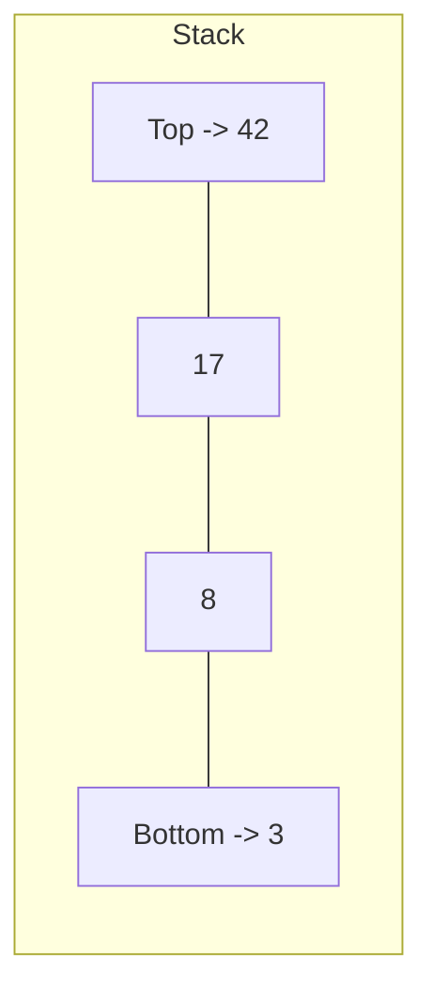

# Stacks

## Definition

A **stack** is a linear data structure that follows the **Last-In, First-Out (LIFO)** principle. The last element added is the first one removed. Think of a stack of plates: you add to the top and remove from the top.



## Key Operations & Complexity

| Operation   | Time | Space | Description                          |
|-------------|:----:|:-----:|--------------------------------------|
| `push(x)`   | O(1) | O(1)  | Add element to top                   |
| `pop()`     | O(1) | O(1)  | Remove and return top element        |
| `peek()`    | O(1) | O(1)  | Return top element without removing  |
| `isEmpty()` | O(1) | O(1)  | Check if stack is empty              |
| `size()`    | O(1) | O(1)  | Return number of elements            |

**Overall space:** O(n) where n is the number of elements stored.

## Implementation

=== "Array-based (Python list)"

    ```python
    class Stack:
        def __init__(self):
            self._items = []

        def push(self, item):
            self._items.append(item)

        def pop(self):
            if self.is_empty():
                raise IndexError("pop from empty stack")
            return self._items.pop()

        def peek(self):
            if self.is_empty():
                raise IndexError("peek at empty stack")
            return self._items[-1]

        def is_empty(self):
            return len(self._items) == 0

        def __len__(self):
            return len(self._items)
    ```

=== "Linked-list-based"

    ```python
    class Node:
        def __init__(self, val, next_node=None):
            self.val = val
            self.next = next_node

    class Stack:
        def __init__(self):
            self._top = None
            self._size = 0

        def push(self, item):
            self._top = Node(item, self._top)
            self._size += 1

        def pop(self):
            if self.is_empty():
                raise IndexError("pop from empty stack")
            val = self._top.val
            self._top = self._top.next
            self._size -= 1
            return val

        def peek(self):
            if self.is_empty():
                raise IndexError("peek at empty stack")
            return self._top.val

        def is_empty(self):
            return self._top is None

        def __len__(self):
            return self._size
    ```

!!! note "Python's built-in options"
    In practice, use `collections.deque` for a stack — it has O(1) `append`/`pop` and is thread-safe for single-ended operations. Python lists work fine too but `deque` avoids occasional O(n) reallocation costs.

## Major Algorithms Using Stacks

### Balanced Parentheses Checking

Given a string of brackets, determine if every opening bracket has a matching closing bracket in the correct order.

```python
def is_balanced(s: str) -> bool:
    stack = []
    pairs = {')': '(', ']': '[', '}': '{'}
    for char in s:
        if char in '([{':
            stack.append(char)
        elif char in ')]}':
            if not stack or stack[-1] != pairs[char]:
                return False
            stack.pop()
    return len(stack) == 0
```

**Why a stack?** Brackets must be closed in reverse order of opening — LIFO is the natural fit.

### Monotonic Stack (Next Greater Element)

For each element in an array, find the next element that is greater. A monotonic stack processes this in O(n) instead of O(n^2).

```python
def next_greater_element(nums: list[int]) -> list[int]:
    result = [-1] * len(nums)
    stack = []  # stores indices
    for i, num in enumerate(nums):
        while stack and nums[stack[-1]] < num:
            result[stack.pop()] = num
        stack.append(i)
    return result
```

**Trace through `[4, 2, 6, 1, 8]`:**

| Step | Current | Stack (values) | Action | Result so far |
|------|---------|---------------|--------|--------------|
| 1 | 4 | [4] | Push | [-1,-1,-1,-1,-1] |
| 2 | 2 | [4,2] | Push (2 < 4) | [-1,-1,-1,-1,-1] |
| 3 | 6 | [6] | Pop 2->6, Pop 4->6, Push 6 | [6,6,-1,-1,-1] |
| 4 | 1 | [6,1] | Push (1 < 6) | [6,6,-1,-1,-1] |
| 5 | 8 | [8] | Pop 1->8, Pop 6->8, Push 8 | [6,6,-1,8,-1] |

**Result:** `[6, 6, -1, 8, -1]`

### DFS Using Explicit Stack

Depth-first search is naturally recursive, but an explicit stack avoids call-stack overflow on deep graphs.

```python
def dfs_iterative(graph: dict, start) -> set:
    visited = set()
    stack = [start]
    while stack:
        node = stack.pop()
        if node in visited:
            continue
        visited.add(node)
        for neighbor in graph[node]:
            if neighbor not in visited:
                stack.append(neighbor)
    return visited
```

### Evaluating Postfix (Reverse Polish Notation)

```python
def eval_rpn(tokens: list[str]) -> int:
    stack = []
    ops = {
        '+': lambda a, b: a + b,
        '-': lambda a, b: a - b,
        '*': lambda a, b: a * b,
        '/': lambda a, b: int(a / b),
    }
    for token in tokens:
        if token in ops:
            b, a = stack.pop(), stack.pop()
            stack.append(ops[token](a, b))
        else:
            stack.append(int(token))
    return stack[0]
```

## Common Use Cases

- **Function call management** — the call stack tracks return addresses and local variables
- **Undo/redo operations** — editors push states onto a stack; undo pops, redo pushes to a second stack
- **Expression evaluation** — infix-to-postfix conversion, postfix evaluation
- **Backtracking algorithms** — DFS, maze solving, N-queens
- **Browser history** — back button pops from history stack
- **Syntax parsing** — compilers use stacks for matching delimiters and operator precedence

## Flashcard Review

??? flashcard "What ordering principle does a stack follow?"

    **LIFO** — Last In, First Out. The most recently added element is the first one removed.

??? flashcard "What is the time complexity of all core stack operations?"

    **O(1)** for push, pop, peek, isEmpty, and size. No operation requires traversal.

??? flashcard "When would you choose a linked-list stack over an array stack?"

    When you need **guaranteed O(1) push/pop** with no amortization cost, or when the maximum size is unknown and you want to avoid reallocation. Array-based stacks have better cache locality, so prefer them in practice unless you have a specific reason.

??? flashcard "What is a monotonic stack?"

    A stack where elements are maintained in sorted (increasing or decreasing) order. Used to efficiently solve "next greater/smaller element" problems in **O(n)** time instead of O(n^2).

??? flashcard "How does DFS relate to stacks?"

    DFS explores as deep as possible before backtracking — exactly LIFO order. Recursive DFS uses the call stack implicitly. Iterative DFS uses an explicit stack to avoid stack overflow on deep graphs.

??? flashcard "What is stack underflow?"

    An error that occurs when you try to `pop()` or `peek()` on an empty stack. Implementations should either raise an exception or return a sentinel value.

## Quiz

<div class="quiz" markdown>

**What happens when you call `pop()` on an empty stack?**
{: .quiz-question}

<div class="quiz-options" data-correct="c">
  <button class="quiz-option" data-value="a">Returns None</button>
  <button class="quiz-option" data-value="b">Returns 0</button>
  <button class="quiz-option" data-value="c">Raises an error (stack underflow)</button>
  <button class="quiz-option" data-value="d">Returns the last popped element</button>
</div>

<div class="quiz-feedback" data-correct="Correct! Popping from an empty stack is a stack underflow error. Most implementations raise an exception." data-incorrect="Not quite. Popping from an empty stack causes a stack underflow — an error condition. Most implementations raise an exception."></div>

</div>

<div class="quiz" markdown>

**Which problem is NOT typically solved with a stack?**
{: .quiz-question}

<div class="quiz-options" data-correct="d">
  <button class="quiz-option" data-value="a">Balanced parentheses checking</button>
  <button class="quiz-option" data-value="b">DFS traversal</button>
  <button class="quiz-option" data-value="c">Undo/redo functionality</button>
  <button class="quiz-option" data-value="d">Finding the shortest path in a graph</button>
</div>

<div class="quiz-feedback" data-correct="Correct! Shortest path uses BFS (queue-based), not a stack. DFS uses a stack but finds paths, not necessarily shortest ones." data-incorrect="Not quite. Shortest path in an unweighted graph is solved with BFS (a queue), not a stack."></div>

</div>

<div class="quiz" markdown>

**What is the output of: push(1), push(2), pop(), push(3), pop(), pop()?**
{: .quiz-question}

<div class="quiz-options" data-correct="b">
  <button class="quiz-option" data-value="a">1, 2, 3</button>
  <button class="quiz-option" data-value="b">2, 3, 1</button>
  <button class="quiz-option" data-value="c">3, 2, 1</button>
  <button class="quiz-option" data-value="d">1, 3, 2</button>
</div>

<div class="quiz-feedback" data-correct="Correct! push(1), push(2) then pop returns 2. push(3) then pop returns 3. Final pop returns 1. Output: 2, 3, 1." data-incorrect="Trace through it: after push(1), push(2), the top is 2. Pop gives 2. Push(3), top is 3. Pop gives 3. Pop gives 1. Answer: 2, 3, 1."></div>

</div>

<div class="quiz" markdown>

**A monotonic decreasing stack processes `[3, 1, 4, 1, 5]`. Which elements remain on the stack at the end?**
{: .quiz-question}

<div class="quiz-options" data-correct="a">
  <button class="quiz-option" data-value="a">5</button>
  <button class="quiz-option" data-value="b">5, 1</button>
  <button class="quiz-option" data-value="c">3, 1</button>
  <button class="quiz-option" data-value="d">5, 4, 3</button>
</div>

<div class="quiz-feedback" data-correct="Correct! 5 is the largest element — in a decreasing stack, every smaller element gets popped when a larger one arrives. Only 5 remains." data-incorrect="In a monotonic decreasing stack, we pop elements smaller than the incoming one. 5 is larger than everything before it, so all previous elements get popped. Only 5 remains."></div>

</div>

## LeetCode Problems

Practice these in order of difficulty:

| # | Problem | Difficulty | Key Concept |
|---|---------|:----------:|-------------|
| 20 | Valid Parentheses | Easy | Balanced brackets |
| 155 | Min Stack | Medium | Auxiliary stack pattern |
| 150 | Evaluate Reverse Polish Notation | Medium | Postfix evaluation |
| 739 | Daily Temperatures | Medium | Monotonic stack |
| 496 | Next Greater Element I | Easy | Monotonic stack intro |
| 84 | Largest Rectangle in Histogram | Hard | Monotonic stack mastery |
| 224 | Basic Calculator | Hard | Recursive descent + stack |
