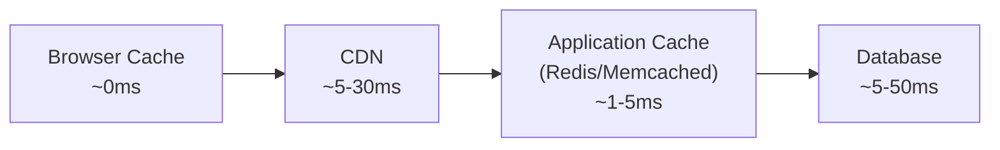
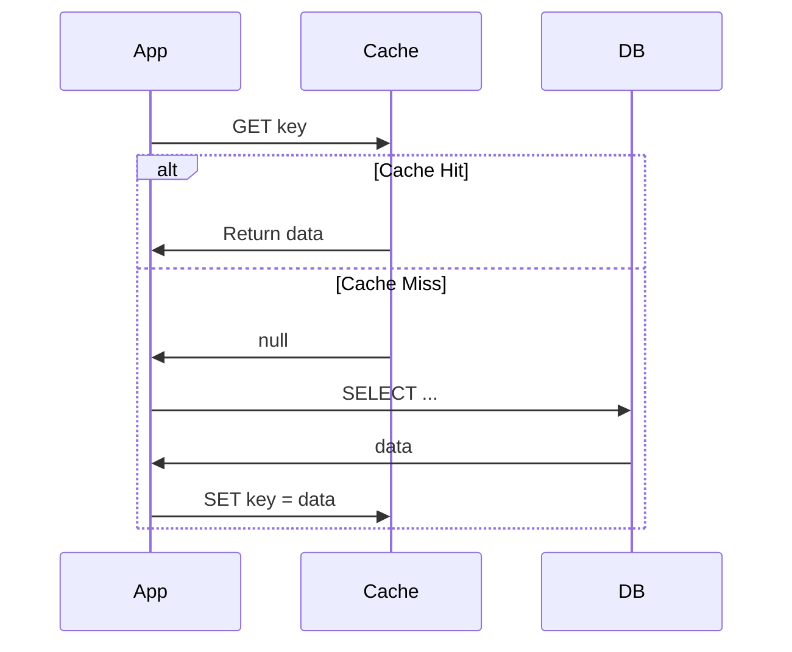
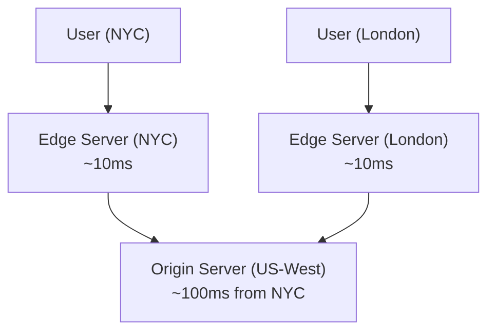

# Caching

## Overview

A **cache** stores copies of frequently accessed data in a faster storage layer to reduce latency and load on the primary data source. Caching is one of the highest-leverage techniques in system design — it can turn a 50ms database query into a 1ms cache hit.

## Cache Hierarchy



Each layer closer to the user is faster but has less capacity:

| Layer | Latency | Capacity | Scope |
|-------|:-------:|:--------:|-------|
| CPU cache (L1/L2/L3) | 1-10 ns | KB-MB | Single machine |
| In-process cache | ~100 ns | MB-GB | Single process |
| Distributed cache (Redis) | ~1 ms | GB-TB | Cluster-wide |
| CDN | ~5-30 ms | TB+ | Global |
| Database | ~5-50 ms | TB+ | Primary store |

## Cache Strategies (Read)

### Cache-Aside (Lazy Loading)

The application checks the cache first. On a miss, it reads from the database and writes the result to the cache.



**Pros:** Only caches data that is actually requested. Cache failure doesn't break reads.

**Cons:** First request for each key is always slow (cold start). Stale data if DB is updated without invalidating cache.

### Read-Through

The cache itself is responsible for loading from the database on a miss. The application only talks to the cache.

**Pros:** Simpler application code — cache handles loading logic.

**Cons:** Cache must know how to query the DB. Harder to customize per-query.

## Cache Strategies (Write)

### Write-Through

Every write goes to both the cache and the database synchronously.

**Pros:** Cache is always consistent with DB.

**Cons:** Higher write latency (two writes per operation). May cache data that is never read.

### Write-Behind (Write-Back)

Writes go to the cache immediately, then asynchronously flush to the database.

**Pros:** Very fast writes. Can batch multiple writes to the DB.

**Cons:** Risk of data loss if cache crashes before flushing. More complex consistency model.

### Write-Around

Writes go directly to the database, bypassing the cache. The cache is populated only on reads (cache-aside).

**Pros:** Avoids caching data that may not be read.

**Cons:** Read-after-write is always a cache miss until the next read loads it.

## Strategy Summary

| Strategy | Read Latency | Write Latency | Consistency | Best For |
|----------|:-----------:|:------------:|:-----------:|----------|
| Cache-aside | Fast on hit | Normal | Eventual | General purpose, read-heavy |
| Read-through | Fast on hit | Normal | Eventual | Simpler app code |
| Write-through | Fast on hit | Slower | Strong | Read-heavy + consistency needs |
| Write-behind | Fast on hit | Fast | Weak | Write-heavy workloads |
| Write-around | Slow on first read | Normal | Strong | Write-heavy, rarely re-read |

## Eviction Policies

When the cache is full, which entry gets removed?

| Policy | How It Works | Tradeoff |
|--------|-------------|----------|
| **LRU** (Least Recently Used) | Evict the entry not accessed for the longest time | Good general purpose. O(1) with hashmap + doubly-linked list |
| **LFU** (Least Frequently Used) | Evict the entry accessed the fewest times | Better for skewed access patterns. More complex to implement |
| **FIFO** | Evict the oldest entry | Simplest. Ignores access patterns |
| **TTL** (Time To Live) | Entries expire after a fixed duration | Good for time-sensitive data. Can coexist with other policies |
| **Random** | Evict a random entry | Surprisingly effective. Zero overhead |

!!! note "LRU implementation"
    An LRU cache is a hashmap (O(1) lookup) + doubly-linked list (O(1) move-to-front/evict). This is why LRU Cache (LC #146) is such a common interview question.

## Cache Invalidation

> "There are only two hard things in Computer Science: cache invalidation and naming things." — Phil Karlton

### Strategies

**TTL-based:** Set an expiration time. Simple, but data can be stale for up to TTL seconds.

**Event-driven:** Invalidate the cache when the underlying data changes. More consistent, but requires coordination.

**Versioned keys:** Include a version number in the cache key (e.g., `user:123:v7`). Bump version on write.

### Common Pitfalls

- **Thundering herd:** TTL expires on a hot key, hundreds of requests simultaneously hit the DB. Fix: request coalescing (only one request fetches, others wait), or stale-while-revalidate.
- **Cache stampede:** Similar to thundering herd but on cold start. Fix: cache warming on deploy.
- **Inconsistency window:** Between DB write and cache invalidation, stale data is served. Fix: shorter TTLs, write-through, or accept eventual consistency.

## Distributed Caching

### Redis

In-memory key-value store. Supports strings, lists, sets, sorted sets, hashes, streams.

**Key patterns:**

- **Simple cache:** `SET key value EX 300` (5 min TTL)
- **Counter:** `INCR page:views:123`
- **Rate limiting:** `INCR` + `EXPIRE` on a per-user key
- **Distributed lock:** `SET lock:resource NX EX 10` (set-if-not-exists with TTL)
- **Pub/sub:** real-time notifications

**Deployment modes:**

| Mode | Description | Tradeoff |
|------|------------|----------|
| Single instance | One Redis server | Simple but SPOF |
| Sentinel | Automatic failover with monitoring | High availability, no sharding |
| Cluster | Sharding across multiple nodes | Scales horizontally, more complex |

### Memcached

Simpler than Redis — pure key-value cache with no persistence, no complex data types. Multi-threaded (Redis is single-threaded).

**When to choose Memcached over Redis:** simple caching with no data structure needs, and you want multi-threaded performance.

## CDN (Content Delivery Network)

A CDN caches content at **edge servers** geographically close to users.



**What to cache on CDN:**

- Static assets (images, CSS, JS, fonts)
- API responses (with appropriate Cache-Control headers)
- Rendered HTML pages (for content that changes rarely)

**Cache-Control headers:**

```
Cache-Control: public, max-age=31536000  # CDN + browser, 1 year
Cache-Control: private, max-age=300      # browser only, 5 min
Cache-Control: no-cache                  # must revalidate with server
Cache-Control: no-store                  # never cache
```

## Flashcard Review

??? flashcard "What is cache-aside (lazy loading)?"

    App checks cache first. On miss, reads from DB and writes result to cache. The cache only holds data that has been requested. Most common caching pattern.

??? flashcard "What is the thundering herd problem?"

    A hot cache key expires, and many concurrent requests simultaneously miss the cache and hit the database. Fix: request coalescing (one fetches, others wait), locking, or stale-while-revalidate.

??? flashcard "LRU vs LFU: when to use each?"

    **LRU** (Least Recently Used): good general-purpose policy, works well when recent access predicts future access.
    **LFU** (Least Frequently Used): better when some items are consistently popular regardless of recency (e.g., homepage data).

??? flashcard "Write-through vs write-behind?"

    **Write-through:** write to cache AND DB synchronously. Strong consistency, higher write latency.
    **Write-behind:** write to cache, async flush to DB. Fast writes, risk of data loss if cache crashes.

??? flashcard "What does a CDN cache?"

    Static assets (images, CSS, JS), API responses (with proper Cache-Control), rendered HTML. Served from edge servers close to users. Reduces latency from ~100ms (cross-continent) to ~10ms (edge).

## Quiz

<div class="quiz" markdown>

**Your read-heavy service has a 99% cache hit rate with TTL of 60s. Users occasionally see stale data for up to a minute. Which strategy would fix this while keeping performance?**
{: .quiz-question}

<div class="quiz-options" data-correct="b">
  <button class="quiz-option" data-value="a">Switch to write-behind caching</button>
  <button class="quiz-option" data-value="b">Add event-driven invalidation on writes</button>
  <button class="quiz-option" data-value="c">Reduce TTL to 1 second</button>
  <button class="quiz-option" data-value="d">Remove the cache entirely</button>
</div>

<div class="quiz-feedback" data-correct="Correct! Event-driven invalidation clears the cache immediately when data changes, eliminating the staleness window while keeping the performance benefits of caching." data-incorrect="Event-driven invalidation is the right fix. Reducing TTL to 1s would increase DB load 60x. Write-behind makes consistency worse. Removing the cache kills performance."></div>

</div>

<div class="quiz" markdown>

**A popular product page's cache key expires and 10,000 requests simultaneously hit the database. What is this called?**
{: .quiz-question}

<div class="quiz-options" data-correct="a">
  <button class="quiz-option" data-value="a">Thundering herd / cache stampede</button>
  <button class="quiz-option" data-value="b">Cache poisoning</button>
  <button class="quiz-option" data-value="c">Write amplification</button>
  <button class="quiz-option" data-value="d">Split brain</button>
</div>

<div class="quiz-feedback" data-correct="Correct! Thundering herd (or cache stampede) happens when a hot key expires and many requests simultaneously miss the cache. Fix with request coalescing or stale-while-revalidate." data-incorrect="This is a thundering herd / cache stampede. Many concurrent requests miss the same cache key and overwhelm the database. Solutions: request coalescing, distributed locking, or serving stale data while revalidating."></div>

</div>

<div class="quiz" markdown>

**Which cache eviction policy needs a hashmap + doubly-linked list for O(1) operations?**
{: .quiz-question}

<div class="quiz-options" data-correct="b">
  <button class="quiz-option" data-value="a">FIFO</button>
  <button class="quiz-option" data-value="b">LRU</button>
  <button class="quiz-option" data-value="c">Random</button>
  <button class="quiz-option" data-value="d">TTL</button>
</div>

<div class="quiz-feedback" data-correct="Correct! LRU needs O(1) lookup (hashmap) and O(1) move-to-front + eviction (doubly-linked list). The hashmap maps keys to linked list nodes." data-incorrect="LRU requires a hashmap for O(1) key lookup and a doubly-linked list for O(1) reordering (move accessed items to front, evict from back)."></div>

</div>

<div class="quiz" markdown>

**When should you use write-behind (write-back) caching?**
{: .quiz-question}

<div class="quiz-options" data-correct="c">
  <button class="quiz-option" data-value="a">When you need strong consistency</button>
  <button class="quiz-option" data-value="b">When data loss is unacceptable</button>
  <button class="quiz-option" data-value="c">When write throughput is the bottleneck</button>
  <button class="quiz-option" data-value="d">When you have a read-heavy workload</button>
</div>

<div class="quiz-feedback" data-correct="Correct! Write-behind absorbs writes in the cache and flushes to DB asynchronously, dramatically improving write throughput. The tradeoff is risk of data loss if the cache crashes." data-incorrect="Write-behind caching is for write-heavy workloads where throughput matters more than consistency or durability. Writes go to cache first, then async to DB."></div>

</div>
