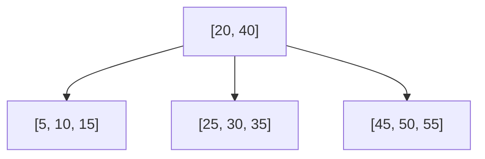
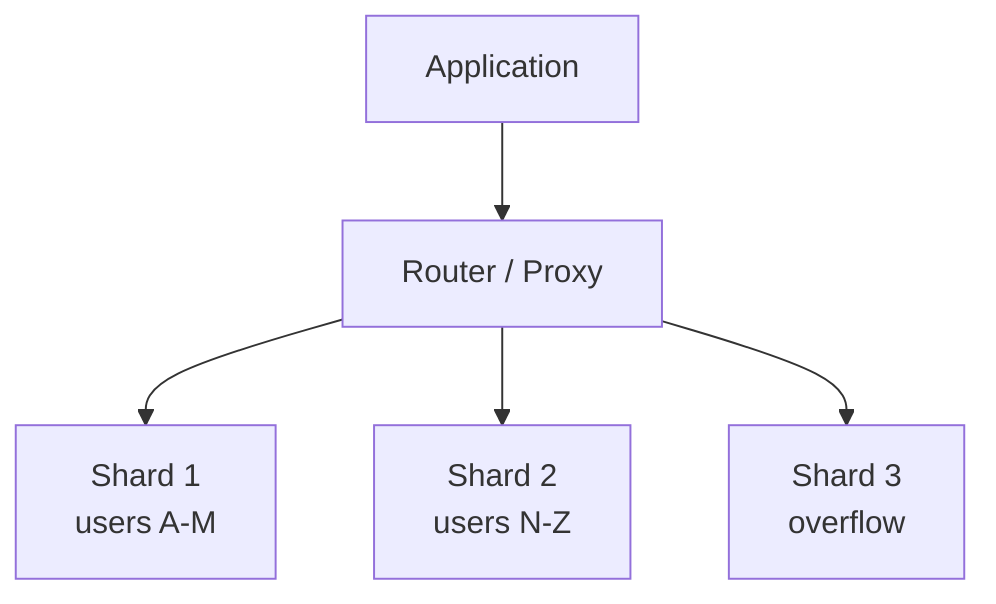
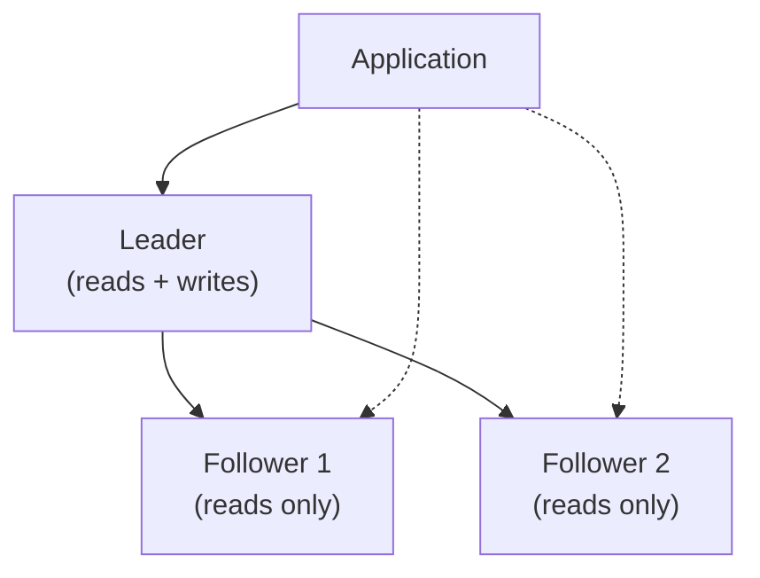

# Databases

## Overview

Databases are the persistence layer of every system. Choosing the right database and understanding its characteristics is one of the most impactful decisions in system design.

## SQL vs NoSQL

| | SQL (Relational) | NoSQL |
|--|------------------|-------|
| **Data model** | Tables with rows and columns, strict schema | Various: document, key-value, column-family, graph |
| **Schema** | Fixed schema, migrations required | Flexible / schema-less |
| **Query** | SQL (declarative, powerful joins) | API-specific, limited joins |
| **Scaling** | Vertical (scale up), horizontal is hard | Horizontal (scale out) by design |
| **Transactions** | ACID guarantees | Usually eventual consistency (some offer ACID) |
| **Examples** | PostgreSQL, MySQL, SQLite | MongoDB (document), Redis (KV), Cassandra (column), Neo4j (graph) |

### When to Use SQL

- Complex relationships between entities (joins)
- Strong consistency requirements (financial data, inventory)
- Complex queries with aggregation, filtering, grouping
- Well-defined, stable schema

### When to Use NoSQL

- High write throughput at scale
- Flexible or evolving schema
- Simple access patterns (key-value lookups, document retrieval)
- Horizontal scaling is a primary requirement
- Denormalized data is acceptable

## ACID Properties

Every SQL transaction guarantees:

| Property | Meaning | Example |
|----------|---------|---------|
| **Atomicity** | All operations succeed or all fail | Bank transfer: debit AND credit, never just one |
| **Consistency** | Database moves from one valid state to another | Foreign key constraints are never violated |
| **Isolation** | Concurrent transactions don't interfere | Two users buying the last item don't both succeed |
| **Durability** | Committed data survives crashes | Write-ahead log (WAL) ensures this |

### Isolation Levels

From weakest to strongest:

| Level | Dirty Reads | Non-Repeatable Reads | Phantom Reads | Performance |
|-------|:-----------:|:-------------------:|:-------------:|:-----------:|
| Read Uncommitted | Yes | Yes | Yes | Fastest |
| Read Committed | No | Yes | Yes | Fast |
| Repeatable Read | No | No | Yes | Medium |
| Serializable | No | No | No | Slowest |

Most databases default to **Read Committed** (Postgres) or **Repeatable Read** (MySQL/InnoDB).

## Indexing

An **index** is a data structure that speeds up reads at the cost of slower writes and extra storage.

### How B-Tree Indexes Work

B-trees keep data sorted and balanced. Lookups, inserts, and deletes are all **O(log n)**.

### Index Types

| Type | Description | Use Case |
|------|------------|----------|
| **B-tree** | Balanced tree, sorted | Range queries, equality, ordering |
| **Hash** | Hash table | Equality lookups only (no ranges) |
| **GIN** | Generalized inverted index | Full-text search, JSONB, arrays |
| **Composite** | Multi-column index | Queries filtering on multiple columns |
| **Covering** | Includes all queried columns | Avoids table lookup entirely |

### Indexing Guidelines

- Index columns used in `WHERE`, `JOIN`, and `ORDER BY`
- Composite index column order matters: `(a, b)` supports queries on `a` and `(a, b)` but not `b` alone
- More indexes = slower writes (each insert updates every index)
- `EXPLAIN ANALYZE` is your best friend — always check the query plan

!!! warning "The slow query anti-pattern"
    A missing index on a column used in `WHERE` turns an O(log n) lookup into an O(n) full table scan. On a 100M row table, that is the difference between 1ms and 10 seconds.

## Normalization vs Denormalization

**Normalization:** split data into related tables to eliminate redundancy. Requires joins to reassemble.

**Denormalization:** duplicate data across tables to avoid joins. Faster reads, more complex writes.

| | Normalized | Denormalized |
|--|-----------|-------------|
| **Reads** | Slower (joins) | Faster (single table) |
| **Writes** | Faster (update one place) | Slower (update multiple copies) |
| **Storage** | Less | More |
| **Consistency** | Easier | Harder (must update all copies) |
| **Best for** | OLTP, correctness-critical | OLAP, read-heavy, NoSQL |

## Sharding (Horizontal Partitioning)

Split data across multiple database instances based on a **shard key**.

### Sharding Strategies

| Strategy | How | Tradeoff |
|----------|-----|----------|
| **Range-based** | shard by ID range (1-1M, 1M-2M, ...) | Simple, but hot spots if traffic is uneven |
| **Hash-based** | hash(shard_key) % num_shards | Even distribution, but range queries span all shards |
| **Directory-based** | lookup table maps key to shard | Most flexible, but the directory is a bottleneck/SPOF |
| **Consistent hashing** | Hash ring with virtual nodes | Minimizes data movement when adding/removing shards |

### Choosing a Shard Key

- Must be present in every query (avoids scatter-gather)
- Should distribute data evenly (avoids hot shards)
- Should minimize cross-shard queries (joins across shards are expensive)

**Common shard keys:** user_id, tenant_id, geographic region.

### Challenges

- **Cross-shard queries:** joins across shards are slow or impossible
- **Rebalancing:** adding shards requires data migration
- **Transactions:** distributed transactions across shards are complex (2PC)
- **Auto-increment IDs:** need a distributed ID generator (snowflake, UUID)

## Replication

Copy data to multiple servers for **availability** and **read scaling**.

### Leader-Follower (Primary-Replica)

- All writes go to the leader
- Followers replicate asynchronously (or synchronously)
- Read replicas handle read traffic

**Tradeoff:** asynchronous replication has replication lag (read-after-write may see stale data). Synchronous replication is consistent but slower.

### Leader-Leader (Multi-Primary)

Both nodes accept writes. Requires conflict resolution.

**Tradeoff:** higher write availability, but conflict resolution is complex (last-write-wins, CRDTs, application-level).

## Write-Ahead Log (WAL)

Before modifying data, the database writes the change to an append-only log. If the system crashes, it replays the WAL to recover.

**Why it matters:** this is how databases achieve durability (the D in ACID). It is also the mechanism behind replication (followers replay the leader's WAL).

## Common Database Choices in System Design

| Database | Type | Best For |
|----------|------|----------|
| **PostgreSQL** | Relational | General purpose, complex queries, JSONB support |
| **MySQL** | Relational | Web applications, read-heavy workloads |
| **Redis** | Key-Value | Caching, sessions, rate limiting, pub/sub |
| **DynamoDB** | Key-Value / Document | High throughput, predictable latency, serverless |
| **Cassandra** | Wide-Column | Write-heavy, time-series, high availability |
| **MongoDB** | Document | Flexible schema, rapid prototyping |
| **Elasticsearch** | Search Engine | Full-text search, log aggregation |
| **Neo4j** | Graph | Social networks, recommendation engines |

## Flashcard Review

??? flashcard "What are the ACID properties?"

    **Atomicity:** all or nothing. **Consistency:** valid state to valid state. **Isolation:** concurrent transactions don't interfere. **Durability:** committed data survives crashes. Together, they guarantee reliable transactions.

??? flashcard "When would you denormalize a database?"

    When read performance matters more than write simplicity. Denormalization duplicates data to avoid expensive joins. Common in read-heavy systems, OLAP workloads, and NoSQL databases where joins aren't supported.

??? flashcard "How do you choose a shard key?"

    It must be: (1) present in every query, (2) evenly distribute data, (3) minimize cross-shard operations. Common choices: user_id, tenant_id. Bad choices: timestamp (hot shard on current time), sequential IDs without hashing.

??? flashcard "What is replication lag and why does it matter?"

    The delay between a write on the leader and its appearance on a follower. During this window, reads from followers return stale data. Solutions: read-your-writes consistency (route reads after writes to the leader), or synchronous replication (slower writes).

??? flashcard "B-tree index vs hash index?"

    **B-tree:** supports equality, range queries, and ordering. O(log n). The default choice.
    **Hash:** O(1) equality lookups only. No range queries, no ordering. Use when you only ever look up by exact key.

## Quiz

**A social media app needs to store user profiles with flexible fields that vary per user. Which database type fits best?**
{: .quiz-question}

  <button class="quiz-option" data-value="a">Relational (PostgreSQL)</button>
  <button class="quiz-option" data-value="b">Document (MongoDB)</button>
  <button class="quiz-option" data-value="c">Key-Value (Redis)</button>
  <button class="quiz-option" data-value="d">Graph (Neo4j)</button>

**You shard a database by user_id using hash(user_id) % 4. You need to add a 5th shard. What happens?**
{: .quiz-question}

  <button class="quiz-option" data-value="a">Nothing — new data goes to shard 5</button>
  <button class="quiz-option" data-value="b">Only shard 4's data is affected</button>
  <button class="quiz-option" data-value="c">Most data needs to be reshuffled across all shards</button>
  <button class="quiz-option" data-value="d">The system automatically rebalances</button>

**Which isolation level prevents dirty reads but allows non-repeatable reads?**
{: .quiz-question}

  <button class="quiz-option" data-value="a">Read Uncommitted</button>
  <button class="quiz-option" data-value="b">Read Committed</button>
  <button class="quiz-option" data-value="c">Repeatable Read</button>
  <button class="quiz-option" data-value="d">Serializable</button>

**Your composite index is (country, city, zip). Which query can use this index efficiently?**
{: .quiz-question}

  <button class="quiz-option" data-value="a">WHERE country = 'US' AND city = 'NYC'</button>
  <button class="quiz-option" data-value="b">WHERE city = 'NYC'</button>
  <button class="quiz-option" data-value="c">WHERE zip = '10001'</button>
  <button class="quiz-option" data-value="d">WHERE city = 'NYC' AND zip = '10001'</button>

