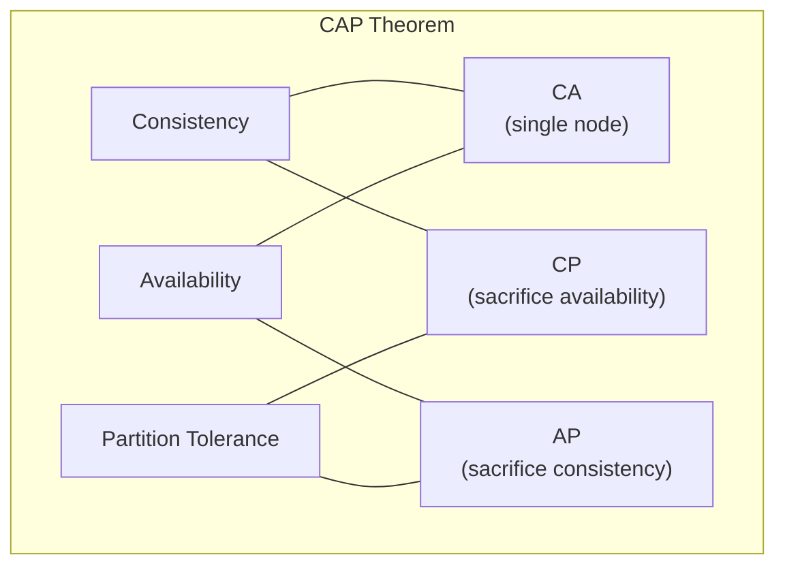
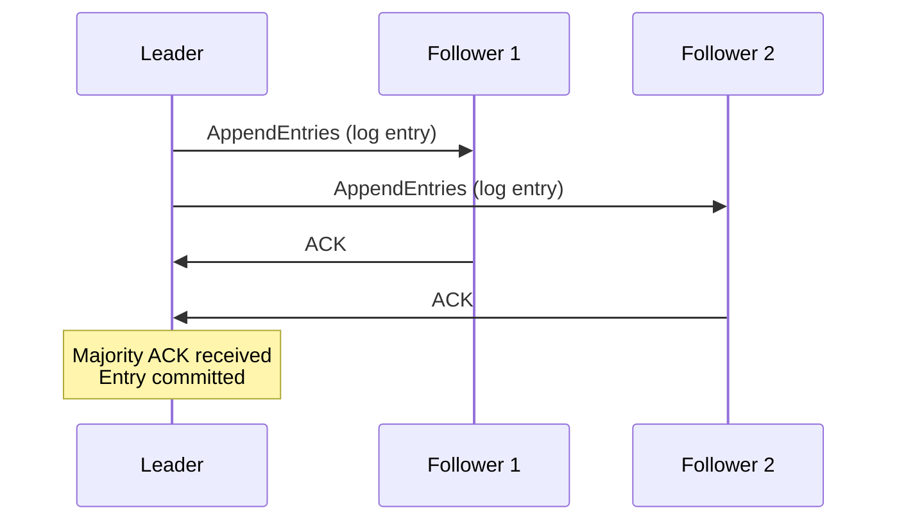
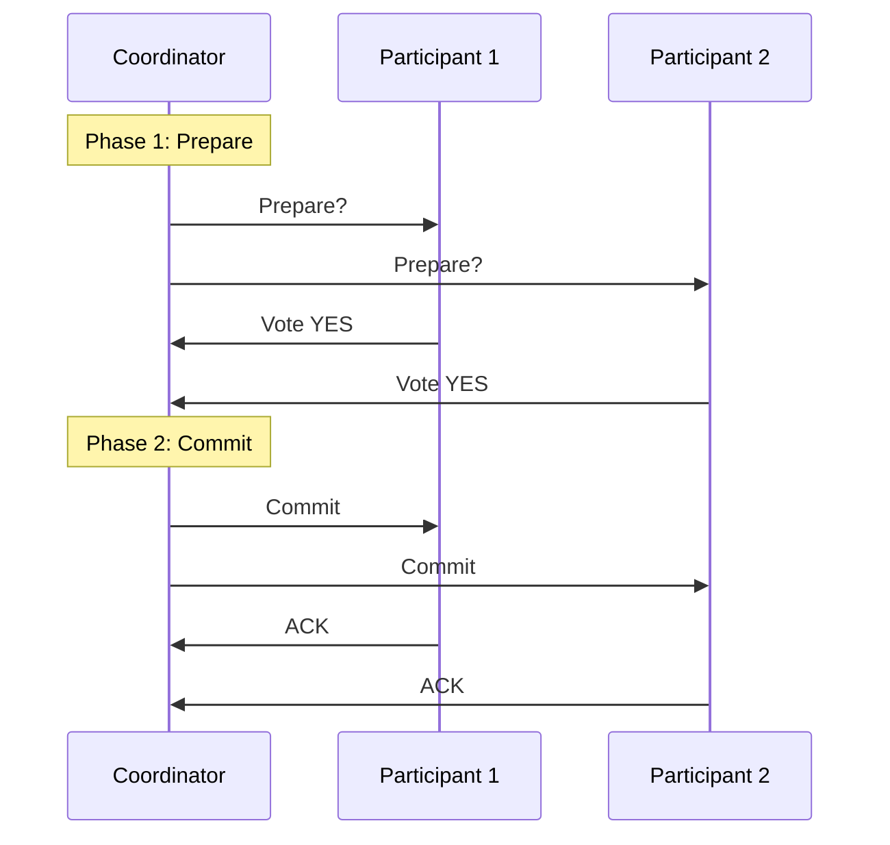
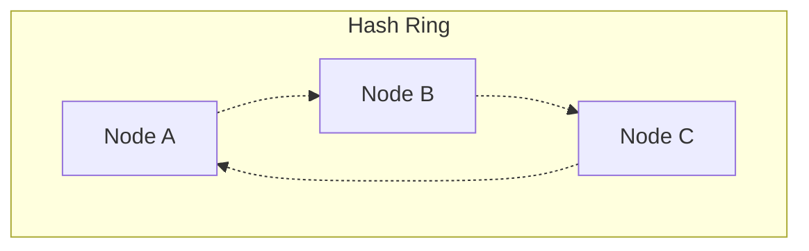

# Distributed Systems

## Overview

A **distributed system** is a collection of independent machines that appear to users as a single coherent system. Distribution introduces fundamental challenges around consistency, availability, and partition tolerance that don't exist in single-machine systems.

## CAP Theorem

In the presence of a **network partition**, a distributed system can guarantee at most two of three properties:

- **Consistency (C):** every read receives the most recent write
- **Availability (A):** every request receives a response (not necessarily the latest data)
- **Partition tolerance (P):** the system continues operating despite network splits

!!! info "CAP in practice"
    Network partitions *will* happen, so P is not optional. The real choice is between **CP** (consistent but may reject requests during partition) and **AP** (available but may serve stale data). Most real systems are tunable — Cassandra lets you choose per-query.

### PACELC: A Better Framework

**PACELC** extends CAP: if there's a **P**artition, choose **A** or **C**; **E**lse (normal operation), choose **L**atency or **C**onsistency.

| System | During Partition (PAC) | Normal Operation (ELC) |
|--------|:---------------------:|:---------------------:|
| PostgreSQL (single leader) | PC | EC |
| Cassandra | PA | EL |
| DynamoDB | PA | EL (tunable) |
| MongoDB | PC | EC |

This is more useful than CAP because most of the time there is no partition, and the latency-vs-consistency tradeoff matters more day-to-day.

## Consistency Models

### Strong Consistency

Every read returns the most recent write. Behaves as if there is a single copy of the data.

**Example:** after a `PUT`, every subsequent `GET` from any node returns the new value.

**Cost:** higher latency (must synchronize across nodes). Lower availability during partitions.

### Eventual Consistency

If no new writes occur, all replicas will eventually converge to the same value. Reads may return stale data.

**Example:** DNS propagation — after updating a DNS record, some resolvers return the old IP for minutes.

**Cost:** stale reads, need conflict resolution.

### Causal Consistency

Preserves cause-and-effect ordering. If A causes B, everyone sees A before B. Concurrent events may be seen in different orders.

**Example:** if user posts a comment, then edits it — no one sees the edit without the original post.

### Read-Your-Writes Consistency

After a write, the same client always sees their own write. Other clients may see stale data.

**Implementation:** route the client's reads to the leader for a short window after writes, or use a session token to track recency.

## Consensus

How do distributed nodes agree on a value when some may fail?

### Raft (Simplified Paxos)

Raft elects a **leader** who manages log replication.

1. **Leader election:** if the leader fails, followers timeout and start an election. A candidate needs majority votes.
2. **Log replication:** leader sends entries to followers. Entry is committed when a majority acknowledges it.
3. **Safety:** only nodes with up-to-date logs can become leader.

**Used in:** etcd, Consul, CockroachDB, TiKV.

### Two-Phase Commit (2PC)

Distributed transaction protocol for atomic commits across multiple nodes.

**Problem:** if the coordinator crashes after Phase 1, participants are stuck holding locks (blocking). This is why 2PC is avoided in large-scale systems.

**Alternative: Sagas** — break the transaction into a sequence of local transactions with compensating actions for rollback.

## Partitioning (Sharding)

Distributing data across nodes. See [Databases - Sharding](databases.md#sharding-horizontal-partitioning) for details.

### Consistent Hashing

Maps both data and nodes to a hash ring. Each node owns the range of keys from its position clockwise to the next node.

**Adding a node:** only keys in the new node's range move. ~1/N of data remaps instead of almost all.

**Virtual nodes:** each physical node maps to multiple positions on the ring for even distribution.

## Replication Patterns

### Quorum Reads/Writes

For a system with N replicas:

- **W:** number of nodes that must acknowledge a write
- **R:** number of nodes that must respond to a read
- **If R + W > N:** guaranteed to read the latest write (at least one node has both)

| Config | Consistency | Availability |
|--------|:-----------:|:------------:|
| W=N, R=1 | Strong (writes to all) | Low write availability |
| W=1, R=N | Strong (reads from all) | Low read availability |
| W=N/2+1, R=N/2+1 | Strong (majority quorum) | Balanced |
| W=1, R=1 | Eventual | High availability |

### Leader-Based vs Leaderless

| | Leader-Based | Leaderless |
|--|-------------|-----------|
| **Writes** | All go to leader | Go to any node |
| **Reads** | From leader or followers | From any node (quorum) |
| **Failover** | Need leader election | No single point of failure |
| **Consistency** | Stronger (single ordering) | Weaker (conflict resolution needed) |
| **Examples** | PostgreSQL, MySQL, MongoDB | Cassandra, DynamoDB, Riak |

## Failure Modes

### Types of Failures

| Failure | Description | Example |
|---------|------------|---------|
| **Crash failure** | Node stops responding | Server out of memory |
| **Omission failure** | Node fails to send/receive messages | Network drop |
| **Byzantine failure** | Node behaves arbitrarily (including maliciously) | Corrupted response, bug |
| **Network partition** | Subset of nodes can't communicate | Datacenter connectivity loss |

### Handling Failures

- **Heartbeats:** detect failed nodes via periodic pings
- **Timeouts:** assume failure after X seconds of no response
- **Retries with backoff:** retry transient failures with exponential backoff + jitter
- **Circuit breaker:** stop calling a failing service after N failures, periodically probe
- **Bulkheading:** isolate failures so one failing component doesn't cascade

## Key Patterns

### Idempotency

An operation is **idempotent** if performing it multiple times has the same effect as performing it once.

**Why it matters:** in distributed systems, retries are inevitable (network timeout — did the request arrive or not?). Idempotent operations are safe to retry.

**Implementation:** use an idempotency key (client-generated UUID) with each request. Server checks if it has already processed this key before executing.

### Outbox Pattern

Ensures that a database write and a message publish happen atomically — without distributed transactions.

1. Write the data AND the message to the database in one local transaction
2. A separate process reads the outbox table and publishes messages
3. Messages are marked as published after successful delivery

### Change Data Capture (CDC)

Stream database changes (inserts, updates, deletes) as events.

**Use cases:** keep caches in sync, build search indexes, replicate to analytics systems.

**Tools:** Debezium, PostgreSQL logical replication, DynamoDB Streams.

## Flashcard Review

??? flashcard "What does the CAP theorem actually say?"

    During a network partition, you must choose between **consistency** (every read sees the latest write) and **availability** (every request gets a response). Since partitions are inevitable, the real choice is CP vs AP. PACELC extends this to latency-vs-consistency tradeoffs during normal operation.

??? flashcard "What is a quorum and why does R + W > N matter?"

    A quorum is the minimum number of nodes that must participate in an operation. If R + W > N, at least one node in every read set must have the latest write, guaranteeing consistency. Common setup: N=3, W=2, R=2.

??? flashcard "Two-Phase Commit vs Sagas?"

    **2PC:** coordinator asks all participants to prepare, then commit. Atomic but blocking — if coordinator crashes, participants hold locks indefinitely.
    **Sagas:** sequence of local transactions with compensating actions for rollback. Non-blocking, eventually consistent, no global locks.

??? flashcard "What is the outbox pattern?"

    Write the data change and a message/event to the database in one local transaction. A separate process reads the outbox and publishes messages. Solves the dual-write problem (DB + message broker) without distributed transactions.

??? flashcard "What is consistent hashing and why use it?"

    A hash ring where both data and nodes are mapped to positions. Each node owns a range. When adding/removing nodes, only ~1/N of keys remap (vs all keys with mod-N hashing). Virtual nodes improve distribution evenness.

## Quiz

**Your system uses N=3 replicas with W=2 and R=2. A network partition isolates one replica. Can you still serve consistent reads and writes?**
{: .quiz-question}

  <button class="quiz-option" data-value="a">Yes — the remaining 2 nodes satisfy both W=2 and R=2</button>
  <button class="quiz-option" data-value="b">Reads yes, writes no</button>
  <button class="quiz-option" data-value="c">No — you need all 3 nodes</button>
  <button class="quiz-option" data-value="d">Writes yes, reads no</button>

 N = 3, so consistency is maintained." data-incorrect="With 2 nodes available out of 3, you can satisfy both W=2 and R=2. The quorum requirement R + W > N ensures overlap, maintaining consistency even with one node down.">

**A request times out — you don't know if the server processed it. The operation is NOT idempotent. What should you do?**
{: .quiz-question}

  <button class="quiz-option" data-value="a">Retry immediately</button>
  <button class="quiz-option" data-value="b">Retry with exponential backoff</button>
  <button class="quiz-option" data-value="c">Check if the operation was applied before retrying</button>
  <button class="quiz-option" data-value="d">Assume it failed and retry</button>

**Which problem does the Saga pattern solve?**
{: .quiz-question}

  <button class="quiz-option" data-value="a">Leader election in a distributed system</button>
  <button class="quiz-option" data-value="b">Distributed transactions across multiple services</button>
  <button class="quiz-option" data-value="c">Consistent hashing for data partitioning</button>
  <button class="quiz-option" data-value="d">Cache invalidation across regions</button>

**In Raft consensus, what happens when the leader fails?**
{: .quiz-question}

  <button class="quiz-option" data-value="a">The system halts until the leader recovers</button>
  <button class="quiz-option" data-value="b">Followers timeout, start an election, and a new leader is elected by majority vote</button>
  <button class="quiz-option" data-value="c">The follower with the most data automatically becomes leader</button>
  <button class="quiz-option" data-value="d">A coordinator promotes the next follower in sequence</button>

