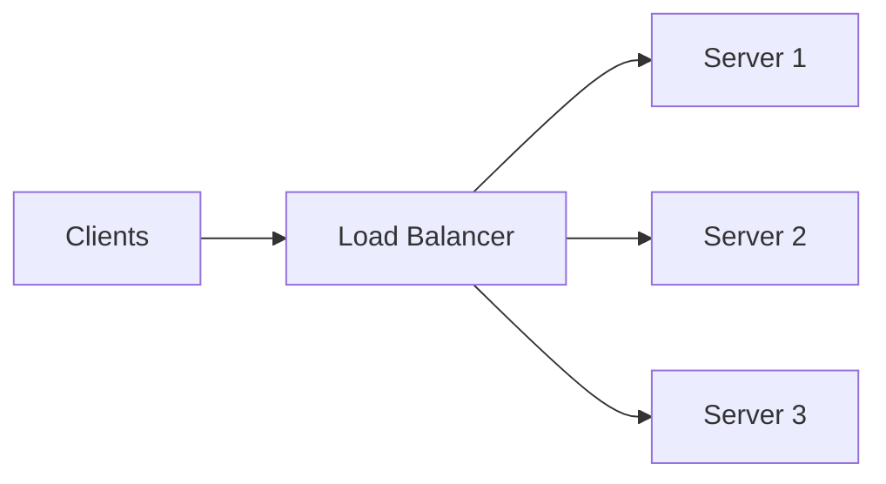
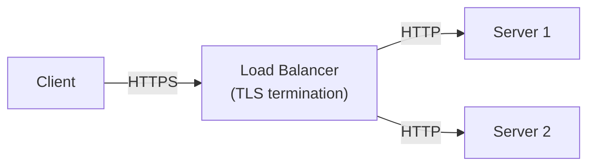
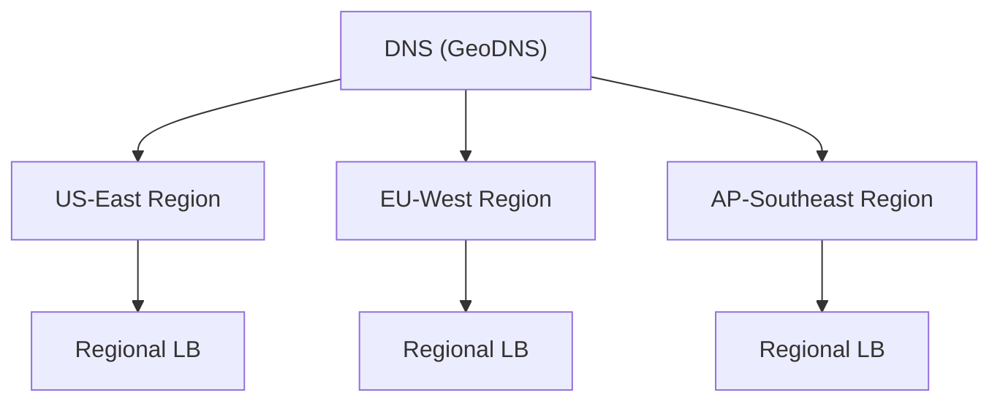
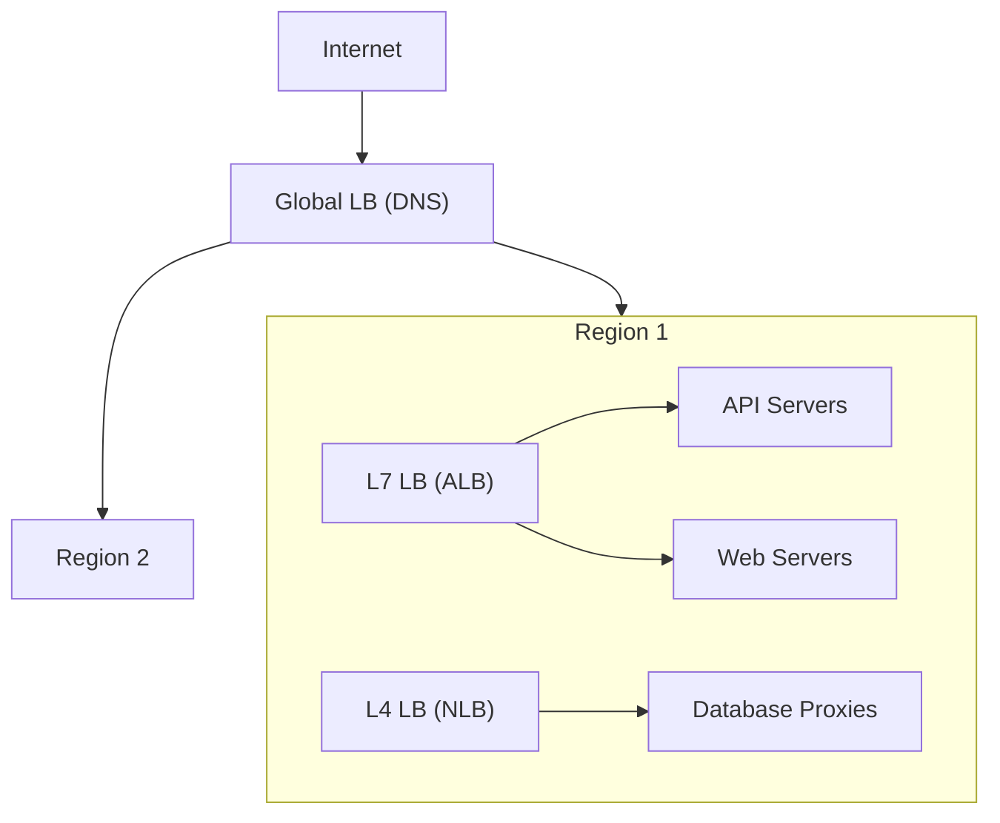

# Load Balancers

## Overview

A **load balancer** distributes incoming network traffic across multiple servers to ensure no single server is overwhelmed. It is the first line of horizontal scaling.

## L4 vs L7 Load Balancing

| | Layer 4 (Transport) | Layer 7 (Application) |
|--|--------------------|-----------------------|
| **Operates at** | TCP/UDP | HTTP/HTTPS |
| **Routes based on** | IP address, port, TCP connection | URL path, headers, cookies, request body |
| **Speed** | Faster (no payload inspection) | Slower (must parse HTTP) |
| **Features** | Basic distribution | URL routing, header-based routing, SSL termination, request modification |
| **TLS** | Passes through (or terminates) | Terminates and can inspect |
| **Examples** | AWS NLB, HAProxy (TCP mode) | AWS ALB, Nginx, HAProxy (HTTP mode), Envoy |

### When to Use Each

- **L4:** raw TCP/UDP traffic, non-HTTP protocols, maximum throughput, simple distribution
- **L7:** HTTP routing (microservices), SSL termination, A/B testing, rate limiting by URL

## Routing Algorithms

| Algorithm | How It Works | Best For |
|-----------|-------------|----------|
| **Round Robin** | Requests go to servers in rotation (1, 2, 3, 1, 2, 3...) | Equal-capacity servers, stateless |
| **Weighted Round Robin** | Like round robin but servers get proportional traffic | Servers with different capacities |
| **Least Connections** | Route to the server with fewest active connections | Varying request durations |
| **Least Response Time** | Route to the server with lowest avg response time | Performance-sensitive |
| **IP Hash** | Hash client IP to pick server | Session persistence without cookies |
| **Consistent Hashing** | Hash ring maps requests to servers | Cache affinity, minimizes remapping |
| **Random** | Pick a random server | Simple, surprisingly effective at scale |

### Which Algorithm to Choose

- **Default:** Round Robin (simple, works for stateless services)
- **Mixed hardware:** Weighted Round Robin
- **Long-lived connections:** Least Connections (WebSockets, gRPC streaming)
- **Session affinity needed:** IP Hash or cookie-based sticky sessions
- **Caching layer:** Consistent Hashing (same key hits same server)

## Health Checks

Load balancers must detect unhealthy servers and stop routing traffic to them.

### Types

| Type | How | Catches |
|------|-----|---------|
| **TCP check** | Can we open a TCP connection? | Server down, port closed |
| **HTTP check** | Does GET /health return 200? | App crashes, dependency failures |
| **Deep health check** | /health checks DB, cache, etc. | Downstream dependency outages |

### Configuration

- **Interval:** how often to check (e.g., every 5 seconds)
- **Timeout:** how long to wait for response (e.g., 3 seconds)
- **Threshold:** how many failures before marking unhealthy (e.g., 3 consecutive)
- **Recovery:** how many successes before marking healthy again (e.g., 2 consecutive)

!!! warning "Deep health check tradeoff"
    If /health checks the database and the database is slow, all servers report unhealthy simultaneously. Consider separating liveness (is the process running?) from readiness (can it serve traffic?).

## SSL/TLS Termination

The load balancer decrypts HTTPS traffic, then forwards plain HTTP to backend servers.

**Benefits:**

- Backend servers don't handle encryption (less CPU)
- Centralized certificate management
- Load balancer can inspect and route based on HTTP content

**Tradeoff:** traffic between LB and backend is unencrypted (fine within a private network; re-encrypt for zero-trust).

## Sticky Sessions (Session Affinity)

Route all requests from the same client to the same server.

**Methods:**

- **Cookie-based:** LB sets a cookie with the server ID
- **IP-based:** hash the client IP (breaks with NAT/proxies)

**When needed:** server stores session state in memory (shopping cart, WebSocket connections).

**Why to avoid:** prevents even load distribution, makes horizontal scaling harder. Prefer stateless servers with external session storage (Redis).

## Global Load Balancing (DNS-based)

For multi-region deployments, DNS-based load balancing routes users to the nearest datacenter.

**How:** DNS resolves to different IPs based on the client's geographic location.

**Examples:** AWS Route 53, Cloudflare, Google Cloud DNS.

## Common Load Balancer Architecture

## Flashcard Review

??? flashcard "L4 vs L7 load balancer: what is the difference?"

    **L4** operates at TCP/UDP level — routes based on IP and port, no payload inspection, very fast.
    **L7** operates at HTTP level — can route based on URL, headers, cookies. Slower but much more flexible.

??? flashcard "When would you use least-connections routing?"

    When requests have **varying processing times**. A server handling one slow request and a server handling ten fast requests may have similar load — least-connections accounts for this. Good for WebSockets and gRPC streaming.

??? flashcard "What is the problem with sticky sessions?"

    They create **uneven load distribution** — one server can accumulate many sticky clients while others are idle. They also make horizontal scaling harder (can't freely add/remove servers). Prefer stateless servers with Redis for session storage.

??? flashcard "What is SSL/TLS termination?"

    The load balancer decrypts HTTPS, then forwards plain HTTP to backends. Benefits: backends don't handle encryption, centralized cert management, LB can inspect HTTP content. Tradeoff: traffic between LB and backend is unencrypted (OK in a private network).

## Quiz

**You have a microservices architecture where /api/users goes to one service and /api/orders goes to another. Which LB type do you need?**
{: .quiz-question}

  <button class="quiz-option" data-value="a">L4 load balancer</button>
  <button class="quiz-option" data-value="b">L7 load balancer</button>
  <button class="quiz-option" data-value="c">DNS load balancer</button>
  <button class="quiz-option" data-value="d">No load balancer needed</button>

**A server in your pool starts returning 500 errors but the TCP port is still open. Which health check catches this?**
{: .quiz-question}

  <button class="quiz-option" data-value="a">TCP health check</button>
  <button class="quiz-option" data-value="b">HTTP health check</button>
  <button class="quiz-option" data-value="c">No health check can detect this</button>
  <button class="quiz-option" data-value="d">DNS health check</button>

**You run a caching layer where the same key should always hit the same server. Which routing algorithm?**
{: .quiz-question}

  <button class="quiz-option" data-value="a">Round Robin</button>
  <button class="quiz-option" data-value="b">Least Connections</button>
  <button class="quiz-option" data-value="c">Random</button>
  <button class="quiz-option" data-value="d">Consistent Hashing</button>

