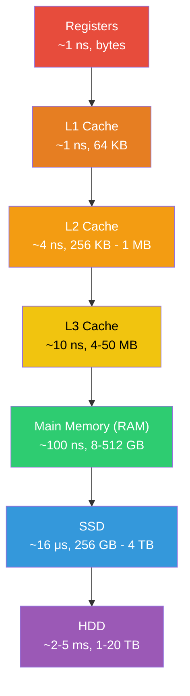
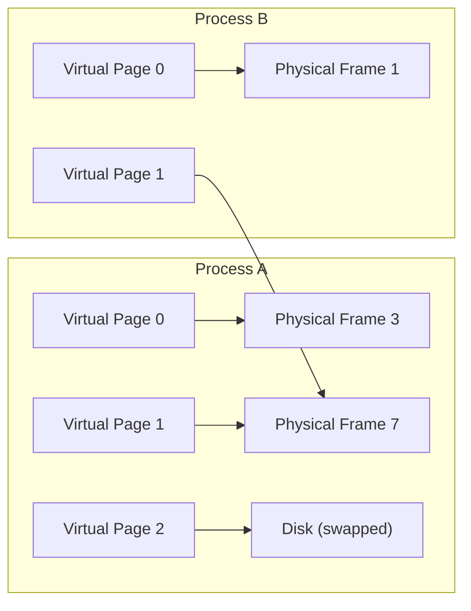
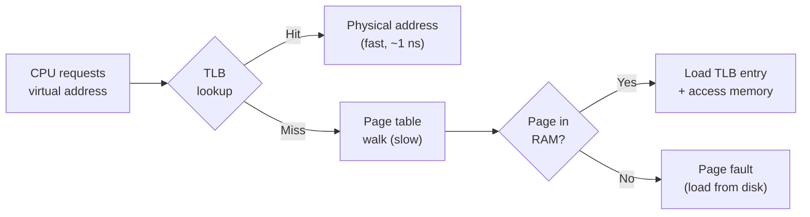

# Computer Memory

## Overview

Understanding how computer memory works — from CPU registers to disk — is fundamental to writing performant software and reasoning about system design tradeoffs. Memory hierarchy, virtual memory, and caching behavior underpin everything from database indexing to garbage collection.

## Memory Hierarchy

Memory systems are organized as a hierarchy trading off speed, size, and cost.

| Level | Latency | Typical Size | Cost per GB | Managed By |
|-------|:-------:|:------------:|:-----------:|:----------:|
| Registers | < 1 ns | ~1 KB | — | Compiler |
| L1 Cache | ~1 ns | 32-64 KB per core | — | Hardware |
| L2 Cache | ~4 ns | 256 KB - 1 MB per core | — | Hardware |
| L3 Cache | ~10 ns | 4-50 MB shared | — | Hardware |
| RAM (DRAM) | ~100 ns | 8-512 GB | ~$3-5 | OS |
| SSD (NAND) | ~16 μs | 256 GB - 4 TB | ~$0.10 | OS |
| HDD | ~2-5 ms | 1-20 TB | ~$0.02 | OS |

!!! info "The key insight"
    Each level is roughly **10x slower** and **10-100x larger** than the one above it. Good software design exploits this hierarchy — keeping hot data in fast memory and cold data in cheap storage.

## How CPU Caches Work

### Cache Lines

CPUs don't fetch individual bytes from RAM — they fetch **cache lines** (typically 64 bytes). When you access one byte, the entire 64-byte block is loaded into the cache.

This is why **sequential access** is much faster than **random access** — sequential reads hit data already in the cache line.

### Locality Principles

| Principle | Definition | Example |
|-----------|-----------|---------|
| **Temporal locality** | Recently accessed data will likely be accessed again soon | Loop variables, hot database rows |
| **Spatial locality** | Data near recently accessed data will likely be accessed soon | Array iteration, struct fields |

### Cache Misses

| Type | Cause | Mitigation |
|------|-------|-----------|
| **Compulsory** | First access to data (cold miss) | Prefetching |
| **Capacity** | Working set exceeds cache size | Reduce working set, partition data |
| **Conflict** | Multiple addresses map to same cache set | Align data, avoid power-of-2 strides |

!!! tip "Interview relevance"
    When discussing why arrays outperform linked lists for iteration, the answer is **spatial locality**: array elements are contiguous in memory, so each cache line fetch brings multiple useful elements. Linked list nodes can be scattered anywhere in memory.

## RAM (Random Access Memory)

### DRAM vs SRAM

| Property | DRAM | SRAM |
|----------|------|------|
| **Speed** | Slower (~100 ns) | Faster (~1-10 ns) |
| **Density** | High (1 transistor + 1 capacitor per bit) | Low (6 transistors per bit) |
| **Cost** | Cheaper | More expensive |
| **Needs refresh?** | Yes (capacitors leak charge) | No |
| **Used for** | Main memory | CPU caches |

### Memory Bandwidth

| System | Bandwidth |
|--------|:---------:|
| DDR4-3200 (single channel) | ~25 GB/s |
| DDR5-4800 (single channel) | ~38 GB/s |
| DDR5-4800 (dual channel) | ~76 GB/s |
| HBM2E (GPU memory) | ~1-2 TB/s |

## Virtual Memory

Virtual memory gives each process the illusion of having its own large, contiguous address space, even though physical memory is limited and shared.

### Why Virtual Memory?

| Benefit | Explanation |
|---------|------------|
| **Isolation** | Each process has its own address space — one process can't corrupt another's memory |
| **Abstraction** | Programs don't need to know physical addresses or how much RAM exists |
| **Overcommitment** | Total virtual memory across all processes can exceed physical RAM |
| **Shared memory** | Multiple processes can map the same physical frame (shared libraries, IPC) |
| **Memory-mapped I/O** | Files can be mapped into the address space and accessed like memory |

### Pages and Page Tables

The OS divides virtual and physical memory into fixed-size **pages** (typically 4 KB).

A **page table** maps virtual page numbers to physical frame numbers. Each process has its own page table.

| Component | Role |
|-----------|------|
| **Page** | Fixed-size block of virtual memory (typically 4 KB) |
| **Frame** | Fixed-size block of physical memory (same size as page) |
| **Page table** | Per-process mapping from virtual pages to physical frames |
| **Page table entry (PTE)** | Contains physical frame number + metadata (present, dirty, accessed, permissions) |

### Translation Lookaside Buffer (TLB)

Page table lookups go through RAM, which is slow. The **TLB** is a small, fast cache of recent virtual-to-physical translations.

| TLB Property | Typical Value |
|-------------|:------------:|
| Entries | 64-1024 |
| Hit rate | >99% for most workloads |
| Lookup time | ~1 ns |
| Miss penalty | ~10-100 ns (page table walk) |

### Page Faults

A **page fault** occurs when a process accesses a virtual page not currently in physical memory.

| Type | Cause | Cost |
|------|-------|:----:|
| **Minor (soft)** | Page exists in memory but not mapped in page table | ~μs |
| **Major (hard)** | Page must be loaded from disk (swap) | ~ms |
| **Invalid** | Access to unmapped or protected memory | Process killed (segfault) |

### Page Replacement Algorithms

When RAM is full and a new page must be loaded, the OS evicts a page using a replacement algorithm.

| Algorithm | Description | Used In Practice? |
|-----------|------------|:-----------------:|
| **FIFO** | Evict the oldest page | Rarely (suffers from Bélády's anomaly) |
| **LRU** | Evict the least recently used page | Approximated (true LRU too expensive) |
| **Clock (Second Chance)** | Circular list with reference bits — skip recently used pages | Yes (Linux, most OSes) |
| **LFU** | Evict the least frequently used page | Sometimes (with aging) |

!!! info "Bélády's anomaly"
    With FIFO, adding more page frames can actually **increase** page faults. LRU and its approximations don't suffer from this anomaly — one reason they're preferred.

## Stack vs Heap

| Property | Stack | Heap |
|----------|-------|------|
| **Allocation** | Automatic (push/pop) | Manual (`malloc`/`free`, `new`/`delete`) or GC |
| **Speed** | Very fast (pointer adjustment) | Slower (free list search, fragmentation) |
| **Size** | Small, fixed (typically 1-8 MB) | Large, limited by virtual memory |
| **Lifetime** | Scope-bound (function call) | Explicit or until GC collects |
| **Fragmentation** | None | Yes (external and internal) |
| **Thread safety** | Each thread gets its own stack | Shared across threads (needs synchronization) |
| **Data stored** | Local variables, return addresses, function params | Dynamically allocated objects, large data |

### Memory Fragmentation

| Type | Description | Mitigation |
|------|------------|-----------|
| **External** | Free memory is split into small non-contiguous blocks | Compaction, buddy allocator |
| **Internal** | Allocated block is larger than requested | Slab allocator, size classes |

## Memory-Mapped Files (mmap)

`mmap` maps a file directly into a process's virtual address space. Reads/writes to that memory region go directly to/from the file via the page cache.

| Advantage | Explanation |
|-----------|------------|
| Zero-copy access | No need to `read()` into a buffer — data is in your address space |
| Lazy loading | Pages are loaded on demand as they're accessed |
| Shared across processes | Multiple processes can mmap the same file for IPC |
| Kernel manages caching | Pages are managed by the OS page cache |

**Used by:** databases (SQLite, LMDB), search engines, shared libraries, log processing.

## Flashcard Review

??? flashcard "What is the memory hierarchy, and why does it matter?"

    **Registers → L1 → L2 → L3 → RAM → SSD → HDD.** Each level is ~10x slower and 10-100x larger. Good software keeps hot data in fast memory. This hierarchy is why caching, data locality, and working set size are critical performance considerations.

??? flashcard "What is a cache line, and why does it affect data structure choice?"

    A cache line is a **64-byte block** — the unit of transfer between RAM and CPU cache. When you access one byte, the full 64 bytes are loaded. Arrays benefit from spatial locality (sequential elements are in the same cache line). Linked lists suffer because nodes are scattered in memory.

??? flashcard "What is virtual memory, and what are its main benefits?"

    Virtual memory gives each process its own address space, mapped to physical memory by the OS via page tables. Benefits: **process isolation** (can't corrupt other processes), **abstraction** (don't need to know physical addresses), **overcommitment** (virtual > physical), and **shared memory** (multiple processes can map the same physical frame).

??? flashcard "What is a TLB, and why is it important?"

    The **Translation Lookaside Buffer** is a small, fast cache of recent virtual-to-physical address translations. Without it, every memory access would require a slow page table walk through RAM. TLBs have >99% hit rates for most workloads.

??? flashcard "What is the difference between stack and heap memory?"

    **Stack:** fast (pointer bump), automatic lifetime (scope-bound), small and fixed size, per-thread. **Heap:** slower (allocator overhead), manual or GC-managed lifetime, large, shared across threads. Use stack for local variables; heap for dynamically sized or long-lived data.

??? flashcard "What is a page fault?"

    A page fault occurs when a process accesses a virtual page not in physical memory. **Minor fault:** page is in memory but unmapped (~μs). **Major fault:** page must be loaded from disk (~ms, very expensive). **Invalid fault:** illegal access, process is killed (segfault).

## Quiz

**A program iterates over a large array sequentially vs. accessing random indices. Which is faster and why?**
{: .quiz-question}

  <button class="quiz-option" data-value="a">Sequential — spatial locality means cache lines are fully utilized</button>
  <button class="quiz-option" data-value="b">Random — the CPU can parallelize random accesses better</button>
  <button class="quiz-option" data-value="c">Same speed — both access the same amount of data</button>
  <button class="quiz-option" data-value="d">Depends on array size only</button>

**A process accesses a virtual address not currently mapped to physical memory. The page exists on disk in the swap area. What type of page fault occurs?**
{: .quiz-question}

  <button class="quiz-option" data-value="a">Minor (soft) page fault</button>
  <button class="quiz-option" data-value="b">Major (hard) page fault</button>
  <button class="quiz-option" data-value="c">Invalid page fault (segfault)</button>
  <button class="quiz-option" data-value="d">TLB miss (not a page fault)</button>

**Why can total virtual memory across all processes exceed physical RAM?**
{: .quiz-question}

  <button class="quiz-option" data-value="a">Virtual memory uses compression to fit more data</button>
  <button class="quiz-option" data-value="b">Virtual addresses are smaller than physical addresses</button>
  <button class="quiz-option" data-value="c">Not all pages need to be in RAM simultaneously — inactive pages can live on disk</button>
  <button class="quiz-option" data-value="d">Each process only uses half its virtual address space</button>

**Which page replacement algorithm can exhibit Bélády's anomaly (more frames causing more faults)?**
{: .quiz-question}

  <button class="quiz-option" data-value="a">FIFO</button>
  <button class="quiz-option" data-value="b">LRU</button>
  <button class="quiz-option" data-value="c">Clock (Second Chance)</button>
  <button class="quiz-option" data-value="d">Optimal (Bélády's)</button>

