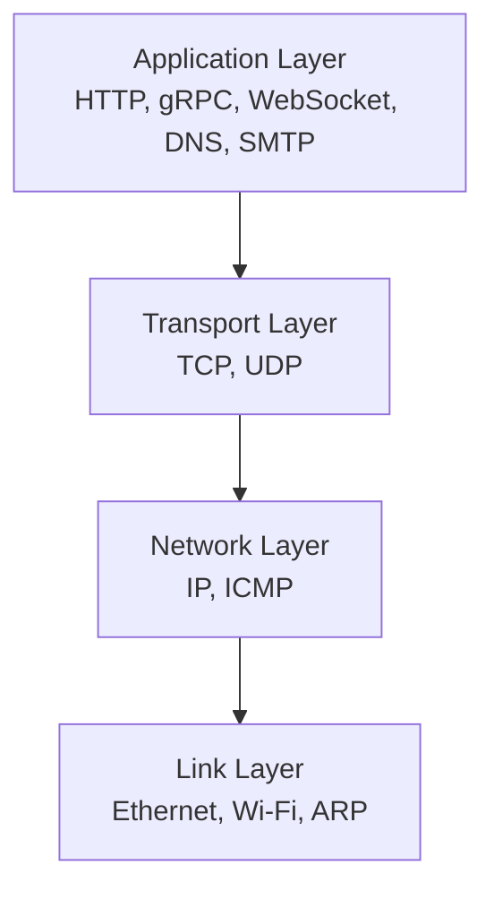
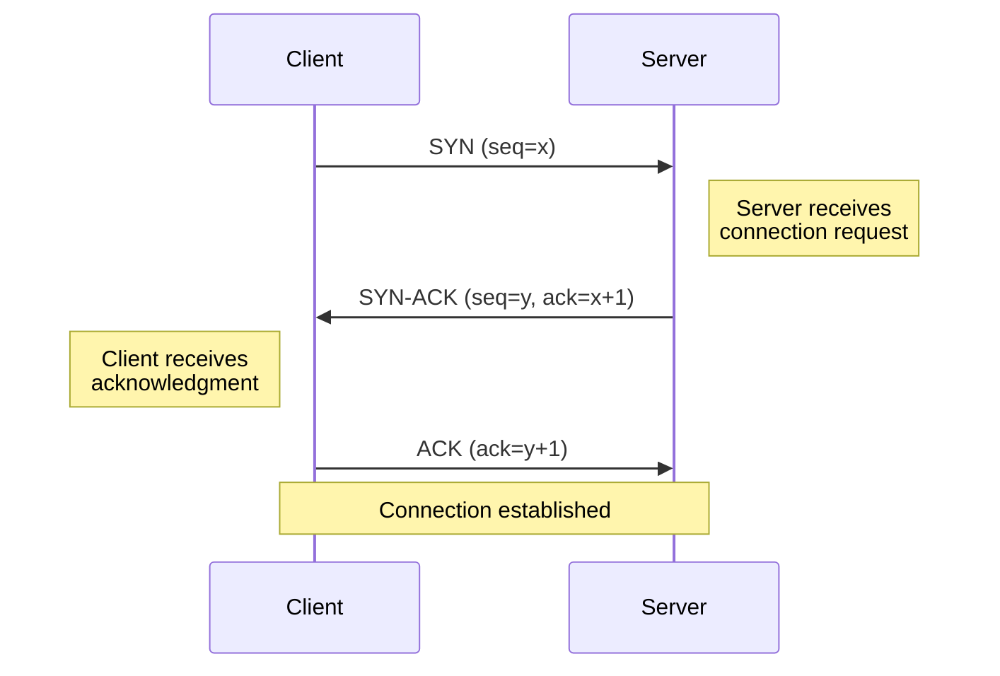
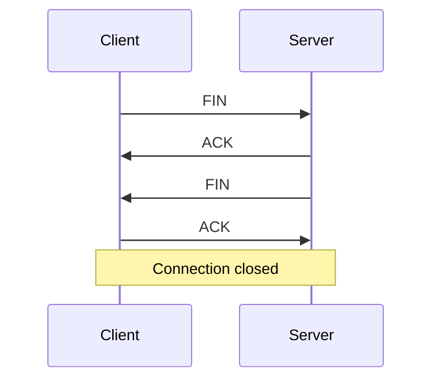
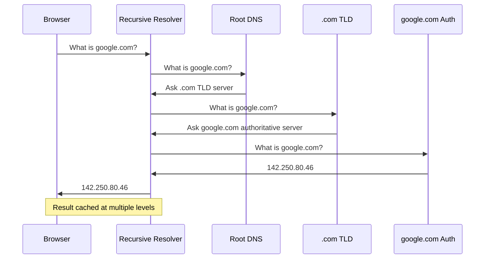
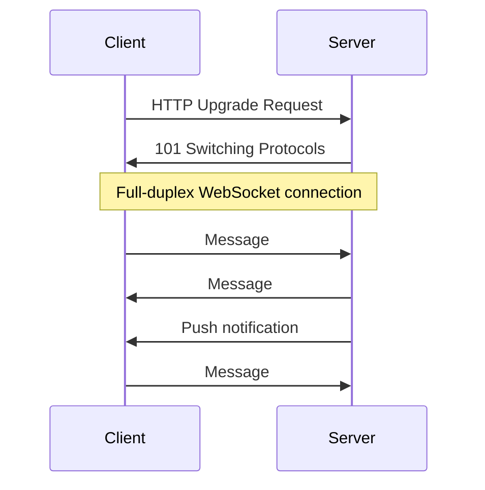

# Networking

## Overview

Networking is the backbone of every distributed system. Understanding protocols, latency characteristics, and connection mechanics lets you reason about system design tradeoffs from first principles.

## What Is a Protocol?

A **protocol** is a set of rules governing how data is formatted, transmitted, and received between devices. Protocols operate at different layers of the network stack.

!!! info "The mental model"
    You rarely need to go below the transport layer in system design interviews. Focus on HTTP vs gRPC, TCP vs UDP, and how DNS resolution works.

## Network Latency: Orders of Magnitude

These numbers matter for back-of-envelope calculations in system design.

| Hop | Latency | Notes |
|-----|:-------:|-------|
| L1 cache reference | ~1 ns | |
| L2 cache reference | ~4 ns | |
| RAM reference | ~100 ns | |
| SSD random read | ~16 us | |
| HDD random read | ~2-5 ms | |
| Same datacenter round-trip | ~0.5 ms | Within one AZ |
| Same region (cross-AZ) | ~1-2 ms | |
| Cross-continent | ~50-150 ms | US East to EU |
| User to server (typical) | ~50-200 ms | Depends on location |

!!! tip "Rule of thumb"
    If your service makes 10 serial cross-datacenter calls at 1ms each, that is 10ms of pure network latency before any computation. This is why batching, caching, and reducing round trips matter.

### Bandwidth Reference

| Connection | Bandwidth |
|-----------|:---------:|
| Datacenter internal | 10-100 Gbps |
| Cloud inter-region | 1-10 Gbps |
| Home broadband | 100-1000 Mbps |
| Mobile (4G) | 10-50 Mbps |
| Mobile (5G) | 100-1000 Mbps |

## TCP (Transmission Control Protocol)

**TCP** is a connection-oriented, reliable transport protocol. It guarantees ordered delivery, retransmits lost packets, and provides flow control.

### The Three-Way Handshake

Every TCP connection starts with this handshake:

1. **SYN** — Client sends a synchronize packet with an initial sequence number
2. **SYN-ACK** — Server acknowledges and sends its own sequence number
3. **ACK** — Client acknowledges the server's sequence number

**Cost:** 1 round-trip (RTT) before any data is sent. This is why persistent connections matter.

### TCP Connection Teardown

### Key TCP Features

| Feature | How It Works |
|---------|-------------|
| **Reliability** | Sequence numbers + acknowledgments. Retransmit on timeout. |
| **Ordering** | Receiver reorders out-of-sequence packets using sequence numbers. |
| **Flow control** | Receiver advertises window size — how much data it can accept. |
| **Congestion control** | Slow start, congestion avoidance, fast retransmit. Prevents overwhelming the network. |

### TCP vs UDP

| | TCP | UDP |
|--|-----|-----|
| **Connection** | Connection-oriented (handshake) | Connectionless |
| **Reliability** | Guaranteed delivery, ordering | Best-effort, no guarantees |
| **Overhead** | Higher (headers, ACKs, retransmits) | Lower (minimal headers) |
| **Latency** | Higher (handshake + retransmit waits) | Lower (fire and forget) |
| **Use cases** | HTTP, databases, file transfer, email | DNS, video streaming, gaming, VoIP |

## DNS (Domain Name System)

DNS translates domain names (google.com) to IP addresses (142.250.80.46).

### DNS Caching Layers

1. **Browser cache** — shortest TTL, checked first
2. **OS cache** — system-level resolver cache
3. **ISP recursive resolver** — caches results for all clients
4. **Authoritative nameserver** — source of truth, sets TTL

**Typical TTL:** 300 seconds (5 min) for dynamic services, hours/days for stable services.

## HTTP (HyperText Transfer Protocol)

### HTTP Methods

| Method | Idempotent | Safe | Description |
|--------|:----------:|:----:|-------------|
| GET | Yes | Yes | Retrieve a resource |
| POST | No | No | Create a resource / trigger action |
| PUT | Yes | No | Replace a resource entirely |
| PATCH | No | No | Partial update |
| DELETE | Yes | No | Remove a resource |
| HEAD | Yes | Yes | GET without the body |

### HTTP Status Codes

| Range | Category | Common Codes |
|-------|----------|-------------|
| 2xx | Success | 200 OK, 201 Created, 204 No Content |
| 3xx | Redirect | 301 Moved Permanently, 302 Found, 304 Not Modified |
| 4xx | Client Error | 400 Bad Request, 401 Unauthorized, 403 Forbidden, 404 Not Found, 429 Too Many Requests |
| 5xx | Server Error | 500 Internal Error, 502 Bad Gateway, 503 Service Unavailable, 504 Gateway Timeout |

### HTTP/1.1 vs HTTP/2 vs HTTP/3

| Feature | HTTP/1.1 | HTTP/2 | HTTP/3 |
|---------|----------|--------|--------|
| **Transport** | TCP | TCP | QUIC (UDP) |
| **Multiplexing** | No (one request per connection) | Yes (streams over one connection) | Yes |
| **Head-of-line blocking** | Yes (per connection) | At TCP level | None (per-stream) |
| **Header compression** | None | HPACK | QPACK |
| **Connection setup** | TCP handshake + TLS | Same | 0-RTT or 1-RTT (combined) |

### Keep-Alive / Persistent Connections

HTTP/1.1 defaults to **persistent connections** — the TCP connection stays open for multiple requests. This avoids the 1-RTT cost of a new handshake per request.

## TLS (Transport Layer Security)

TLS provides encryption, authentication, and integrity for connections.

### TLS Handshake (simplified)

1. **Client Hello** — supported cipher suites, TLS version
2. **Server Hello** — chosen cipher suite, server certificate
3. **Certificate Verification** — client verifies server's certificate chain
4. **Key Exchange** — agree on a shared session key (Diffie-Hellman)
5. **Encrypted communication** begins

**Cost:** 1-2 additional RTTs on top of TCP. TLS 1.3 reduces this to 1 RTT (or 0-RTT for resumption).

## gRPC

**gRPC** is an RPC framework built on HTTP/2 with Protocol Buffers (protobuf) for serialization.

| Feature | REST/JSON | gRPC/Protobuf |
|---------|-----------|---------------|
| **Serialization** | JSON (text, larger) | Protobuf (binary, compact) |
| **Contract** | OpenAPI/Swagger (optional) | .proto file (required, strict) |
| **Streaming** | SSE / WebSocket | Built-in bidirectional streaming |
| **Performance** | Good | Better (smaller payloads, HTTP/2 multiplexing) |
| **Browser support** | Native | Requires grpc-web proxy |

**When to use gRPC:** internal service-to-service communication where performance matters and both sides are controlled.

## WebSockets

**WebSockets** provide full-duplex communication over a single TCP connection.

**Use cases:** chat, live updates, collaborative editing, real-time dashboards.

**Tradeoff vs polling:** WebSockets maintain a persistent connection (stateful, harder to load balance) but eliminate the latency and overhead of repeated HTTP requests.

## Flashcard Review

??? flashcard "What is the TCP three-way handshake?"

    **SYN -> SYN-ACK -> ACK.** Client sends SYN with sequence number. Server responds with SYN-ACK (its own sequence number + acknowledgment). Client sends ACK. Takes 1 RTT before data can flow.

??? flashcard "TCP vs UDP: when to use each?"

    **TCP:** when you need reliability and ordering (HTTP, databases, file transfer).
    **UDP:** when you need low latency and can tolerate loss (DNS lookups, video streaming, gaming, VoIP).

??? flashcard "What latency numbers should you know for system design?"

    Same datacenter: ~0.5ms. Cross-AZ: ~1-2ms. Cross-continent: ~50-150ms. User to server: ~50-200ms. These determine when you need caching, CDNs, or regional deployments.

??? flashcard "What is HTTP/2's main advantage over HTTP/1.1?"

    **Multiplexing:** multiple requests/responses over a single TCP connection, eliminating head-of-line blocking at the HTTP level. Also: header compression (HPACK) and server push.

??? flashcard "How does DNS resolution work?"

    Browser -> recursive resolver -> root DNS -> TLD server -> authoritative server. The result is cached at each level with a TTL. Typical DNS lookup adds 20-120ms if not cached.

??? flashcard "What is the cost of a TLS handshake?"

    1-2 additional RTTs on top of TCP's 1 RTT. TLS 1.3 reduces to 1 RTT (0-RTT for session resumption). This is why persistent connections and connection pooling matter.

## Quiz

**How many round trips does a TCP + TLS 1.2 connection require before sending data?**
{: .quiz-question}

  <button class="quiz-option" data-value="a">1 RTT</button>
  <button class="quiz-option" data-value="b">2 RTTs</button>
  <button class="quiz-option" data-value="c">3 RTTs</button>
  <button class="quiz-option" data-value="d">0 RTTs</button>

**A system makes 5 serial database calls, each taking 2ms network + 3ms compute. What is the total latency?**
{: .quiz-question}

  <button class="quiz-option" data-value="a">10ms</button>
  <button class="quiz-option" data-value="b">25ms</button>
  <button class="quiz-option" data-value="c">15ms</button>
  <button class="quiz-option" data-value="d">5ms</button>

**Which HTTP method is both idempotent and safe?**
{: .quiz-question}

  <button class="quiz-option" data-value="a">GET</button>
  <button class="quiz-option" data-value="b">POST</button>
  <button class="quiz-option" data-value="c">PUT</button>
  <button class="quiz-option" data-value="d">DELETE</button>

**A video streaming service needs low-latency delivery and can tolerate some packet loss. Which protocol?**
{: .quiz-question}

  <button class="quiz-option" data-value="a">TCP</button>
  <button class="quiz-option" data-value="b">UDP</button>
  <button class="quiz-option" data-value="c">HTTP/2</button>
  <button class="quiz-option" data-value="d">WebSocket</button>

