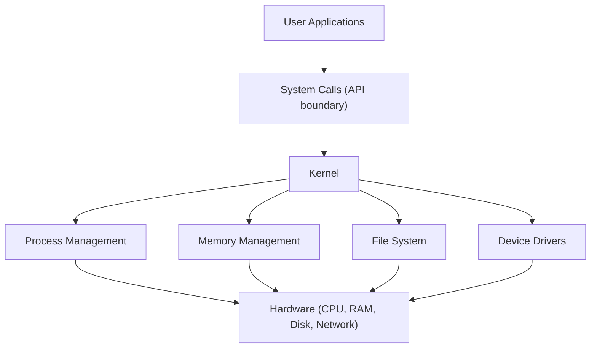
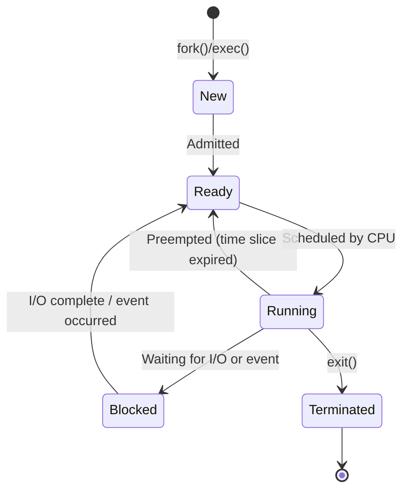
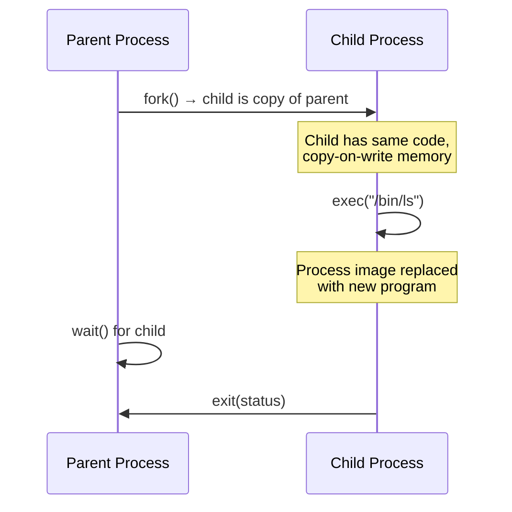
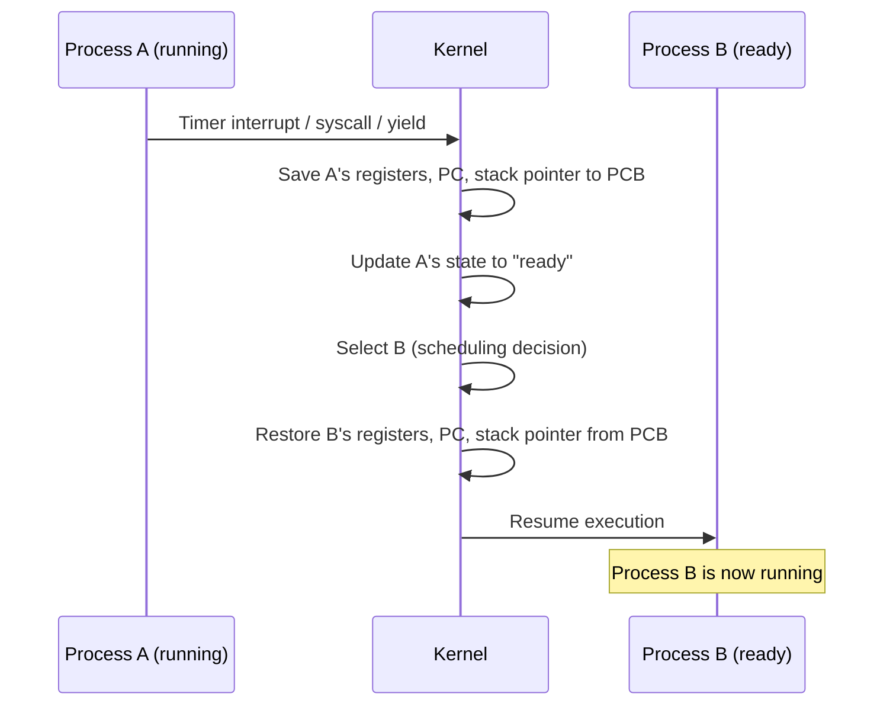
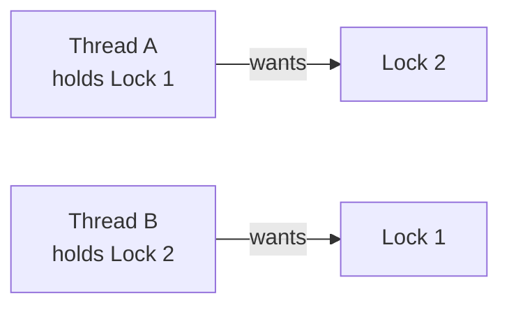

# Operating Systems

## Overview

An operating system manages hardware resources and provides abstractions that let programs run without worrying about the underlying machine. Understanding processes, threads, scheduling, and synchronization is essential for reasoning about concurrency, performance, and system behavior in interviews.

## What Does an OS Do?

| Responsibility | What It Does |
|---------------|-------------|
| **Process management** | Create, schedule, and terminate processes and threads |
| **Memory management** | Virtual memory, paging, allocation (see [Memory](memory.md)) |
| **File system** | Organize, store, and retrieve files on disk |
| **I/O management** | Abstract hardware devices through drivers and system calls |
| **Security & isolation** | Enforce permissions, isolate processes, protect kernel memory |

## Processes

A **process** is a running instance of a program. It has its own address space, file descriptors, and execution state.

### Process State Diagram

### Process Control Block (PCB)

The OS maintains a **PCB** for each process containing:

| Field | Description |
|-------|------------|
| **PID** | Unique process identifier |
| **State** | Running, ready, blocked, etc. |
| **Program counter** | Address of next instruction to execute |
| **CPU registers** | Saved register values (for context switching) |
| **Memory info** | Page table pointer, memory limits |
| **Open files** | File descriptor table |
| **Scheduling info** | Priority, CPU time used, scheduling queue pointers |

### Process Creation: fork() and exec()

On Unix systems:

- **`fork()`** — creates a child process that is a copy of the parent (copy-on-write)
- **`exec()`** — replaces the current process image with a new program
- **`fork()` + `exec()`** — the standard pattern for creating a new process running a different program

!!! info "Copy-on-Write (COW)"
    `fork()` doesn't actually copy all memory immediately. Parent and child share the same physical pages (marked read-only). Only when one process writes to a page is it copied. This makes `fork()` fast even for large processes.

### Inter-Process Communication (IPC)

| Mechanism | Description | Use Case |
|-----------|------------|----------|
| **Pipes** | Unidirectional byte stream between related processes | Shell pipelines (`ls \| grep`) |
| **Named pipes (FIFOs)** | Pipes accessible by name in the filesystem | Unrelated process communication |
| **Shared memory** | Processes map the same physical memory region | High-throughput data sharing |
| **Message queues** | Kernel-managed queue of typed messages | Structured async communication |
| **Sockets** | Network-style communication (local or remote) | Client-server, microservices |
| **Signals** | Asynchronous notifications (SIGKILL, SIGTERM, etc.) | Process control, error handling |

## Threads

A **thread** is a lightweight unit of execution within a process. Threads within the same process share the address space but have their own stack and registers.

### Process vs Thread

| Property | Process | Thread |
|----------|---------|--------|
| **Address space** | Own (isolated) | Shared with other threads in same process |
| **Creation cost** | High (~ms, copy page tables) | Low (~μs, just allocate stack) |
| **Context switch cost** | High (flush TLB, swap page tables) | Low (same address space, no TLB flush) |
| **Communication** | IPC mechanisms (pipes, sockets, shared memory) | Direct memory access (shared heap) |
| **Failure isolation** | One crash doesn't affect others | One crash can kill all threads in process |
| **Concurrency unit** | OS-level | Within a process |

### User Threads vs Kernel Threads

| Model | Description | Tradeoff |
|-------|------------|----------|
| **1:1 (kernel threads)** | Each user thread maps to one kernel thread | Simple, true parallelism, but heavier context switches |
| **N:1 (user threads)** | Many user threads map to one kernel thread | Lightweight, but no true parallelism — one blocks all |
| **M:N (hybrid)** | M user threads map to N kernel threads | Best of both, but complex scheduling |
| **Goroutines (Go)** | M:N with cooperative scheduling + work stealing | Lightweight, high concurrency, Go runtime manages mapping |

!!! tip "Interview context"
    When discussing why Go can handle millions of goroutines while Java struggles with thousands of OS threads: goroutines use ~2 KB stack (grows dynamically) vs ~1 MB per OS thread. Goroutines are M:N scheduled by the Go runtime, not the OS kernel.

## CPU Scheduling

The **scheduler** decides which ready process/thread gets the CPU next. The goal is to balance throughput, latency, fairness, and responsiveness.

### Scheduling Metrics

| Metric | Definition |
|--------|-----------|
| **Turnaround time** | Total time from submission to completion |
| **Response time** | Time from submission to first output |
| **Waiting time** | Total time spent in the ready queue |
| **Throughput** | Number of processes completed per time unit |
| **CPU utilization** | Percentage of time the CPU is busy |

### Scheduling Algorithms

| Algorithm | Preemptive? | Description | Pros | Cons |
|-----------|:-----------:|-------------|------|------|
| **FCFS** | No | First come, first served | Simple | Convoy effect — short jobs wait behind long ones |
| **SJF** | No | Shortest job first | Optimal average turnaround | Requires knowing job lengths; starvation of long jobs |
| **SRTF** | Yes | Shortest remaining time first | Optimal average turnaround (preemptive) | Starvation; impractical (need predictions) |
| **Round Robin** | Yes | Each process gets a fixed time quantum | Fair, good response time | High turnaround for long jobs; context switch overhead |
| **Priority** | Yes/No | Highest priority runs first | Flexible | Starvation of low-priority processes |
| **MLFQ** | Yes | Multiple queues with different priorities and quanta | Adapts to workload, good all-around | Complex to tune |
| **CFS (Linux)** | Yes | Completely Fair Scheduler — red-black tree of virtual runtimes | Fair, scalable, O(log n) | Not optimal for real-time workloads |

### Context Switching

A **context switch** saves the state of the current process/thread and restores the state of the next one.

| Switch Type | Cost | Why |
|------------|:----:|-----|
| Thread (same process) | ~1-10 μs | No TLB flush, same address space |
| Process | ~10-100 μs | TLB flush, swap page tables, cache cold |
| Virtual machine | ~100+ μs | Full hardware state save/restore |

## Synchronization

When threads share data, you need synchronization to prevent **race conditions** — bugs where the result depends on the timing of thread execution.

### The Critical Section Problem

A **critical section** is code that accesses shared data. A correct solution must ensure:

| Property | Meaning |
|----------|---------|
| **Mutual exclusion** | At most one thread in the critical section at a time |
| **Progress** | If no thread is in the critical section, a waiting thread can enter |
| **Bounded waiting** | A thread won't wait forever to enter |

### Synchronization Primitives

| Primitive | Description | Use Case |
|-----------|------------|----------|
| **Mutex (lock)** | Binary lock — one thread holds it at a time | Protecting shared data |
| **Semaphore** | Counter-based — allows N concurrent accesses | Resource pools, producer-consumer |
| **Condition variable** | Thread waits until a condition is signaled | Wait-for-event patterns |
| **Read-write lock** | Multiple readers OR one writer | Read-heavy shared data |
| **Spinlock** | Busy-waits (no sleep) until lock is available | Very short critical sections in kernel code |
| **Barrier** | All threads must reach a point before any can proceed | Parallel computation phases |

### Deadlock

**Deadlock** occurs when threads are stuck waiting for each other and none can proceed.

#### Four Necessary Conditions (Coffman)

All four must hold simultaneously for deadlock:

| Condition | Meaning |
|-----------|---------|
| **Mutual exclusion** | Resources can't be shared |
| **Hold and wait** | Threads hold resources while waiting for others |
| **No preemption** | Resources can't be forcibly taken away |
| **Circular wait** | A cycle exists in the resource dependency graph |

#### Deadlock Prevention Strategies

| Strategy | How | Tradeoff |
|----------|-----|----------|
| **Lock ordering** | Always acquire locks in a global fixed order | Simple; requires discipline |
| **Lock timeout** | Give up after waiting too long | May cause livelock |
| **Try-lock** | Non-blocking attempt — back off and retry | Added complexity |
| **Resource hierarchy** | Number resources; always request in ascending order | Restrictive but effective |

### Common Concurrency Problems

| Problem | Description | Solution |
|---------|------------|----------|
| **Race condition** | Outcome depends on thread timing | Mutex / atomic operations |
| **Deadlock** | Threads block forever waiting for each other | Lock ordering, timeouts |
| **Livelock** | Threads keep changing state without progress | Randomized backoff |
| **Starvation** | A thread never gets to run | Fair locks, priority aging |
| **Priority inversion** | High-priority thread waits for low-priority thread's lock | Priority inheritance |

## System Calls

System calls are the interface between user programs and the kernel.

| Category | Examples | Purpose |
|----------|---------|---------|
| **Process** | `fork()`, `exec()`, `wait()`, `exit()` | Create and manage processes |
| **File** | `open()`, `read()`, `write()`, `close()` | File I/O |
| **Memory** | `mmap()`, `brk()`, `mprotect()` | Memory allocation and protection |
| **Network** | `socket()`, `bind()`, `listen()`, `accept()` | Network communication |
| **Signal** | `kill()`, `signal()`, `sigaction()` | Inter-process signaling |

### User Mode vs Kernel Mode

| Property | User Mode | Kernel Mode |
|----------|-----------|-------------|
| **Privilege** | Restricted — can't access hardware directly | Full access to hardware and memory |
| **Memory access** | Own virtual address space only | All physical memory |
| **Failure** | Process crashes | System crash (kernel panic) |
| **Transition** | System call, interrupt, exception → kernel mode | Return from syscall / interrupt → user mode |

!!! info "Why this matters"
    System calls are expensive (~1-10 μs) because of the mode switch, register save/restore, and security checks. This is why batching I/O operations (buffered I/O, `writev()`, `io_uring`) improves performance — fewer mode transitions.

## I/O Models

| Model | Behavior | Used By |
|-------|----------|---------|
| **Blocking I/O** | Thread waits until I/O completes | Traditional `read()`/`write()` |
| **Non-blocking I/O** | Returns immediately; caller polls for completion | `O_NONBLOCK` flag |
| **I/O multiplexing** | Wait on multiple file descriptors simultaneously | `select()`, `poll()`, `epoll()`, `kqueue()` |
| **Async I/O** | Kernel completes I/O and notifies the caller | `io_uring` (Linux), IOCP (Windows) |

### epoll (Linux) vs kqueue (BSD/macOS)

Both are scalable I/O multiplexing mechanisms used by high-performance servers.

| Feature | epoll | kqueue |
|---------|-------|--------|
| **Platform** | Linux | BSD, macOS |
| **Scalability** | O(1) for ready events | O(1) for ready events |
| **Event types** | File descriptors only | FDs, signals, timers, processes |
| **Used by** | Nginx, Redis, Node.js (on Linux) | Nginx, Node.js (on macOS) |

!!! tip "The C10K problem"
    Traditional `select()` scans all file descriptors on each call — O(n). `epoll`/`kqueue` only return ready descriptors — O(1). This is what enabled single-threaded servers like Nginx and Redis to handle tens of thousands of concurrent connections.

## File Systems

### Key Concepts

| Concept | Description |
|---------|------------|
| **Inode** | Metadata structure for a file — permissions, size, block pointers (not the filename) |
| **Directory** | A mapping from filenames to inode numbers |
| **Block** | Fixed-size unit of disk storage (typically 4 KB) |
| **Superblock** | Metadata about the filesystem itself (size, block count, free blocks) |
| **Journal** | Write-ahead log for crash recovery (ext4, NTFS) |

### Common File Systems

| File System | Platform | Features |
|------------|----------|----------|
| **ext4** | Linux | Journaling, extents, backward compatible |
| **XFS** | Linux | High-performance, parallel I/O, large files |
| **Btrfs** | Linux | Copy-on-write, snapshots, checksums |
| **NTFS** | Windows | Journaling, ACLs, compression |
| **APFS** | macOS/iOS | Copy-on-write, encryption, snapshots |
| **ZFS** | FreeBSD/Linux | Pooled storage, checksums, snapshots, RAID built-in |

## Flashcard Review

??? flashcard "What is the difference between a process and a thread?"

    A **process** has its own address space, file descriptors, and is isolated from other processes. A **thread** shares the address space with other threads in the same process but has its own stack and registers. Thread creation and context switching are cheaper (~μs vs ~ms), but a thread crash can take down the whole process.

??? flashcard "What are the four conditions for deadlock?"

    **Coffman conditions** — all four must hold simultaneously: (1) **Mutual exclusion** — resources can't be shared, (2) **Hold and wait** — hold resources while waiting for others, (3) **No preemption** — can't forcibly take resources, (4) **Circular wait** — cycle in dependency graph. Break any one to prevent deadlock.

??? flashcard "What is a context switch, and why is it expensive?"

    A context switch saves one process/thread's state (registers, PC, stack pointer) and restores another's. **Process switches** are expensive (~10-100 μs) because they require flushing the TLB and swapping page tables, causing cache misses. **Thread switches** within the same process are cheaper (~1-10 μs) — same address space, no TLB flush.

??? flashcard "How does the Linux CFS scheduler work?"

    CFS (Completely Fair Scheduler) maintains a **red-black tree** of runnable tasks, keyed by **virtual runtime** (how much CPU time they've used, weighted by priority). It always picks the task with the smallest virtual runtime. This gives each task a fair share of CPU proportional to its weight. O(log n) per scheduling decision.

??? flashcard "What is the difference between blocking I/O and I/O multiplexing?"

    **Blocking I/O:** one thread waits on one I/O operation — need many threads for many connections. **I/O multiplexing** (`epoll`/`kqueue`): one thread monitors many file descriptors and only processes those that are ready. This is how single-threaded servers like Nginx and Redis handle tens of thousands of concurrent connections.

??? flashcard "What is copy-on-write in the context of fork()?"

    After `fork()`, parent and child share the same physical memory pages (marked read-only). Only when one process **writes** to a page is it actually copied. This makes `fork()` nearly instant even for large processes, because most pages are never modified by the child (especially if it immediately calls `exec()`).

## Quiz

**Thread A holds Lock 1 and wants Lock 2. Thread B holds Lock 2 and wants Lock 1. What is this situation called?**
{: .quiz-question}

  <button class="quiz-option" data-value="a">Race condition</button>
  <button class="quiz-option" data-value="b">Deadlock</button>
  <button class="quiz-option" data-value="c">Starvation</button>
  <button class="quiz-option" data-value="d">Livelock</button>

**A web server needs to handle 50,000 concurrent connections efficiently. Which I/O model is most appropriate?**
{: .quiz-question}

  <button class="quiz-option" data-value="a">One thread per connection with blocking I/O</button>
  <button class="quiz-option" data-value="b">Non-blocking I/O with busy polling</button>
  <button class="quiz-option" data-value="c">I/O multiplexing with epoll/kqueue</button>
  <button class="quiz-option" data-value="d">Async I/O with one thread per request</button>

**What makes goroutines cheaper than OS threads?**
{: .quiz-question}

  <button class="quiz-option" data-value="a">Smaller stacks (~2 KB vs ~1 MB) and M:N scheduling by the Go runtime</button>
  <button class="quiz-option" data-value="b">Goroutines don't use any memory</button>
  <button class="quiz-option" data-value="c">Goroutines bypass the CPU scheduler entirely</button>
  <button class="quiz-option" data-value="d">Goroutines are compiled to hardware threads</button>

**After fork(), parent and child share the same physical memory pages. When does actual copying occur?**
{: .quiz-question}

  <button class="quiz-option" data-value="a">Immediately after fork() returns</button>
  <button class="quiz-option" data-value="b">When either process writes to a shared page</button>
  <button class="quiz-option" data-value="c">When the child calls exec()</button>
  <button class="quiz-option" data-value="d">When the parent calls wait()</button>

